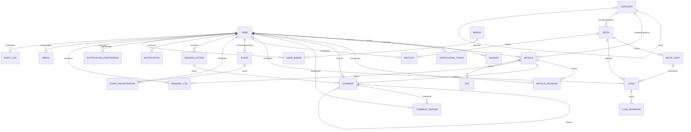
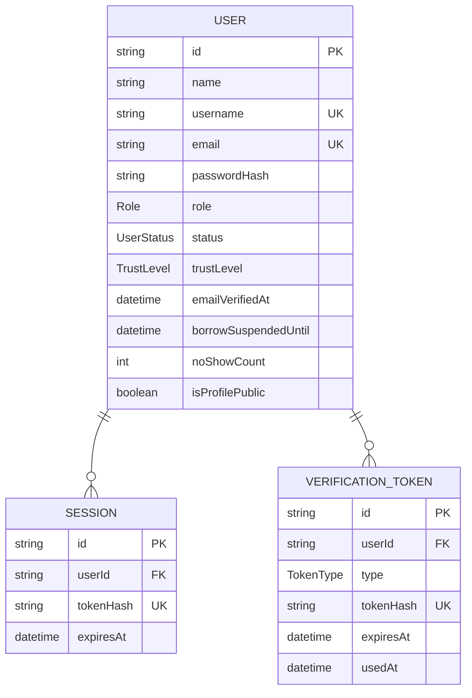
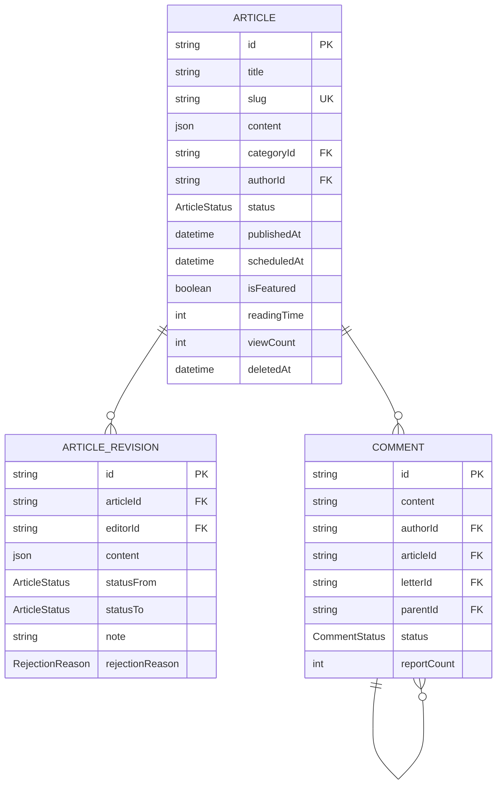
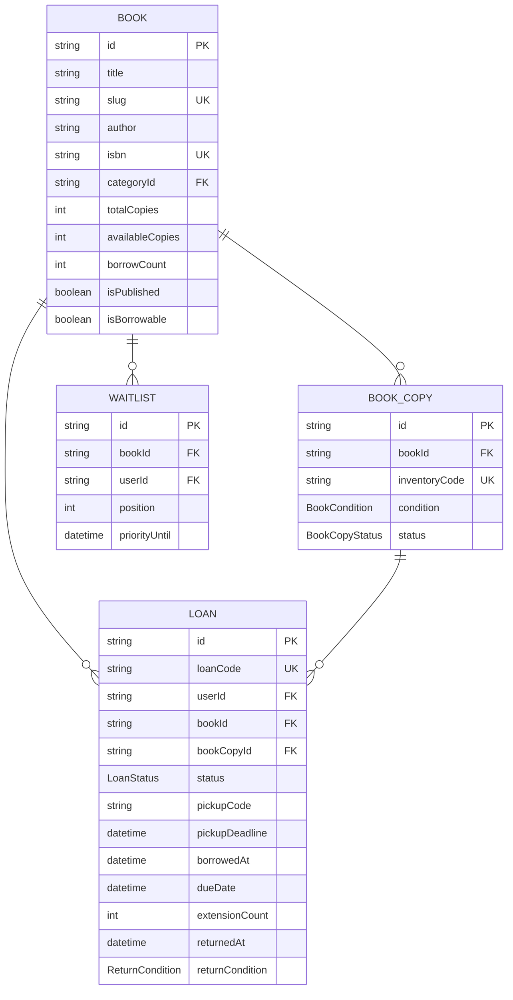

# DATABASE & ERD — Perpusjal v3

**Status:** Baseline · **Versi:** 1.0 · **Tanggal:** 22 September 2026
**Acuan:** `PRD.md` v3.0 §22 · `ARCHITECTURE.md` §8
**Database:** PostgreSQL 16 · **ORM:** Prisma

---

## Daftar Isi

1. [Prinsip Perancangan Data](#1-prinsip-perancangan-data)
2. [ERD Lengkap](#2-erd-lengkap)
3. [ERD per Domain](#3-erd-per-domain)
4. [Skema Prisma](#4-skema-prisma)
5. [Strategi Indeks](#5-strategi-indeks)
6. [Constraint & Integritas](#6-constraint--integritas)
7. [Full-Text Search](#7-full-text-search)
8. [Data Turunan & Rekonsiliasi](#8-data-turunan--rekonsiliasi)
9. [Strategi Migrasi](#9-strategi-migrasi)
10. [Seed Data](#10-seed-data)
11. [Retensi & Penghapusan Data](#11-retensi--penghapusan-data)
12. [Kueri Umum](#12-kueri-umum)

---

## 1. Prinsip Perancangan Data

| # | Prinsip | Penerapan |
|---|---|---|
| 1 | **Normalisasi dulu, denormalisasi seperlunya** | `availableCopies` didenormalisasi demi kecepatan katalog, dengan job rekonsiliasi sebagai penjaga |
| 2 | **Soft delete untuk apa pun yang punya nilai arsip** | `deletedAt` pada Article, Book, Comment. Draft boleh dihapus permanen |
| 3 | **Waktu selalu UTC di database** | Konversi ke WIB hanya di lapisan tampilan (DI-07) |
| 4 | **Enum di database, bukan string bebas** | Status yang salah ketik adalah bug yang mahal |
| 5 | **Jejak audit tidak dapat diubah** | `ArticleRevision`, `AuditLog` bersifat append-only |
| 6 | **ID memakai `cuid()`** | Tidak bisa ditebak, aman dipakai di URL, urut secara waktu |
| 7 | **Nama field bahasa Inggris** | Konsisten dengan kode; bahasa Indonesia hanya di UI |

---

## 2. ERD Lengkap



---

## 3. ERD per Domain

### 3.1 Domain Identitas



### 3.2 Domain Konten



### 3.3 Domain Perpustakaan



---

## 4. Skema Prisma

Berkas ini menjadi isi `prisma/schema.prisma`.

```prisma
generator client {
  provider        = "prisma-client-js"
  previewFeatures = ["fullTextSearchPostgres"]
}

datasource db {
  provider = "postgresql"
  url      = env("DATABASE_URL")
}

// ─────────────────────────────────────────────
// ENUM
// ─────────────────────────────────────────────

enum Role {
  USER
  KURATOR
  ADMIN
}

enum UserStatus {
  PENDING_VERIFICATION
  ACTIVE
  SUSPENDED
  DEACTIVATED
  DELETED
}

enum TrustLevel {
  TL0
  TL1
  TL2
  RESTRICTED
}

enum TokenType {
  EMAIL_VERIFY
  PASSWORD_RESET
}

enum ArticleStatus {
  DRAFT
  PENDING_REVIEW
  REVISION
  APPROVED
  SCHEDULED
  PUBLISHED
  ARCHIVED
  REJECTED
}

enum RejectionReason {
  PLAGIARISM
  HATE_SPEECH
  PROMOTIONAL
  OFF_TOPIC
  LOW_QUALITY
  OTHER
}

enum CommentStatus {
  PENDING
  PUBLISHED
  HIDDEN
  DELETED_BY_USER
  DELETED
}

enum ReportReason {
  SPAM
  ABUSE
  OFF_TOPIC
  PERSONAL_INFO
}

enum BookCopyStatus {
  AVAILABLE
  BORROWED
  RESERVED
  UNAVAILABLE
  LOST
  DAMAGED
}

enum BookCondition {
  BARU
  BAIK
  CUKUP
  RUSAK_RINGAN
}

enum LoanStatus {
  PENDING
  APPROVED
  BORROWED
  RETURNED
  RETURNED_LOST
  OVERDUE
  REJECTED
  CANCELLED
  EXPIRED
}

enum ReturnCondition {
  BAIK
  RUSAK
  HILANG
}

enum ReminderType {
  PICKUP_DEADLINE
  DUE_SOON
  DUE_TODAY
  OVERDUE_1
  OVERDUE_3
  OVERDUE_7
}

enum WaitlistStatus {
  WAITING
  NOTIFIED
  FULFILLED
  EXPIRED
  CANCELLED
}

enum EventStatus {
  DRAFT
  PUBLISHED
  OPEN
  FULL
  CLOSED
  COMPLETED
  CANCELLED
}

enum EventType {
  KELAS
  DISKUSI
  WORKSHOP
  LAPAK
  LAINNYA
}

enum RegistrationStatus {
  REGISTERED
  WAITLISTED
  CANCELLED
  ATTENDED
  NO_SHOW
}

enum LetterStatus {
  PENDING
  PUBLISHED
  REJECTED
}

enum Language {
  ID
  EN
  JV
  AR
  OTHER
}

enum CategoryType {
  ARTICLE
  BOOK
  BOTH
}

enum BadgeCriteria {
  ARTICLES_READ
  ARTICLES_PUBLISHED
  COMMENTS_PUBLISHED
  EVENTS_ATTENDED
  LOANS_RETURNED
  ONTIME_STREAK
  ACCOUNT_AGE_DAYS
  MANUAL
}

enum MediaType {
  ARTICLE_COVER
  ARTICLE_INLINE
  BOOK_COVER
  AVATAR
  EVENT_COVER
  PAGE_IMAGE
}

// ─────────────────────────────────────────────
// IDENTITAS
// ─────────────────────────────────────────────

model User {
  id                   String     @id @default(cuid())
  name                 String     @db.VarChar(60)
  username             String     @unique @db.VarChar(20)
  email                String     @unique @db.VarChar(120)
  passwordHash         String?
  avatarUrl            String?
  bio                  String?    @db.VarChar(200)
  instagramUrl         String?
  websiteUrl           String?

  role                 Role       @default(USER)
  status               UserStatus @default(PENDING_VERIFICATION)
  trustLevel           TrustLevel @default(TL0)

  emailVerifiedAt      DateTime?
  lastLoginAt          DateTime?
  failedLoginCount     Int        @default(0)
  lockedUntil          DateTime?

  // Perpustakaan
  borrowSuspendedUntil DateTime?
  suspensionReason     String?
  noShowCount          Int        @default(0)
  onTimeStreak         Int        @default(0)

  // Privasi
  isProfilePublic      Boolean    @default(true)
  showBadges           Boolean    @default(true)

  createdAt            DateTime   @default(now())
  updatedAt            DateTime   @updatedAt
  deletedAt            DateTime?

  sessions             Session[]
  tokens               VerificationToken[]
  articles             Article[]               @relation("ArticleAuthor")
  revisions            ArticleRevision[]
  comments             Comment[]
  commentReports       CommentReport[]
  loans                Loan[]                  @relation("LoanBorrower")
  approvedLoans        Loan[]                  @relation("LoanApprover")
  handedOverLoans      Loan[]                  @relation("LoanHandover")
  receivedLoans        Loan[]                  @relation("LoanReceiver")
  waitlists            Waitlist[]
  organizedEvents      Event[]
  registrations        EventRegistration[]
  letters              ReaderLetter[]          @relation("LetterAuthor")
  moderatedLetters     ReaderLetter[]          @relation("LetterModerator")
  notifications        Notification[]
  notificationPrefs    NotificationPreference[]
  badges               UserBadge[]
  readingLogs          ReadingLog[]
  uploads              Media[]
  auditLogs            AuditLog[]

  @@index([role])
  @@index([status])
  @@index([createdAt])
}

model Session {
  id           String   @id @default(cuid())
  userId       String
  tokenHash    String   @unique
  userAgent    String?
  ipAddress    String?
  expiresAt    DateTime
  lastActiveAt DateTime @default(now())
  createdAt    DateTime @default(now())

  user User @relation(fields: [userId], references: [id], onDelete: Cascade)

  @@index([userId])
  @@index([expiresAt])
}

model VerificationToken {
  id        String    @id @default(cuid())
  userId    String
  type      TokenType
  tokenHash String    @unique
  expiresAt DateTime
  usedAt    DateTime?
  createdAt DateTime  @default(now())

  user User @relation(fields: [userId], references: [id], onDelete: Cascade)

  @@index([userId, type])
  @@index([expiresAt])
}

// ─────────────────────────────────────────────
// KATEGORI & TAG
// ─────────────────────────────────────────────

model Category {
  id          String       @id @default(cuid())
  name        String       @db.VarChar(60)
  slug        String       @unique @db.VarChar(60)
  description String?      @db.VarChar(300)
  iconName    String?
  color       String?      @db.VarChar(9)
  type        CategoryType @default(BOTH)
  parentId    String?
  order       Int          @default(0)
  isActive    Boolean      @default(true)
  createdAt   DateTime     @default(now())
  updatedAt   DateTime     @updatedAt

  parent   Category?  @relation("CategoryTree", fields: [parentId], references: [id])
  children Category[] @relation("CategoryTree")
  articles Article[]
  books    Book[]

  @@index([type, isActive])
  @@index([parentId])
}

model Tag {
  id        String    @id @default(cuid())
  name      String    @db.VarChar(40)
  slug      String    @unique @db.VarChar(40)
  createdAt DateTime  @default(now())
  articles  Article[]
}

// ─────────────────────────────────────────────
// ARTIKEL
// ─────────────────────────────────────────────

model Article {
  id             String        @id @default(cuid())
  title          String        @db.VarChar(120)
  slug           String        @unique @db.VarChar(160)
  subtitle       String?       @db.VarChar(160)
  excerpt        String?       @db.VarChar(300)
  content        Json
  plainText      String?       // turunan konten, untuk FTS & excerpt otomatis
  coverImage     String?
  coverCredit    String?       @db.VarChar(120)

  categoryId     String
  authorId       String

  status         ArticleStatus @default(DRAFT)
  publishedAt    DateTime?
  scheduledAt    DateTime?
  isFeatured     Boolean       @default(false)
  allowComments  Boolean       @default(true)

  readingTime    Int           @default(1)
  wordCount      Int           @default(0)
  viewCount      Int           @default(0)
  commentCount   Int           @default(0)

  // Kurasi
  reviewLockedById String?
  reviewLockedAt   DateTime?
  submittedAt      DateTime?

  // SEO
  seoTitle       String?       @db.VarChar(60)
  seoDescription String?       @db.VarChar(160)
  ogImage        String?
  previewToken   String?       @unique

  createdAt      DateTime      @default(now())
  updatedAt      DateTime      @updatedAt
  deletedAt      DateTime?

  category  Category          @relation(fields: [categoryId], references: [id])
  author    User              @relation("ArticleAuthor", fields: [authorId], references: [id])
  tags      Tag[]
  revisions ArticleRevision[]
  comments  Comment[]
  readLogs  ReadingLog[]

  @@index([status, publishedAt(sort: Desc)])
  @@index([categoryId, status])
  @@index([authorId, status])
  @@index([isFeatured, publishedAt(sort: Desc)])
  @@index([scheduledAt])
  @@index([deletedAt])
}

model ArticleRevision {
  id              String           @id @default(cuid())
  articleId       String
  editorId        String
  content         Json?
  statusFrom      ArticleStatus
  statusTo        ArticleStatus
  note            String?          @db.Text
  rejectionReason RejectionReason?
  originalityConfirmed Boolean     @default(false)
  createdAt       DateTime         @default(now())

  article Article @relation(fields: [articleId], references: [id], onDelete: Cascade)
  editor  User    @relation(fields: [editorId], references: [id])

  @@index([articleId, createdAt(sort: Desc)])
}

// ─────────────────────────────────────────────
// KOMENTAR
// ─────────────────────────────────────────────

model Comment {
  id          String        @id @default(cuid())
  content     String        @db.VarChar(1500)
  authorId    String
  articleId   String?
  letterId    String?
  parentId    String?
  status      CommentStatus @default(PENDING)
  moderatedById String?
  moderatedAt   DateTime?
  reportCount Int           @default(0)
  editedAt    DateTime?
  createdAt   DateTime      @default(now())
  updatedAt   DateTime      @updatedAt
  deletedAt   DateTime?

  author   User          @relation(fields: [authorId], references: [id], onDelete: Cascade)
  article  Article?      @relation(fields: [articleId], references: [id], onDelete: Cascade)
  letter   ReaderLetter? @relation(fields: [letterId], references: [id], onDelete: Cascade)
  parent   Comment?      @relation("CommentThread", fields: [parentId], references: [id])
  replies  Comment[]     @relation("CommentThread")
  reports  CommentReport[]

  @@index([articleId, status, createdAt])
  @@index([letterId, status, createdAt])
  @@index([authorId])
  @@index([status, createdAt])
  @@index([parentId])
}

model CommentReport {
  id         String       @id @default(cuid())
  commentId  String
  reporterId String
  reason     ReportReason
  note       String?      @db.VarChar(300)
  createdAt  DateTime     @default(now())

  comment  Comment @relation(fields: [commentId], references: [id], onDelete: Cascade)
  reporter User    @relation(fields: [reporterId], references: [id], onDelete: Cascade)

  @@unique([commentId, reporterId])
  @@index([commentId])
}

// ─────────────────────────────────────────────
// PERPUSTAKAAN
// ─────────────────────────────────────────────

model Book {
  id              String     @id @default(cuid())
  title           String     @db.VarChar(200)
  slug            String     @unique @db.VarChar(220)
  author          String     @db.VarChar(150)
  isbn            String?    @unique @db.VarChar(13)
  publisher       String?    @db.VarChar(120)
  publicationYear Int?
  categoryId      String
  description     String?    @db.VarChar(2000)
  coverImage      String?
  language        Language   @default(ID)
  pages           Int?
  shelfLocation   String?    @db.VarChar(60)
  donatedBy       String?    @db.VarChar(120)

  isPublished     Boolean    @default(false)
  isBorrowable    Boolean    @default(true)

  totalCopies     Int        @default(0)
  availableCopies Int        @default(0)
  borrowCount     Int        @default(0)

  createdAt       DateTime   @default(now())
  updatedAt       DateTime   @updatedAt
  deletedAt       DateTime?

  category  Category   @relation(fields: [categoryId], references: [id])
  copies    BookCopy[]
  loans     Loan[]
  waitlists Waitlist[]

  @@index([isPublished, createdAt(sort: Desc)])
  @@index([categoryId, isPublished])
  @@index([availableCopies])
  @@index([borrowCount(sort: Desc)])
  @@index([deletedAt])
}

model BookCopy {
  id            String         @id @default(cuid())
  bookId        String
  inventoryCode String         @unique @db.VarChar(20)
  condition     BookCondition  @default(BAIK)
  status        BookCopyStatus @default(AVAILABLE)
  acquiredAt    DateTime       @default(now())
  note          String?        @db.VarChar(300)
  createdAt     DateTime       @default(now())
  updatedAt     DateTime       @updatedAt

  book  Book   @relation(fields: [bookId], references: [id], onDelete: Cascade)
  loans Loan[]

  @@index([bookId, status])
  @@index([status])
}

model Loan {
  id             String     @id @default(cuid())
  loanCode       String     @unique @db.VarChar(20)
  userId         String
  bookId         String
  bookCopyId     String?

  status         LoanStatus @default(PENDING)

  requestedAt    DateTime   @default(now())
  pickupPoint    String     @db.VarChar(60)
  pickupDatePlan DateTime?
  userNote       String?    @db.VarChar(300)

  approvedAt     DateTime?
  approvedById   String?
  rejectionReason String?   @db.VarChar(300)

  pickupCode     String?    @db.VarChar(6)
  pickupDeadline DateTime?

  borrowedAt     DateTime?
  handedOverById String?
  dueDate        DateTime?
  extensionCount Int        @default(0)
  lastExtendedAt DateTime?

  returnedAt      DateTime?
  receivedById    String?
  returnCondition ReturnCondition?

  adminNote      String?    @db.VarChar(500)

  createdAt      DateTime   @default(now())
  updatedAt      DateTime   @updatedAt

  user        User           @relation("LoanBorrower", fields: [userId], references: [id])
  book        Book           @relation(fields: [bookId], references: [id])
  bookCopy    BookCopy?      @relation(fields: [bookCopyId], references: [id])
  approvedBy  User?          @relation("LoanApprover", fields: [approvedById], references: [id])
  handedOverBy User?         @relation("LoanHandover", fields: [handedOverById], references: [id])
  receivedBy  User?          @relation("LoanReceiver", fields: [receivedById], references: [id])
  reminders   LoanReminder[]

  @@index([userId, status])
  @@index([status, dueDate])
  @@index([status, pickupDeadline])
  @@index([pickupCode])
  @@index([bookId, status])
}

model LoanReminder {
  id        String       @id @default(cuid())
  loanId    String
  type      ReminderType
  sentAt    DateTime     @default(now())

  loan Loan @relation(fields: [loanId], references: [id], onDelete: Cascade)

  @@unique([loanId, type])
}

model Waitlist {
  id           String         @id @default(cuid())
  bookId       String
  userId       String
  position     Int
  status       WaitlistStatus @default(WAITING)
  notifiedAt   DateTime?
  priorityUntil DateTime?
  createdAt    DateTime       @default(now())

  book Book @relation(fields: [bookId], references: [id], onDelete: Cascade)
  user User @relation(fields: [userId], references: [id], onDelete: Cascade)

  @@index([bookId, status, position])
  @@index([userId, status])
}

// ─────────────────────────────────────────────
// KEGIATAN
// ─────────────────────────────────────────────

model Event {
  id                     String      @id @default(cuid())
  title                  String      @db.VarChar(120)
  slug                   String      @unique @db.VarChar(140)
  type                   EventType   @default(LAINNYA)
  description            Json
  coverImage             String?

  startAt                DateTime
  endAt                  DateTime
  locationName           String      @db.VarChar(120)
  locationDetail         String?     @db.VarChar(300)
  mapUrl                 String?
  isOnline               Boolean     @default(false)
  meetingUrl             String?

  quota                  Int?
  registrationOpenAt     DateTime?
  registrationCloseAt    DateTime?
  isParticipantListPublic Boolean    @default(false)

  organizerId            String
  status                 EventStatus @default(DRAFT)

  // Dokumentasi pascakegiatan
  summary                String?     @db.Text
  gallery                Json?

  createdAt              DateTime    @default(now())
  updatedAt              DateTime    @updatedAt

  organizer     User                @relation(fields: [organizerId], references: [id])
  registrations EventRegistration[]

  @@index([status, startAt])
  @@index([startAt])
  @@index([organizerId])
}

model EventRegistration {
  id             String             @id @default(cuid())
  eventId        String
  userId         String
  status         RegistrationStatus @default(REGISTERED)
  attendanceCode String             @db.VarChar(6)
  note           String?            @db.VarChar(300)
  registeredAt   DateTime           @default(now())
  checkedInAt    DateTime?
  cancelledAt    DateTime?

  event Event @relation(fields: [eventId], references: [id], onDelete: Cascade)
  user  User  @relation(fields: [userId], references: [id], onDelete: Cascade)

  @@unique([eventId, userId])
  @@index([eventId, status])
  @@index([userId, status])
}

// ─────────────────────────────────────────────
// SURAT PEMBACA
// ─────────────────────────────────────────────

model ReaderLetter {
  id              String       @id @default(cuid())
  title           String       @db.VarChar(120)
  slug            String       @unique @db.VarChar(140)
  content         String       @db.Text
  originalContent String?      @db.Text
  authorId        String
  displayName     String       @db.VarChar(60)
  isAnonymous     Boolean      @default(false)
  status          LetterStatus @default(PENDING)
  publishedAt     DateTime?
  moderatedById   String?
  moderatedAt     DateTime?
  rejectionReason String?      @db.VarChar(300)
  createdAt       DateTime     @default(now())
  updatedAt       DateTime     @updatedAt

  author      User      @relation("LetterAuthor", fields: [authorId], references: [id])
  moderatedBy User?     @relation("LetterModerator", fields: [moderatedById], references: [id])
  comments    Comment[]

  @@index([status, createdAt(sort: Desc)])
  @@index([authorId])
}

// ─────────────────────────────────────────────
// NOTIFIKASI
// ─────────────────────────────────────────────

model Notification {
  id         String   @id @default(cuid())
  userId     String
  type       String   @db.VarChar(40)
  title      String   @db.VarChar(160)
  body       String   @db.VarChar(400)
  actionUrl  String?
  entityType String?  @db.VarChar(30)
  entityId   String?
  isRead     Boolean  @default(false)
  readAt     DateTime?
  createdAt  DateTime @default(now())

  user User @relation(fields: [userId], references: [id], onDelete: Cascade)

  @@index([userId, isRead, createdAt(sort: Desc)])
  @@index([createdAt])
}

model NotificationPreference {
  id     String  @id @default(cuid())
  userId String
  type   String  @db.VarChar(40)
  inApp  Boolean @default(true)
  email  Boolean @default(true)

  user User @relation(fields: [userId], references: [id], onDelete: Cascade)

  @@unique([userId, type])
}

// ─────────────────────────────────────────────
// GAMIFIKASI
// ─────────────────────────────────────────────

model Badge {
  id            String        @id @default(cuid())
  code          String        @unique @db.VarChar(40)
  name          String        @db.VarChar(60)
  description   String        @db.VarChar(200)
  iconName      String
  criteriaType  BadgeCriteria
  criteriaValue Int           @default(1)
  order         Int           @default(0)
  isActive      Boolean       @default(true)
  createdAt     DateTime      @default(now())

  userBadges UserBadge[]
}

model UserBadge {
  id       String   @id @default(cuid())
  userId   String
  badgeId  String
  progress Int      @default(0)
  earnedAt DateTime?

  user  User  @relation(fields: [userId], references: [id], onDelete: Cascade)
  badge Badge @relation(fields: [badgeId], references: [id], onDelete: Cascade)

  @@unique([userId, badgeId])
  @@index([userId, earnedAt])
}

model ReadingLog {
  id           String   @id @default(cuid())
  userId       String?
  anonId       String?  @db.VarChar(40)
  articleId    String
  secondsSpent Int      @default(0)
  scrollDepth  Int      @default(0)
  counted      Boolean  @default(false)
  readAt       DateTime @default(now())

  user    User?   @relation(fields: [userId], references: [id], onDelete: SetNull)
  article Article @relation(fields: [articleId], references: [id], onDelete: Cascade)

  @@index([articleId, readAt])
  @@index([userId, counted])
  @@index([anonId, articleId, readAt])
}

// ─────────────────────────────────────────────
// CMS & SISTEM
// ─────────────────────────────────────────────

model Page {
  id             String   @id @default(cuid())
  title          String   @db.VarChar(120)
  slug           String   @unique @db.VarChar(120)
  content        Json
  isPublished    Boolean  @default(false)
  isSystem       Boolean  @default(false)
  showInFooter   Boolean  @default(false)
  showInNav      Boolean  @default(false)
  order          Int      @default(0)
  seoTitle       String?  @db.VarChar(60)
  seoDescription String?  @db.VarChar(160)
  createdAt      DateTime @default(now())
  updatedAt      DateTime @updatedAt

  @@index([isPublished])
}

model Media {
  id           String    @id @default(cuid())
  url          String
  publicId     String    @unique
  type         MediaType
  width        Int?
  height       Int?
  sizeBytes    Int?
  format       String?   @db.VarChar(10)
  alt          String?   @db.VarChar(200)
  uploadedById String
  usedIn       String?   @db.VarChar(60)
  createdAt    DateTime  @default(now())

  uploadedBy User @relation(fields: [uploadedById], references: [id])

  @@index([uploadedById])
  @@index([type, createdAt])
}

model Setting {
  key         String   @id @db.VarChar(60)
  value       Json
  description String?  @db.VarChar(300)
  updatedById String?
  updatedAt   DateTime @updatedAt
}

model AuditLog {
  id         String   @id @default(cuid())
  actorId    String?
  action     String   @db.VarChar(60)
  entityType String   @db.VarChar(40)
  entityId   String?
  before     Json?
  after      Json?
  ipAddress  String?  @db.VarChar(45)
  userAgent  String?  @db.VarChar(300)
  createdAt  DateTime @default(now())

  actor User? @relation(fields: [actorId], references: [id], onDelete: SetNull)

  @@index([entityType, entityId])
  @@index([actorId, createdAt(sort: Desc)])
  @@index([createdAt(sort: Desc)])
}

model SearchQueryLog {
  id          String   @id @default(cuid())
  query       String   @db.VarChar(120)
  type        String?  @db.VarChar(20)
  resultCount Int      @default(0)
  createdAt   DateTime @default(now())

  @@index([createdAt])
  @@index([resultCount])
}

model JobRun {
  id          String    @id @default(cuid())
  jobName     String    @db.VarChar(60)
  startedAt   DateTime  @default(now())
  finishedAt  DateTime?
  durationMs  Int?
  processed   Int       @default(0)
  failed      Int       @default(0)
  errorDetail String?   @db.Text

  @@index([jobName, startedAt(sort: Desc)])
}
```

---

## 5. Strategi Indeks

Indeks bukan hiasan — setiap indeks di bawah ini dipasang karena ada kueri nyata yang membutuhkannya.

| Tabel | Indeks | Kueri yang dilayani |
|---|---|---|
| `Article` | `(status, publishedAt DESC)` | Daftar artikel publik — kueri paling sering di seluruh aplikasi |
| `Article` | `(categoryId, status)` | Filter kategori |
| `Article` | `(authorId, status)` | "Tulisan Saya", profil penulis |
| `Article` | `(isFeatured, publishedAt DESC)` | Seksi unggulan di home |
| `Article` | `(scheduledAt)` | Job penerbitan terjadwal |
| `Book` | `(isPublished, createdAt DESC)` | Katalog default |
| `Book` | `(borrowCount DESC)` | "Paling sering dipinjam" |
| `BookCopy` | `(bookId, status)` | Hitung eksemplar tersedia, pilih eksemplar saat serah terima |
| `Loan` | `(userId, status)` | Dashboard pengguna, pemeriksaan kelayakan |
| `Loan` | `(status, dueDate)` | Job overdue & pengingat |
| `Loan` | `(status, pickupDeadline)` | Job kedaluwarsa pengambilan |
| `Loan` | `(pickupCode)` | Mode Lapak — harus instan |
| `Comment` | `(articleId, status, createdAt)` | Thread komentar |
| `Comment` | `(status, createdAt)` | Antrean moderasi |
| `Notification` | `(userId, isRead, createdAt DESC)` | Lonceng notifikasi |
| `Event` | `(status, startAt)` | Daftar kegiatan mendatang |
| `EventRegistration` | `(eventId, status)` | Hitung kuota, daftar peserta |
| `AuditLog` | `(entityType, entityId)` | Riwayat satu objek |

**Aturan:** setiap kali menambah filter atau pengurutan baru di UI, periksa apakah indeksnya sudah ada. Gunakan `EXPLAIN ANALYZE` pada data yang menyerupai produksi, bukan pada 10 baris seed.

---

## 6. Constraint & Integritas

Prisma tidak mendukung semua constraint yang dibutuhkan, jadi beberapa ditambahkan lewat migrasi SQL manual.

### 6.1 Check Constraint

```sql
-- DI-03: hitungan eksemplar tidak boleh mustahil
ALTER TABLE "Book"
  ADD CONSTRAINT book_available_non_negative CHECK ("availableCopies" >= 0),
  ADD CONSTRAINT book_available_lte_total   CHECK ("availableCopies" <= "totalCopies");

-- DI-05: komentar menempel pada tepat satu induk
ALTER TABLE "Comment"
  ADD CONSTRAINT comment_single_parent CHECK (
    ("articleId" IS NOT NULL AND "letterId" IS NULL) OR
    ("articleId" IS NULL AND "letterId" IS NOT NULL)
  );

-- Event: waktu selesai setelah waktu mulai
ALTER TABLE "Event"
  ADD CONSTRAINT event_time_order CHECK ("endAt" > "startAt");

-- Loan: perpanjangan tidak melebihi batas keras
ALTER TABLE "Loan"
  ADD CONSTRAINT loan_extension_max CHECK ("extensionCount" >= 0 AND "extensionCount" <= 3);

-- Kuota event tidak negatif
ALTER TABLE "Event"
  ADD CONSTRAINT event_quota_positive CHECK ("quota" IS NULL OR "quota" > 0);
```

### 6.2 Partial Unique Index

```sql
-- DI-04: satu pengguna hanya boleh punya satu pinjaman aktif per judul
CREATE UNIQUE INDEX loan_one_active_per_user_book
  ON "Loan" ("userId", "bookId")
  WHERE "status" IN ('PENDING', 'APPROVED', 'BORROWED', 'OVERDUE');

-- Kode pengambilan unik selama masih aktif
CREATE UNIQUE INDEX loan_pickup_code_active
  ON "Loan" ("pickupCode")
  WHERE "status" = 'APPROVED' AND "pickupCode" IS NOT NULL;

-- Satu posisi antrean per pengguna per buku
CREATE UNIQUE INDEX waitlist_one_active_per_user_book
  ON "Waitlist" ("bookId", "userId")
  WHERE "status" IN ('WAITING', 'NOTIFIED');

-- Slug unik hanya di antara data yang belum dihapus
CREATE UNIQUE INDEX article_slug_active ON "Article" ("slug") WHERE "deletedAt" IS NULL;
CREATE UNIQUE INDEX book_slug_active    ON "Book" ("slug")    WHERE "deletedAt" IS NULL;
```

### 6.3 Perilaku Foreign Key

| Relasi | On Delete | Alasan |
|---|---|---|
| `Session → User` | Cascade | Sesi tidak punya makna tanpa pengguna |
| `Article → User (author)` | Restrict | Artikel terbit adalah arsip komunitas; pengguna dianonimkan, tidak dihapus (BR-AUTH-05) |
| `Comment → User` | Cascade | Komentar boleh ikut terhapus |
| `Loan → User` | Restrict | Riwayat peminjaman harus utuh |
| `Loan → Book` | Restrict | Tidak boleh menghapus buku yang punya riwayat (AC-LIB-01) |
| `BookCopy → Book` | Cascade | Eksemplar tidak berarti tanpa judul |
| `ReadingLog → User` | SetNull | Statistik tetap, identitas hilang |
| `AuditLog → User` | SetNull | Jejak audit harus bertahan |

---

## 7. Full-Text Search

### 7.1 Persiapan

```sql
CREATE EXTENSION IF NOT EXISTS pg_trgm;
CREATE EXTENSION IF NOT EXISTS unaccent;
```

### 7.2 Kolom Tersimpan

```sql
-- Artikel
ALTER TABLE "Article" ADD COLUMN search_vector tsvector
  GENERATED ALWAYS AS (
    setweight(to_tsvector('simple', coalesce("title", '')), 'A') ||
    setweight(to_tsvector('simple', coalesce("subtitle", '')), 'B') ||
    setweight(to_tsvector('simple', coalesce("excerpt", '')), 'B') ||
    setweight(to_tsvector('simple', coalesce("plainText", '')), 'C')
  ) STORED;

CREATE INDEX article_search_idx ON "Article" USING GIN (search_vector);

-- Buku
ALTER TABLE "Book" ADD COLUMN search_vector tsvector
  GENERATED ALWAYS AS (
    setweight(to_tsvector('simple', coalesce("title", '')), 'A') ||
    setweight(to_tsvector('simple', coalesce("author", '')), 'A') ||
    setweight(to_tsvector('simple', coalesce("publisher", '')), 'C') ||
    setweight(to_tsvector('simple', coalesce("description", '')), 'C')
  ) STORED;

CREATE INDEX book_search_idx ON "Book" USING GIN (search_vector);

-- Toleransi salah ketik pada judul
CREATE INDEX article_title_trgm ON "Article" USING GIN ("title" gin_trgm_ops);
CREATE INDEX book_title_trgm    ON "Book"    USING GIN ("title" gin_trgm_ops);
CREATE INDEX book_author_trgm   ON "Book"    USING GIN ("author" gin_trgm_ops);
```

> **Mengapa `simple`, bukan konfigurasi bahasa?** PostgreSQL tidak memiliki stemmer bahasa Indonesia bawaan. `simple` memberi pencocokan kata apa adanya, yang untuk bahasa Indonesia (imbuhan banyak) tetap lebih baik daripada stemmer bahasa Inggris yang salah memotong kata. Toleransi bentuk kata ditangani `pg_trgm`.

### 7.3 Kueri Pencarian

```sql
SELECT id, title, slug,
       ts_rank(search_vector, websearch_to_tsquery('simple', $1)) AS rank,
       similarity(title, $1) AS sim
FROM "Article"
WHERE "status" = 'PUBLISHED'
  AND "deletedAt" IS NULL
  AND (search_vector @@ websearch_to_tsquery('simple', $1) OR title % $1)
ORDER BY rank DESC, sim DESC, "publishedAt" DESC
LIMIT 20 OFFSET $2;
```

### 7.4 Menjaga `plainText`

`Article.plainText` diisi di service setiap kali konten disimpan, dengan mengekstrak teks dari JSON TipTap. Kolom ini juga dipakai untuk menghasilkan excerpt otomatis (FR-ART-02) dan menghitung `wordCount`/`readingTime` (FR-ART-01).

---

## 8. Data Turunan & Rekonsiliasi

| Kolom turunan | Diperbarui saat | Penjaga |
|---|---|---|
| `Book.totalCopies` | Eksemplar ditambah/dihapus | Job rekonsiliasi harian |
| `Book.availableCopies` | Transaksi pinjam/kembali | Check constraint + job harian (DI-09) |
| `Book.borrowCount` | Pengembalian tercatat | — |
| `Article.commentCount` | Komentar terbit/tersembunyi | Job mingguan |
| `Article.readingTime`, `wordCount` | Konten disimpan | — |
| `Article.viewCount` | `ReadingLog` dihitung | Job harian dari `ReadingLog` |
| `User.onTimeStreak` | Pengembalian | Reset saat `OVERDUE` |
| `Waitlist.position` | Masuk/keluar antrean | Renumerasi dalam transaksi |

### 8.1 Kueri Rekonsiliasi

```sql
-- Menemukan ketidaksesuaian hitungan eksemplar
SELECT b.id, b.title, b."availableCopies" AS tercatat,
       COUNT(c.id) FILTER (WHERE c.status = 'AVAILABLE') AS sebenarnya
FROM "Book" b
LEFT JOIN "BookCopy" c ON c."bookId" = b.id
GROUP BY b.id, b.title, b."availableCopies"
HAVING b."availableCopies" <> COUNT(c.id) FILTER (WHERE c.status = 'AVAILABLE');
```

Hasil yang tidak kosong dilaporkan ke admin lewat notifikasi, **bukan** diperbaiki diam-diam — selisih biasanya menandakan bug yang perlu dicari, bukan sekadar angka yang perlu diluruskan.

---

## 9. Strategi Migrasi

### 9.1 Aturan

1. Satu migrasi = satu perubahan logis, dengan nama deskriptif: `20261001_add_loan_pickup_code`.
2. Migrasi dijalankan sebelum deploy aplikasi.
3. Migrasi harus **backward compatible** dengan versi aplikasi yang masih hidup.
4. Dilarang mengedit migrasi yang sudah masuk `main`.
5. Backup manual sebelum migrasi produksi.

### 9.2 Pola Penghapusan Kolom Dua Tahap

```text
Rilis N   : berhenti menulis & membaca kolom (kode saja, skema tidak berubah)
Rilis N+1 : DROP COLUMN
```

### 9.3 Pola Penambahan Kolom Wajib

```text
1. Tambah kolom nullable
2. Isi data lama (backfill) lewat skrip
3. Ubah menjadi NOT NULL pada migrasi berikutnya
```

### 9.4 Migrasi yang Perlu SQL Manual

| Migrasi | Isi |
|---|---|
| `init` | Seluruh tabel & enum dari Prisma |
| `add_constraints` | Check constraint §6.1 |
| `add_partial_indexes` | Partial unique index §6.2 |
| `add_fulltext_search` | Ekstensi, kolom tsvector, indeks GIN §7 |

---

## 10. Seed Data

`prisma/seed.ts` bersifat idempoten (`upsert`), sehingga aman dijalankan berkali-kali.

### 10.1 Data Wajib (semua lingkungan)

| Entitas | Isi |
|---|---|
| **Admin** | 1 akun dari `SEED_ADMIN_EMAIL`/`SEED_ADMIN_PASSWORD`, dipaksa ganti password saat login pertama |
| **Kategori** | Sastra, Pendidikan, Sosial, Budaya, Lingkungan, Sejarah, Anak, Fiksi, Non-Fiksi |
| **Badge** | 12 badge sesuai PRD §17.1 |
| **Page** | Tentang, Sejarah, Kontak, Cara Meminjam, FAQ, Ketentuan, Kebijakan Privasi, Jadwal Lapak |
| **Setting** | Nilai default sesuai `ARCHITECTURE.md` §14.2 |

### 10.2 Data Pengembangan (`--scenario=dev`)

| Entitas | Jumlah | Variasi penting |
|---|---|---|
| User | 6 | 1 admin, 1 kurator, 4 member — satu punya tunggakan, satu tersuspensi, satu TL0, satu TL2 |
| Book | 20 | Beragam ketersediaan: habis, sisa 1, banyak, tidak dapat dipinjam |
| BookCopy | 32 | Termasuk yang `DAMAGED` dan `LOST` |
| Article | 15 | Mencakup **semua** status agar setiap tampilan bisa diuji |
| Loan | 12 | Mencakup semua status termasuk `EXPIRED` dan `OVERDUE` |
| Event | 4 | Mendatang, penuh, selesai, dibatalkan |
| Comment | 25 | Berbagai status & kedalaman |

**Prinsip seed:** setiap status yang ada di enum harus punya minimal satu contoh di data dev. Kalau tidak, tampilan untuk status itu tidak akan pernah teruji sampai muncul di produksi.

---

## 11. Retensi & Penghapusan Data

| Data | Retensi | Mekanisme |
|---|---|---|
| Akun belum terverifikasi | 7 hari | Hard delete (cron) |
| Akun `DEACTIVATED` | 30 hari | → `DELETED` + anonimisasi |
| Notifikasi | 90 hari | Hard delete (cron) |
| `ReadingLog` | 12 bulan | Agregasi lalu hapus detail |
| `SearchQueryLog` | 12 bulan | Hard delete |
| `Session` kedaluwarsa | 7 hari setelah expired | Hard delete |
| `AuditLog` | 2 tahun | Arsip lalu hapus |
| `JobRun` | 90 hari | Hard delete |
| Komentar `DELETED` | 90 hari | Hard delete |
| Artikel terbit | **Permanen** | Arsip komunitas |
| Riwayat peminjaman | **Permanen** | Dianonimkan bila akun dihapus |
| Media yatim | 30 hari | Hapus di Cloudinary setelah konfirmasi admin |

### 11.1 Anonimisasi Akun

```ts
await prisma.user.update({
  where: { id },
  data: {
    name: "Pengguna Dihapus",
    username: `deleted_${shortHash(id)}`,
    email: `deleted_${shortHash(id)}@perpusjal.invalid`,
    passwordHash: null,
    avatarUrl: null,
    bio: null,
    instagramUrl: null,
    websiteUrl: null,
    status: "DELETED",
    deletedAt: new Date(),
  },
});
```

Artikel yang sudah terbit tetap tayang dengan atribusi anonim (BR-AUTH-05). Ketentuan ini **wajib** dijelaskan di Kebijakan Privasi sebelum Rilis 1.

---

## 12. Kueri Umum

### 12.1 Pemeriksaan Kelayakan Pinjam

```ts
const [activeLoans, overdue, duplicate, user] = await Promise.all([
  prisma.loan.count({ where: { userId, status: { in: ["PENDING", "APPROVED", "BORROWED"] } } }),
  prisma.loan.count({ where: { userId, status: "OVERDUE" } }),
  prisma.loan.count({ where: { userId, bookId, status: { in: ["PENDING", "APPROVED", "BORROWED", "OVERDUE"] } } }),
  prisma.user.findUniqueOrThrow({ where: { id: userId }, select: { emailVerifiedAt: true, borrowSuspendedUntil: true } }),
]);
```

Urutan pemeriksaan menentukan pesan mana yang muncul lebih dulu: email belum verifikasi → tunggakan → suspensi → batas aktif → duplikat.

### 12.2 Daftar Artikel Publik

```ts
prisma.article.findMany({
  where: { status: "PUBLISHED", deletedAt: null, ...(categorySlug && { category: { slug: categorySlug } }) },
  select: {
    id: true, title: true, slug: true, excerpt: true, coverImage: true,
    publishedAt: true, readingTime: true,
    author: { select: { name: true, username: true, avatarUrl: true } },
    category: { select: { name: true, slug: true, color: true } },
  },
  orderBy: { publishedAt: "desc" },
  take: 12,
  skip: (page - 1) * 12,
});
```

Perhatikan `select` yang eksplisit — jangan pernah mengembalikan seluruh baris `Article` (berisi `content` JSON yang besar) untuk sebuah daftar.

### 12.3 Papan Mode Lapak

```ts
prisma.loan.findMany({
  where: {
    OR: [
      { status: "APPROVED", pickupDeadline: { gte: startOfTodayWIB } },
      { status: { in: ["BORROWED", "OVERDUE"] }, dueDate: { lte: endOfTodayWIB } },
    ],
  },
  include: {
    user: { select: { name: true, username: true } },
    book: { select: { title: true, coverImage: true } },
  },
  orderBy: [{ status: "asc" }, { pickupDeadline: "asc" }],
});
```

### 12.4 Statistik Dashboard

```ts
const [users, articles, pendingArticles, books, availableCopies, activeLoans, overdueLoans, pendingLoans, pendingComments, upcomingEvents] =
  await prisma.$transaction([
    prisma.user.count({ where: { status: "ACTIVE" } }),
    prisma.article.count({ where: { status: "PUBLISHED", deletedAt: null } }),
    prisma.article.count({ where: { status: "PENDING_REVIEW" } }),
    prisma.book.count({ where: { isPublished: true, deletedAt: null } }),
    prisma.bookCopy.count({ where: { status: "AVAILABLE" } }),
    prisma.loan.count({ where: { status: "BORROWED" } }),
    prisma.loan.count({ where: { status: "OVERDUE" } }),
    prisma.loan.count({ where: { status: "PENDING" } }),
    prisma.comment.count({ where: { status: "PENDING" } }),
    prisma.event.count({ where: { status: { in: ["PUBLISHED", "OPEN", "FULL"] }, startAt: { gte: new Date() } } }),
  ]);
```

Seluruhnya dalam satu `$transaction` agar hanya sekali perjalanan ke database.
