# PRD — PERPUSJAL v3 (FINAL)

## Perpustakaan Jalanan Blora

**Tagline:** _Membaca dan Berbahagia._
**Document Status:** ✅ Final / Approved Baseline
**Version:** 3.0
**Tanggal:** 21 September 2026
**Product Type:** Community Literacy Platform + Digital Library
**Target Pengguna:** Masyarakat umum & komunitas literasi Blora
**Tim:** 1 orang (solo developer, full-stack)
**Dokumen ini adalah _single source of truth_.** Perubahan setelah tanggal di atas wajib dicatat di [Changelog](#0-2-changelog).

---

## Daftar Isi

| Bagian | Isi |
|---|---|
| **0** | [Document Control](#0-document-control) |
| **1** | [Product Overview](#1-product-overview) |
| **2** | [Problem Statement](#2-problem-statement) |
| **3** | [Goals, Non-Goals & Success Metrics](#3-goals-non-goals--success-metrics) |
| **4** | [Personas, Roles & RBAC](#4-personas-roles--rbac) |
| **5** | [Information Architecture & Routing](#5-information-architecture--routing) |
| **6** | [User Flows (Diagram)](#6-user-flows-diagram) |
| **7** | [Modul: Authentication & Akun](#7-modul-authentication--akun) |
| **8** | [Modul: Blog & Artikel](#8-modul-blog--artikel) |
| **9** | [Modul: Editor & Submission](#9-modul-editor--submission) |
| **10** | [Modul: Kurasi (Curator Workflow)](#10-modul-kurasi-curator-workflow) |
| **11** | [Modul: Komentar Native](#11-modul-komentar-native) |
| **12** | [Modul: Perpustakaan Digital (Katalog)](#12-modul-perpustakaan-digital-katalog) |
| **13** | [Modul: Peminjaman (Borrowing)](#13-modul-peminjaman-borrowing) |
| **14** | [Modul: Kegiatan / Event](#14-modul-kegiatan--event) |
| **15** | [Modul: Surat Pembaca](#15-modul-surat-pembaca) |
| **16** | [Modul: Notifikasi](#16-modul-notifikasi) |
| **17** | [Modul: Gamifikasi & Badge](#17-modul-gamifikasi--badge) |
| **18** | [Modul: Profil Pengguna](#18-modul-profil-pengguna) |
| **19** | [Modul: Search](#19-modul-search) |
| **20** | [Modul: Dashboard Admin & Kurator](#20-modul-dashboard-admin--kurator) |
| **21** | [Modul: CMS Halaman Statis](#21-modul-cms-halaman-statis) |
| **22** | [Data Model & ERD](#22-data-model--erd) |
| **23** | [API Specification](#23-api-specification) |
| **24** | [Arsitektur Teknis & ADR](#24-arsitektur-teknis--adr) |
| **25** | [Security Requirements](#25-security-requirements) |
| **26** | [Design System](#26-design-system) |
| **27** | [SEO, Accessibility, Performance](#27-seo-accessibility-performance) |
| **28** | [Analytics & Event Tracking](#28-analytics--event-tracking) |
| **29** | [Roadmap & Sprint Plan (Solo Dev)](#29-roadmap--sprint-plan-solo-dev) |
| **30** | [Risks & Mitigation](#30-risks--mitigation) |
| **31** | [Definition of Done & QA Checklist](#31-definition-of-done--qa-checklist) |
| **32** | [Open Questions](#32-open-questions) |
| **33** | [Appendix: Microcopy & Empty States](#33-appendix-microcopy--empty-states) |

---

## 0. Document Control

### 0.1 Tujuan Dokumen

Dokumen ini mendefinisikan **apa** yang dibangun dan **mengapa**, sampai tingkat detail yang cukup untuk langsung dikerjakan tanpa perlu menebak. Dokumen ini **bukan** dokumen teknis implementasi (lihat `ARCHITECTURE.md`) dan bukan spesifikasi UI pixel-perfect (lihat `DESIGN-SYSTEM.md`).

### 0.2 Changelog

| Versi | Tanggal | Perubahan |
|---|---|---|
| 1.0 | — | Konsep awal blog komunitas |
| 2.0 | — | Baseline PRD: penambahan perpustakaan digital, peminjaman, event, gamifikasi |
| **3.0** | 21 Sep 2026 | **FINAL.** Penambahan: user flow lengkap + diagram, permission matrix, spesifikasi field & validasi, business rules, acceptance criteria, ERD, API contract, sprint plan solo dev, analytics, microcopy. **Keputusan berubah:** (a) sistem komentar Giscus → **komentar native**; (b) peminjaman ditetapkan **ambil di lapak tanpa denda uang**; (c) penambahan entitas `BookCopy`; (d) penambahan status `EXPIRED` pada peminjaman. |

### 0.3 Glossary

| Istilah | Arti |
|---|---|
| **Perpusjal** | Perpustakaan Jalanan Blora, nama komunitas sekaligus nama produk |
| **Lapak** | Titik gelar buku di ruang publik (alun-alun, taman, CFD) pada jadwal tertentu |
| **Basecamp** | Sekretariat komunitas, tempat penyimpanan koleksi & titik ambil/kembali buku |
| **Eksemplar (Copy)** | Satu unit fisik buku. Satu judul bisa punya beberapa eksemplar |
| **Kurator** | Relawan yang mereview tulisan masyarakat sebelum terbit |
| **Pustakawan** | Peran operasional; di v3 melekat pada Admin (lihat §4.4) |
| **Surat Pembaca** | Kanal tulisan pendek/opini terbuka dari masyarakat |
| **Trust Level** | Tingkat kepercayaan akun, menentukan apakah komentar perlu pre-moderasi |
| **P0 / P1 / P2** | Prioritas: wajib rilis / penting / pelengkap |
| **FR** | Functional Requirement |
| **BR** | Business Rule |
| **AC** | Acceptance Criteria |

### 0.4 Konvensi Penulisan Requirement

- **HARUS / WAJIB** = mandatory, blocking untuk rilis.
- **SEBAIKNYA** = strongly recommended, boleh ditunda dengan alasan tercatat.
- **DAPAT / OPSIONAL** = nice to have.
- Setiap requirement punya ID unik dan **tidak boleh didaur ulang** meskipun requirement dihapus.

Format ID: `FR-<MODUL>-<NN>`, `BR-<MODUL>-<NN>`, `AC-<MODUL>-<NN>`.

---

## 1. Product Overview

**Perpusjal (Perpustakaan Jalanan Blora)** adalah platform digital komunitas yang menggabungkan enam hal dalam satu produk:

| # | Pilar | Inti |
|---|---|---|
| 1 | **Community Blog** | Artikel dari pengurus & masyarakat |
| 2 | **Digital Library Catalog** | Katalog koleksi buku fisik komunitas |
| 3 | **Book Lending** | Pengajuan pinjam online, ambil & kembali di lapak/basecamp |
| 4 | **Literacy Events** | Informasi & pendaftaran kegiatan literasi |
| 5 | **Community Contribution** | Kiriman tulisan masyarakat dengan alur kurasi |
| 6 | **Reader Engagement** | Komentar, profil, badge |

Perpusjal bukan sekadar website perpustakaan, tetapi **ruang digital bagi komunitas untuk membaca, menulis, berbagi pengetahuan, dan berinteraksi.**

### 1.1 Product Philosophy

> **Perpusjal bukan sekadar tempat menemukan buku.
> Perpusjal adalah tempat menemukan cerita, gagasan, dan orang-orang yang ingin belajar bersama.**

### 1.2 Posisi Produk (yang membedakan)

| Perpusjal **adalah** | Perpusjal **bukan** |
|---|---|
| Etalase & katalog koleksi fisik komunitas | Toko buku / marketplace |
| Ruang publikasi tulisan warga yang dikurasi | Platform blogging bebas tanpa moderasi |
| Jembatan antara kegiatan offline dan online | Aplikasi e-book / pembaca digital |
| Alat bantu kerja relawan (admin ringan) | Sistem perpustakaan (ILS) sekelas instansi |

### 1.3 Batasan Konteks Penting

- **Peminjaman selalu berakhir offline.** Transaksi disetujui online, tetapi serah terima buku terjadi di lapak/basecamp. Sistem harus ramah terhadap kenyataan ini (kode pengambilan, jadwal lapak, batas waktu ambil).
- **Pengguna bukan digital native.** Mayoritas pengguna adalah pelajar SMA/SMK, mahasiswa, dan warga umum Blora. Alur harus bisa diselesaikan di HP, koneksi seluler sedang, tanpa tutorial.
- **Pengelola adalah relawan.** Tidak ada staf penuh waktu. Fitur admin harus hemat waktu: sedikit klik, notifikasi jelas, tidak butuh pelatihan panjang.

---

## 2. Problem Statement

### 2.1 Masalah yang Dihadapi

| # | Masalah | Dampak Saat Ini | Terjawab Oleh |
|---|---|---|---|
| P1 | Informasi koleksi buku sulit diakses secara digital | Calon peminjam harus datang dulu untuk tahu buku ada atau tidak | §12 Katalog |
| P2 | Tidak ada sistem katalog yang mudah dipakai relawan | Pencatatan di kertas/spreadsheet, rawan hilang & tidak sinkron | §12, §20 |
| P3 | Kontribusi tulisan masyarakat belum terorganisasi | Tulisan masuk via WhatsApp/DM, tercecer, tidak terbit | §9, §10 |
| P4 | Informasi kegiatan literasi tersebar | Pengumuman hanya di IG story, cepat tenggelam, peserta tak terdata | §14 |
| P5 | Dokumentasi aktivitas komunitas tidak terstruktur | Jejak kegiatan hilang, sulit dipakai untuk laporan/donasi | §8, §14 |
| P6 | Interaksi pembaca dan komunitas terbatas | Pembaca pasif, tidak ada kanal timbal balik | §11, §15, §17 |
| P7 | Peminjaman tidak tercatat rapi | Buku hilang tanpa jejak, tidak tahu siapa memegang apa | §13 |

### 2.2 Asumsi yang Mendasari

| ID | Asumsi | Risiko jika salah | Cara memvalidasi |
|---|---|---|---|
| A1 | Masyarakat mau mendaftar akun untuk meminjam | Konversi rendah, katalog jadi read-only | Ukur rasio pengunjung → registrasi di 4 minggu pertama |
| A2 | Ada minimal 3–5 relawan aktif untuk kurasi & approval pinjam | Antrean menumpuk, SLA jebol | Komitmen tertulis relawan sebelum rilis |
| A3 | Koleksi awal ≥ 200 judul layak dikatalogkan | Katalog terasa kosong | Inventarisasi sebelum Sprint 7 |
| A4 | Tulisan masuk ≥ 4/bulan | Blog terlihat mati | Program "tantangan menulis" saat peluncuran |
| A5 | Jadwal lapak konsisten mingguan | Alur ambil buku membingungkan | Tetapkan jadwal tetap & tampilkan di halaman Cara Meminjam |

---

## 3. Goals, Non-Goals & Success Metrics

### 3.1 Primary Goals

| ID | Goal | Deskripsi | Metrik Utama |
|---|---|---|---|
| **G1** | Digitalisasi perpustakaan | Katalog buku mudah dicari & dikelola | 100% koleksi fisik terdata dalam 3 bulan |
| **G2** | Membangun ruang menulis | Masyarakat bisa mengirim tulisan | ≥ 4 submission/bulan, approval rate ≥ 50% |
| **G3** | Meningkatkan engagement | Mendorong baca, komentar, ikut event, pinjam | ≥ 30% user terdaftar melakukan ≥1 aksi/bulan |
| **G4** | Mendukung kegiatan literasi | Informasi & pendaftaran kegiatan terpusat | ≥ 80% peserta event mendaftar lewat web |
| **G5** | Mempermudah pengelolaan komunitas | CMS & dashboard administratif | Waktu approve pinjaman < 1 menit/transaksi |

### 3.2 Non-Goals (eksplisit TIDAK dikerjakan di v3)

- ❌ Aplikasi mobile native — web responsif sudah cukup.
- ❌ Peminjaman e-book / digital lending — masalah lisensi & DRM.
- ❌ Pembayaran, donasi, membership berbayar.
- ❌ Denda uang & akuntansi keuangan.
- ❌ Multi-cabang / multi-perpustakaan (multi-tenant).
- ❌ Multibahasa (i18n). Bahasa Indonesia saja.
- ❌ Rekomendasi berbasis AI/ML.
- ❌ Barcode scanner hardware & integrasi RFID.
- ❌ Impor data dari SLiMS/INLISLite (dipertimbangkan v4).

### 3.3 Success Metrics

**North Star Metric:**
> **Jumlah "interaksi literasi bermakna" per bulan** = (artikel dibaca tuntas) + (buku dipinjam) + (tulisan dikirim) + (pendaftaran event).
> Satu angka yang mewakili apakah platform benar-benar dipakai, bukan sekadar dikunjungi.

| Kategori | Metrik | Target 3 Bulan | Target 12 Bulan | Sumber Data |
|---|---|---|---|---|
| **Community** | Registered Users | 150 | 800 | DB `User` |
| | Monthly Active Users | 60 | 350 | Analytics |
| | Returning User Rate | 25% | 40% | Analytics |
| | Article Contributors | 8 | 40 | DB `Article.authorId` distinct |
| **Content** | Articles Published | 30 | 150 | DB |
| | Articles Submitted | 40 | 220 | DB |
| | Approval Rate | ≥ 50% | ≥ 60% | DB |
| | Median waktu review | ≤ 5 hari | ≤ 3 hari | DB timestamp |
| **Library** | Judul terdata | 200 | 600 | DB `Book` |
| | Buku dipinjam (kumulatif) | 80 | 600 | DB `Loan` |
| | Return Rate (tepat waktu) | ≥ 75% | ≥ 85% | DB |
| | Overdue Rate | ≤ 20% | ≤ 12% | DB |
| | Pickup no-show rate | ≤ 25% | ≤ 15% | `Loan.EXPIRED` / `APPROVED` |
| **Engagement** | Article Views/bulan | 1.500 | 8.000 | Analytics |
| | Komentar/bulan | 25 | 150 | DB |
| | Event Registrations/event | 15 | 30 | DB |
| | Badge Earned | 120 | 900 | DB |
| **Ops** | Median waktu approve pinjam | ≤ 12 jam | ≤ 6 jam | DB |
| | Komentar ter-moderasi < 24 jam | ≥ 90% | ≥ 95% | DB |

### 3.4 Kriteria Kegagalan (kapan harus evaluasi ulang)

Jika setelah 3 bulan rilis:
- Registered users < 50, **atau**
- Submission tulisan < 5 total, **atau**
- Peminjaman via web < 20 total,

maka lakukan review produk: kemungkinan masalahnya adalah distribusi/sosialisasi offline, bukan fitur. Jangan menambah fitur sebagai respons.

---

## 4. Personas, Roles & RBAC

### 4.1 Personas

#### 👩‍🎓 Persona 1 — Rina, 17 tahun, siswa SMA (Primary)
- **Konteks:** HP Android mid-range, kuota terbatas, akses malam hari.
- **Tujuan:** Meminjam novel tanpa harus bolak-balik ke lapak untuk cek ketersediaan.
- **Frustrasi:** Datang ke lapak tapi buku yang dicari sudah dipinjam orang.
- **Kebutuhan produk:** Katalog cepat, status ketersediaan jelas, tombol pinjam sederhana, pengingat jatuh tempo.
- **Kalimat kunci:** _"Ada nggak ya bukunya? Males kalau udah jauh-jauh ternyata kosong."_

#### ✍️ Persona 2 — Dimas, 22 tahun, mahasiswa & penulis pemula (Primary)
- **Konteks:** Laptop + HP, aktif menulis esai, ingin tulisannya dibaca orang.
- **Tujuan:** Mengirim esai dan melihatnya terbit dengan nama sendiri.
- **Frustrasi:** Kirim tulisan lewat WA lalu tidak ada kabar; tidak tahu ditolak atau dilupakan.
- **Kebutuhan produk:** Editor yang tidak ribet, status submission transparan, catatan revisi yang jelas, halaman profil penulis.
- **Kalimat kunci:** _"Yang penting saya tahu tulisan saya dibaca dan kenapa ditolak."_

#### 🧑‍🏫 Persona 3 — Mbak Ayu, 29 tahun, relawan kurator (Secondary)
- **Konteks:** Punya pekerjaan lain, mengurus Perpusjal di waktu luang (±3 jam/minggu).
- **Tujuan:** Menjaga kualitas tulisan tanpa menghabiskan malam untuk administrasi.
- **Frustrasi:** Tidak tahu mana yang sudah/belum direview, harus buka banyak tempat.
- **Kebutuhan produk:** Satu antrean review, aksi cepat (approve/revisi/tolak), template catatan revisi.
- **Kalimat kunci:** _"Kasih saya satu daftar, saya kerjakan sekali duduk."_

#### 🧔 Persona 4 — Mas Bayu, 31 tahun, pengurus/admin (Secondary)
- **Konteks:** Penanggung jawab koleksi & kegiatan; sering mengurus dari HP saat di lapak.
- **Tujuan:** Tahu siapa memegang buku apa, dan mencatat serah terima dalam hitungan detik.
- **Frustrasi:** Buku hilang tanpa jejak; peserta event tidak terdata.
- **Kebutuhan produk:** Dashboard ringkas, approve pinjaman sekali tap, pencarian peminjam cepat, mode HP yang nyaman.
- **Kalimat kunci:** _"Saya di lapak, tangan saya penuh buku. Jangan suruh saya isi form panjang."_

#### 👀 Persona 5 — Pak Hadi, 45 tahun, pengunjung umum (Tertiary)
- **Konteks:** Mencari informasi kegiatan literasi untuk anaknya.
- **Tujuan:** Membaca informasi tanpa mendaftar.
- **Kebutuhan produk:** Konten terbuka, informasi kontak jelas, tidak dipaksa login.

### 4.2 Peta Peran

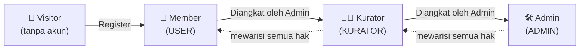

**Aturan pewarisan:** `ADMIN ⊃ KURATOR ⊃ USER`. Satu akun hanya memiliki **satu** role (bukan multi-role) untuk menjaga kesederhanaan.

### 4.3 Permission Matrix (normatif)

Legenda: ✅ boleh · ⚠️ boleh dengan syarat · ❌ tidak boleh

| Kemampuan | Visitor | USER | KURATOR | ADMIN |
|---|:--:|:--:|:--:|:--:|
| **Konten Publik** |||||
| Membaca artikel terbit | ✅ | ✅ | ✅ | ✅ |
| Melihat katalog & detail buku | ✅ | ✅ | ✅ | ✅ |
| Melihat event & detailnya | ✅ | ✅ | ✅ | ✅ |
| Melihat halaman statis & kontributor | ✅ | ✅ | ✅ | ✅ |
| Search global | ✅ | ✅ | ✅ | ✅ |
| Melihat profil publik user lain | ✅ | ✅ | ✅ | ✅ |
| **Interaksi** |||||
| Menulis komentar | ❌ | ✅ | ✅ | ✅ |
| Mengedit komentar sendiri (≤15 menit) | ❌ | ✅ | ✅ | ✅ |
| Menghapus komentar sendiri | ❌ | ✅ | ✅ | ✅ |
| Melaporkan komentar | ❌ | ✅ | ✅ | ✅ |
| Menyembunyikan/menghapus komentar orang lain | ❌ | ❌ | ✅ | ✅ |
| Kirim Surat Pembaca | ❌ | ✅ | ✅ | ✅ |
| **Menulis** |||||
| Membuat & menyimpan draft artikel | ❌ | ✅ | ✅ | ✅ |
| Submit artikel untuk review | ❌ | ✅ | ✅ | ✅ |
| Mengedit artikel sendiri saat `DRAFT`/`REVISION` | ❌ | ✅ | ✅ | ✅ |
| Mengedit artikel sendiri setelah `PUBLISHED` | ❌ | ⚠️ ajukan revisi | ✅ | ✅ |
| Menerbitkan artikel langsung (tanpa review) | ❌ | ❌ | ✅ | ✅ |
| Mengedit artikel orang lain | ❌ | ❌ | ✅ | ✅ |
| Menghapus artikel orang lain | ❌ | ❌ | ❌ | ✅ |
| **Kurasi** |||||
| Melihat antrean review | ❌ | ❌ | ✅ | ✅ |
| Approve / Request Revision / Reject | ❌ | ❌ | ✅ | ✅ |
| Menandai artikel `FEATURED` | ❌ | ❌ | ✅ | ✅ |
| Mengelola kategori & tag | ❌ | ❌ | ✅ | ✅ |
| Moderasi Surat Pembaca | ❌ | ❌ | ✅ | ✅ |
| **Perpustakaan** |||||
| Mengajukan peminjaman | ❌ | ⚠️ jika tidak diblokir | ✅ | ✅ |
| Membatalkan pengajuan sendiri (status `PENDING`) | ❌ | ✅ | ✅ | ✅ |
| Melihat riwayat pinjam sendiri | ❌ | ✅ | ✅ | ✅ |
| Approve/Reject pengajuan pinjam | ❌ | ❌ | ❌ | ✅ |
| Konfirmasi pengambilan & pengembalian | ❌ | ❌ | ❌ | ✅ |
| CRUD buku & eksemplar | ❌ | ❌ | ❌ | ✅ |
| Melihat data peminjam (nama, kontak) | ❌ | ❌ | ❌ | ✅ |
| **Event** |||||
| Mendaftar event | ❌ | ✅ | ✅ | ✅ |
| Membatalkan pendaftaran sendiri | ❌ | ✅ | ✅ | ✅ |
| CRUD event | ❌ | ❌ | ⚠️ event miliknya | ✅ |
| Check-in peserta | ❌ | ❌ | ✅ | ✅ |
| **Sistem** |||||
| Mengelola profil sendiri | ❌ | ✅ | ✅ | ✅ |
| Mengelola user & role | ❌ | ❌ | ❌ | ✅ |
| Menonaktifkan / suspend akun | ❌ | ❌ | ❌ | ✅ |
| CMS halaman statis | ❌ | ❌ | ❌ | ✅ |
| Mengelola badge | ❌ | ❌ | ❌ | ✅ |
| Melihat dashboard KPI penuh | ❌ | ❌ | ⚠️ KPI konten | ✅ |
| Konfigurasi sistem (`Setting`) | ❌ | ❌ | ❌ | ✅ |
| Melihat audit log | ❌ | ❌ | ❌ | ✅ |

> **FR-RBAC-01 (WAJIB):** Seluruh baris pada matriks di atas HARUS divalidasi di **server**. Menyembunyikan tombol di frontend bukan otorisasi.
> **FR-RBAC-02 (WAJIB):** Role tidak boleh diambil dari body request atau localStorage; hanya dari session/JWT yang diverifikasi server.
> **FR-RBAC-03 (WAJIB):** Setiap kegagalan otorisasi mengembalikan `403` dan dicatat di audit log, tanpa membocorkan keberadaan resource (gunakan `404` untuk resource privat milik orang lain).

### 4.4 Catatan Peran "Pustakawan"

Pada v3, seluruh operasi perpustakaan (approve pinjam, serah terima, CRUD buku) melekat pada **ADMIN**. Peran terpisah `PUSTAKAWAN` **tidak** dibuat sekarang untuk menghindari kompleksitas RBAC pada tim relawan kecil.

**Trigger untuk membuatnya di v4:** jika jumlah relawan yang mengurus buku > 3 orang, atau jika ada kebutuhan membatasi relawan agar tidak bisa mengubah role user lain.

---

## 5. Information Architecture & Routing

### 5.1 Sitemap

```mermaid
flowchart TD
    HOME["🏠 Home /"]

    HOME --> ART["📄 Artikel /artikel"]
    HOME --> LIB["📚 Perpustakaan /buku"]
    HOME --> COM["🤝 Komunitas"]
    HOME --> EVT["📅 Kegiatan /kegiatan"]
    HOME --> SRC["🔍 Search /cari"]
    HOME --> AUTH["🔐 Auth"]
    HOME --> DASH["📊 Dashboard"]

    ART --> ART1["Semua Artikel"]
    ART --> ART2["Per Kategori /artikel/kategori/:slug"]
    ART --> ART3["Detail /artikel/:slug"]

    LIB --> LIB1["Koleksi /buku"]
    LIB --> LIB2["Detail /buku/:slug"]
    LIB --> LIB3["Cara Meminjam /cara-meminjam"]

    COM --> COM1["Tentang /tentang"]
    COM --> COM2["Surat Pembaca /surat-pembaca"]
    COM --> COM3["Kontributor /kontributor"]
    COM --> COM4["Profil Publik /u/:username"]

    EVT --> EVT1["Daftar Event"]
    EVT --> EVT2["Detail /kegiatan/:slug"]

    AUTH --> AU1["Login"]
    AUTH --> AU2["Register"]
    AUTH --> AU3["Lupa/Reset Password"]
    AUTH --> AU4["Verifikasi Email"]

    DASH --> D1["👤 User /dashboard"]
    DASH --> D2["🧑‍🏫 Kurator /kurator"]
    DASH --> D3["🛠️ Admin /admin"]
```

### 5.2 Tabel Routing Lengkap

Kolom **Render**: `SSG` = static, `ISR` = incremental static regeneration, `SSR` = server-rendered, `CSR` = client-side.

#### Publik

| Route | Halaman | Render | Auth | Catatan |
|---|---|---|---|---|
| `/` | Home | ISR 300s | — | 10 seksi, lihat §8.1 |
| `/artikel` | Daftar artikel | ISR 300s | — | Paginasi 12/hal |
| `/artikel/kategori/:slug` | Artikel per kategori | ISR 600s | — | |
| `/artikel/tag/:slug` | Artikel per tag | ISR 600s | — | P1 |
| `/artikel/:slug` | Detail artikel | ISR 60s | — | Komentar di-fetch client |
| `/buku` | Katalog buku | SSR | — | Filter via query param |
| `/buku/:slug` | Detail buku | ISR 60s | — | Ketersediaan di-fetch live |
| `/kegiatan` | Daftar event | ISR 300s | — | |
| `/kegiatan/:slug` | Detail event | ISR 60s | — | |
| `/surat-pembaca` | Daftar surat pembaca | ISR 300s | — | |
| `/surat-pembaca/:slug` | Detail surat | ISR 300s | — | |
| `/kontributor` | Daftar kontributor | ISR 3600s | — | Urut jumlah artikel terbit |
| `/u/:username` | Profil publik | SSR | — | Menghormati setting privasi |
| `/cari` | Hasil pencarian | SSR | — | `?q=&type=&kategori=` |
| `/tentang`, `/sejarah`, `/kontak`, `/cara-meminjam`, `/faq`, `/ketentuan`, `/kebijakan-privasi` | Halaman CMS | ISR 3600s | — | Dari tabel `Page` |
| `/sitemap.xml`, `/robots.txt`, `/rss.xml` | Metadata | SSG/dinamis | — | |

#### Autentikasi

| Route | Halaman | Auth | Catatan |
|---|---|---|---|
| `/masuk` | Login | Guest only | Redirect ke `?next=` |
| `/daftar` | Register | Guest only | |
| `/lupa-password` | Minta reset | Guest only | Rate limited |
| `/reset-password?token=` | Set password baru | Token | Token 1 jam, sekali pakai |
| `/verifikasi?token=` | Verifikasi email | Token | Token 24 jam |

#### Dashboard User (`/dashboard`, role: USER+)

| Route | Halaman | Isi |
|---|---|---|
| `/dashboard` | Ringkasan | Pinjaman aktif, status tulisan, event terdaftar, badge terbaru |
| `/dashboard/tulisan` | Daftar tulisan saya | Filter per status |
| `/dashboard/tulisan/baru` | Editor baru | TipTap |
| `/dashboard/tulisan/:id/edit` | Editor edit | Hanya `DRAFT`/`REVISION` |
| `/dashboard/pinjaman` | Pinjaman & riwayat | Tab: Aktif / Riwayat |
| `/dashboard/kegiatan` | Event saya | Termasuk e-tiket/kode hadir |
| `/dashboard/notifikasi` | Pusat notifikasi | |
| `/dashboard/badge` | Koleksi badge | Termasuk badge terkunci |
| `/dashboard/profil` | Edit profil | Avatar, bio, privasi |
| `/dashboard/keamanan` | Ganti password, sesi | |

#### Dashboard Kurator (`/kurator`, role: KURATOR+)

| Route | Halaman |
|---|---|
| `/kurator` | Ringkasan antrean & KPI konten |
| `/kurator/review` | Antrean review (tab: Menunggu / Revisi / Disetujui / Terbit) |
| `/kurator/review/:id` | Layar review artikel |
| `/kurator/komentar` | Moderasi komentar (tab: Menunggu / Dilaporkan / Disembunyikan) |
| `/kurator/surat-pembaca` | Moderasi surat pembaca |
| `/kurator/kategori` | Kelola kategori & tag |

#### Dashboard Admin (`/admin`, role: ADMIN)

| Route | Halaman |
|---|---|
| `/admin` | Dashboard KPI |
| `/admin/artikel` | Kelola semua artikel |
| `/admin/buku` | Kelola buku |
| `/admin/buku/:id/eksemplar` | Kelola eksemplar |
| `/admin/pinjaman` | Kelola peminjaman (tab per status) |
| `/admin/pinjaman/pickup` | **Mode Lapak** — input kode pengambilan/pengembalian |
| `/admin/kegiatan` | Kelola event |
| `/admin/kegiatan/:id/peserta` | Peserta & check-in |
| `/admin/pengguna` | Kelola user & role |
| `/admin/halaman` | CMS halaman statis |
| `/admin/badge` | Kelola badge |
| `/admin/media` | Media library |
| `/admin/pengaturan` | Konfigurasi sistem |
| `/admin/audit-log` | Audit log |

### 5.3 Aturan Navigasi

- **Header (desktop):** Logo · Artikel · Perpustakaan · Kegiatan · Komunitas ▾ · 🔍 · [Masuk] / Avatar ▾
- **Header (mobile):** Logo · 🔍 · ☰ (drawer)
- **FR-NAV-01:** Item navigasi aktif WAJIB ditandai visual dan `aria-current="page"`.
- **FR-NAV-02:** Setelah login, tombol "Masuk" berganti avatar dengan menu: Dashboard, Tulisan Saya, Pinjaman, Notifikasi (dengan badge angka), Profil, Keluar. Kurator/Admin mendapat item tambahan menuju panelnya.
- **FR-NAV-03:** Breadcrumb WAJIB ada di halaman detail (artikel, buku, event) dan di seluruh dashboard.
- **FR-NAV-04:** Jika user tanpa akses membuka route dashboard yang bukan haknya → redirect ke `/dashboard` dengan toast "Kamu tidak punya akses ke halaman itu." (bukan halaman 403 telanjang).

---

## 6. User Flows (Diagram)

Bagian ini adalah inti dokumen: setiap alur utama digambarkan lengkap dengan cabang gagal, bukan hanya happy path.

### 6.1 Flow Global — Perjalanan Pengunjung Pertama

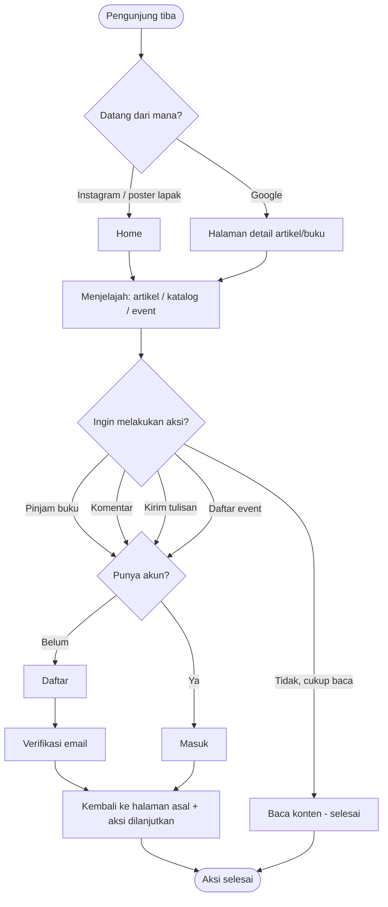

> **FR-FLOW-01 (WAJIB):** Ketika visitor menekan aksi yang butuh login, sistem menyimpan tujuan (`?next=`) **dan** konteks aksi, lalu mengembalikan user tepat ke titik semula setelah login. Dilarang membuang user ke Home.

### 6.2 Flow — Registrasi & Verifikasi Email

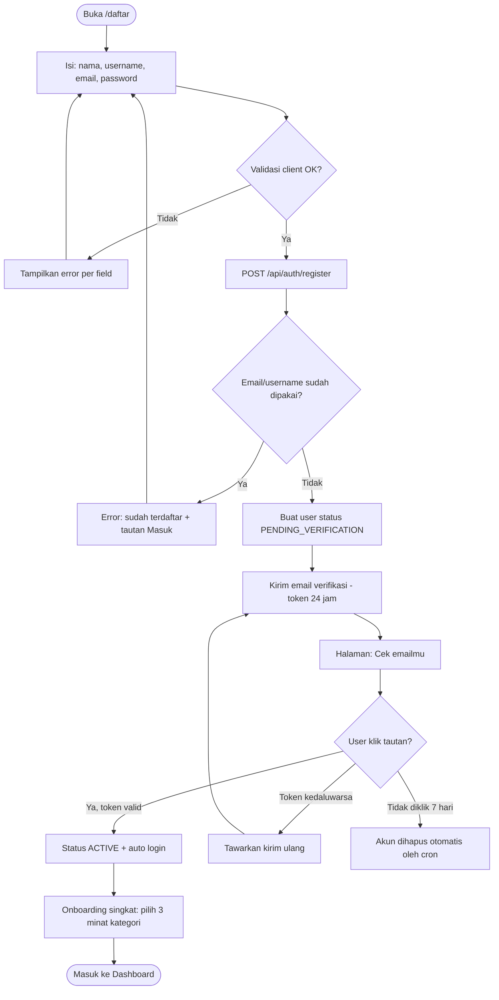

**BR-AUTH-01:** Sebelum email diverifikasi, akun **boleh** login dan membaca, tetapi **tidak boleh** berkomentar, mengirim tulisan, mengajukan pinjaman, atau mendaftar event. Banner persisten mengingatkan untuk verifikasi.
**BR-AUTH-02:** Maksimal 3 kali kirim ulang email verifikasi per jam per akun.

### 6.3 Flow — Login & Lupa Password

```mermaid
flowchart TD
    A([/masuk]) --> B[Isi email + password]
    B --> C{Kredensial valid?}
    C -->|Ya| D{Status akun?}
    D -->|ACTIVE / PENDING_VERIFICATION| E[Buat sesi] --> F([Redirect ke next atau /dashboard])
    D -->|SUSPENDED| G[Tolak: akun ditangguhkan + kontak pengurus]
    D -->|DELETED| H[Pesan generik: kredensial salah]
    C -->|Tidak| I[Error generik + hitung percobaan gagal]
    I --> J{"Gagal 5 kali atau lebih dalam 15 menit?"}
    J -->|Ya| K[Kunci 15 menit + kirim email peringatan]
    J -->|Tidak| B

    B -.->|Lupa password| L[/lupa-password]
    L --> M[Isi email] --> N[Selalu tampilkan pesan sama: tautan dikirim jika email terdaftar]
    N --> O{Email terdaftar?}
    O -->|Ya| P[Kirim tautan reset - token 1 jam sekali pakai]
    O -->|Tidak| Q[Tidak mengirim apa pun]
    P --> R[/reset-password] --> S[Set password baru] --> T[Invalidasi semua sesi lain] --> A
```

**BR-AUTH-03:** Pesan error login WAJIB generik ("Email atau password salah") untuk mencegah enumerasi akun.
**BR-AUTH-04:** Reset password WAJIB mencabut seluruh sesi aktif lain dan mengirim email notifikasi.

### 6.4 Flow — Menulis & Mengirim Tulisan (Member)

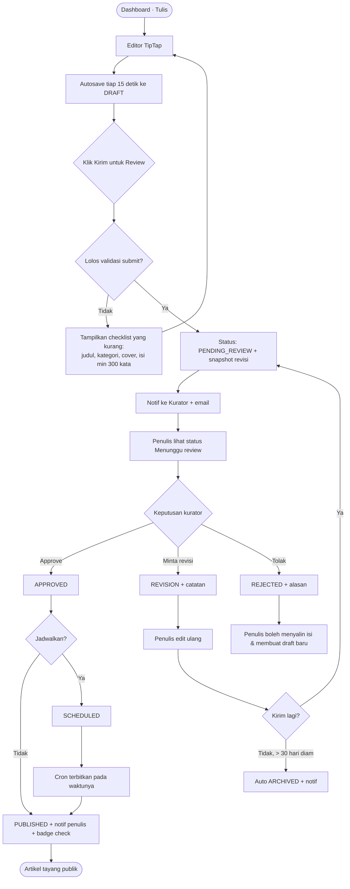

**BR-WRITE-01:** Selama `PENDING_REVIEW` / `APPROVED`, artikel **terkunci** dari pengeditan penulis. Penulis hanya bisa **menarik kembali** (withdraw) selama belum disentuh kurator; setelah kurator membuka dan mengunci review, withdraw ditolak.
**BR-WRITE-02:** Setiap transisi status menyimpan satu `ArticleRevision` (snapshot konten + siapa + kapan + catatan).
**BR-WRITE-03:** Artikel `REJECTED` tidak dihapus; tetap terlihat oleh penulisnya di dashboard sebagai arsip.

### 6.5 Flow — Kurasi (Kurator)

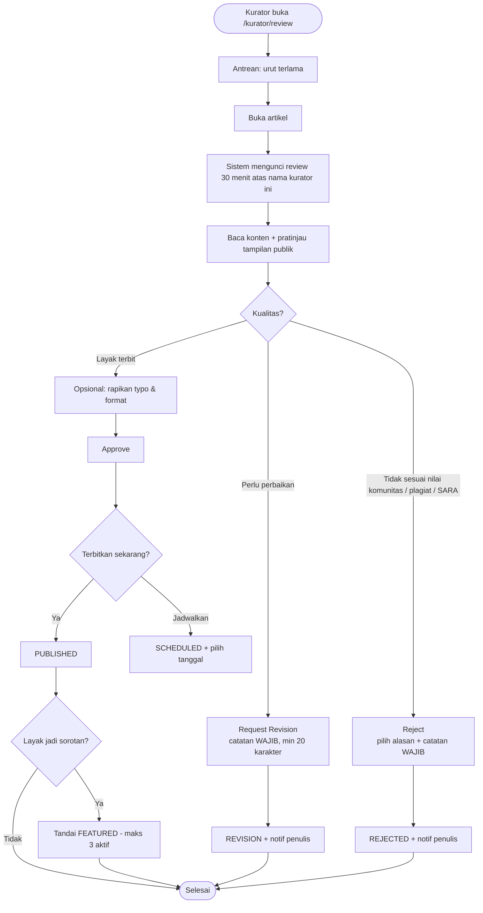

**BR-CUR-01:** Kurator **tidak boleh** mereview artikel yang ditulisnya sendiri. Sistem menyembunyikannya dari antrean dan menolak aksi di server.
**BR-CUR-02:** Catatan revisi/penolakan bersifat **wajib**; approve boleh tanpa catatan.
**BR-CUR-03:** Kunci review otomatis lepas setelah 30 menit tanpa aktivitas, agar tidak macet.
**BR-CUR-04 (SLA):** Artikel yang menunggu > 7 hari ditandai merah di antrean dan dikirimi pengingat harian ke seluruh kurator.

### 6.6 Flow — Peminjaman Buku (End-to-End)

Ini adalah alur paling kompleks karena menyeberang dari online ke offline.

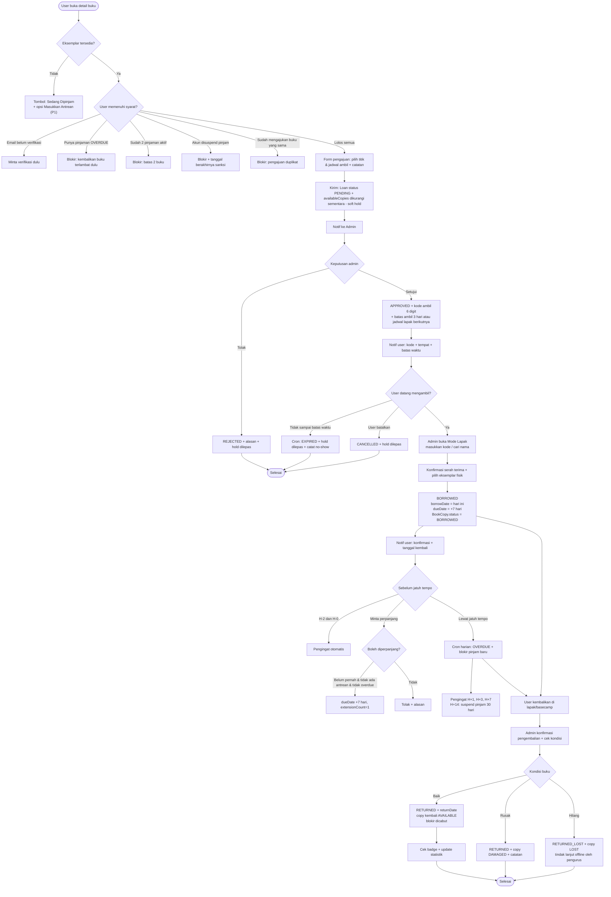

#### Sequence Diagram — Pengajuan sampai Serah Terima

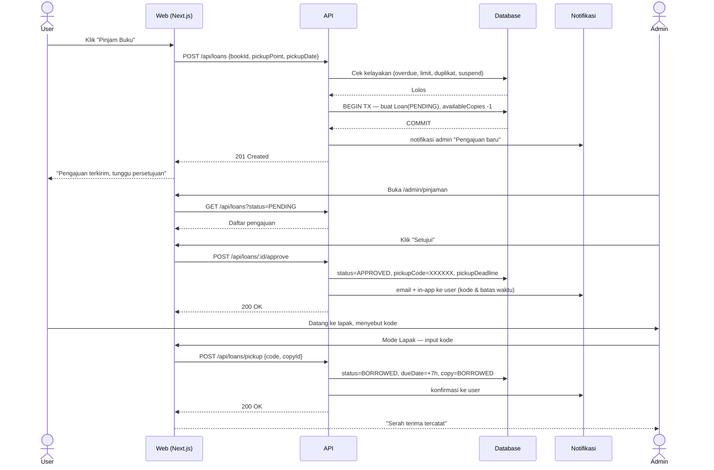

### 6.7 Flow — Pendaftaran Event

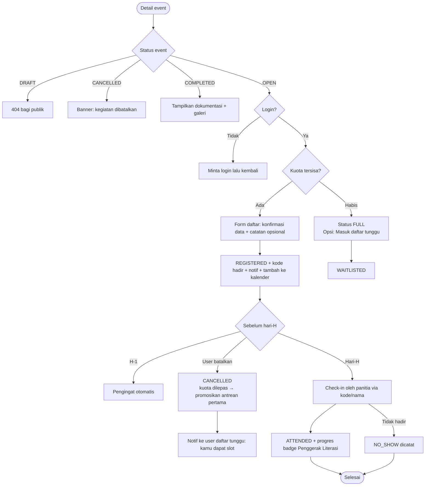

### 6.8 Flow — Komentar (Native, dengan moderasi)

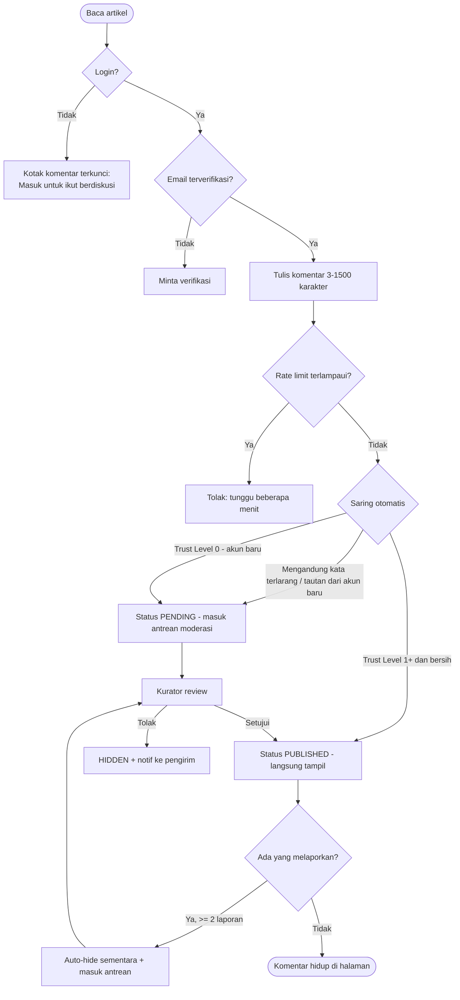

### 6.9 Flow — Admin Menambah Buku

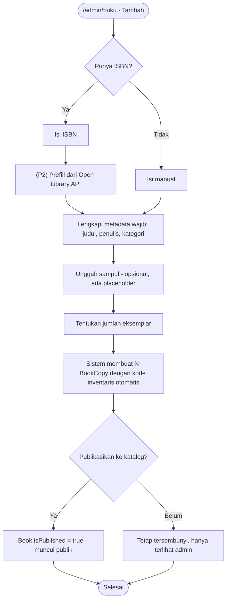

### 6.10 Flow — Surat Pembaca

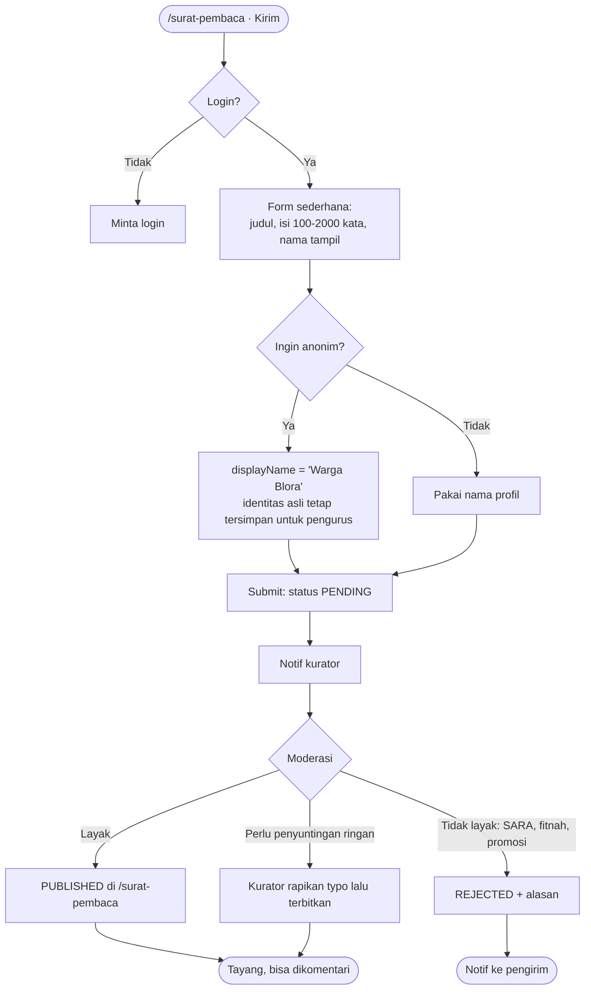

> **Perbedaan Surat Pembaca vs Artikel:** Surat Pembaca adalah **plain text pendek** (tanpa TipTap, tanpa gambar, tanpa kategori), alur satu langkah (terbit/tolak, tanpa siklus revisi), dan tidak masuk hitungan badge penulis. Artikel adalah karya panjang bergambar dengan siklus revisi.

### 6.11 Flow — Pengingat Otomatis (Cron / Scheduled Jobs)

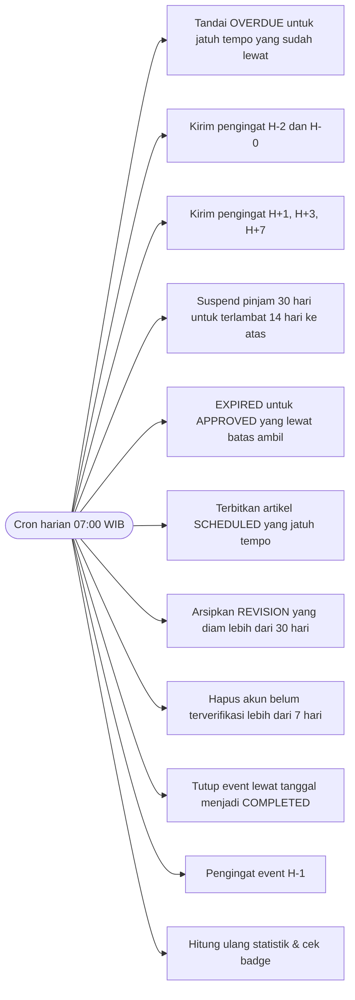

**FR-CRON-01:** Seluruh job WAJIB idempoten — dijalankan dua kali tidak boleh menghasilkan efek ganda (mis. notifikasi dobel).
**FR-CRON-02:** Setiap eksekusi job dicatat (nama job, durasi, jumlah record terproses, error).
**FR-CRON-03:** Zona waktu sistem tetap **Asia/Jakarta (WIB)**; seluruh perbandingan tanggal jatuh tempo memakai batas hari WIB.

---

## 7. Modul: Authentication & Akun

**Prioritas:** P0 · **Fase:** 1

### 7.1 Metode Autentikasi

| Metode | Status v3 | Catatan |
|---|---|---|
| Email + Password | ✅ Wajib | Metode utama |
| Google OAuth | 🟡 SEBAIKNYA | Menurunkan friksi registrasi; murah diimplementasikan lewat Auth.js |
| Magic link | ❌ Tidak | Menambah beban email & kebingungan |
| GitHub OAuth | ❌ Tidak | Audiens tidak memakai GitHub (lihat ADR-001) |

### 7.2 Field & Validasi

| Field | Tipe | Wajib | Aturan Validasi | Pesan Error |
|---|---|:--:|---|---|
| `name` | string | ✅ | 2–60 karakter, huruf/spasi/titik/apostrof | "Nama minimal 2 karakter." |
| `username` | string | ✅ | 3–20, `a-z0-9_`, unik, tidak boleh kata terlarang/`admin` | "Username sudah dipakai." |
| `email` | string | ✅ | Format email valid, unik, lowercase, max 120 | "Format email tidak valid." |
| `password` | string | ✅ | Min 8 karakter, mengandung huruf & angka, tidak sama dengan email/username, cek daftar 1000 password umum | "Password minimal 8 karakter dan mengandung angka." |
| `passwordConfirm` | string | ✅ | Sama dengan `password` | "Konfirmasi password tidak cocok." |
| `agreeTerms` | boolean | ✅ | Harus `true` | "Kamu perlu menyetujui ketentuan." |

**FR-AUTH-01:** Password WAJIB di-hash dengan **bcrypt (cost ≥ 12)** atau argon2id. Password plaintext dilarang masuk log, error message, atau analytics.
**FR-AUTH-02:** Indikator kekuatan password ditampilkan saat mengetik (lemah/sedang/kuat).
**FR-AUTH-03:** Username tidak dapat diubah dalam 30 hari setelah perubahan terakhir (mencegah impersonasi).
**FR-AUTH-04:** Sesi berlaku 30 hari dengan sliding expiration; "Ingat saya" tidak memperpanjang lebih jauh.
**FR-AUTH-05:** Halaman `/dashboard/keamanan` menampilkan daftar sesi aktif (perangkat, lokasi kasar, terakhir aktif) dengan tombol "Keluarkan".

### 7.3 Status Akun

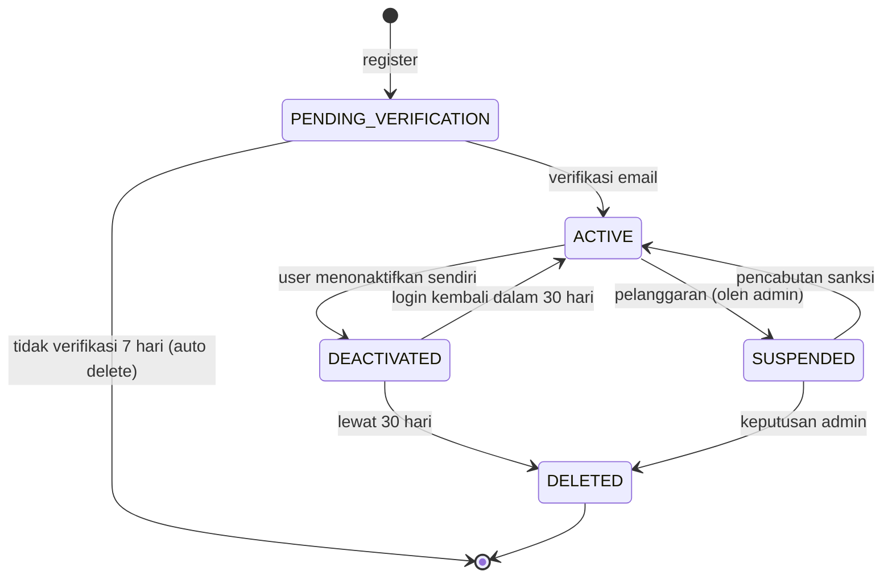

**BR-AUTH-05:** `DELETED` bersifat **soft delete + anonimisasi**: nama menjadi "Pengguna Dihapus", email di-hash, avatar dihapus. Artikel yang sudah terbit **tetap tayang** dengan atribusi anonim, karena menghapusnya merusak arsip komunitas. Ketentuan ini WAJIB tertulis di Kebijakan Privasi.
**BR-AUTH-06:** Akun dengan pinjaman aktif **tidak dapat** dinonaktifkan sampai buku dikembalikan.

### 7.4 Acceptance Criteria

- `AC-AUTH-01` — Mendaftar dengan email yang sudah ada menampilkan error jelas + tautan ke halaman masuk, bukan error 500.
- `AC-AUTH-02` — Tautan verifikasi kedaluwarsa menampilkan halaman ramah dengan tombol "Kirim ulang".
- `AC-AUTH-03` — Setelah 5 kegagalan login dalam 15 menit, percobaan ke-6 ditolak dengan pesan "Terlalu banyak percobaan, coba lagi dalam 15 menit."
- `AC-AUTH-04` — Token reset password hanya bisa dipakai sekali; penggunaan kedua ditolak.
- `AC-AUTH-05` — Seluruh form auth dapat diselesaikan penuh dengan keyboard dan terbaca screen reader.
- `AC-AUTH-06` — Mengakses `/admin` sebagai USER tidak pernah memuat data admin, bahkan sesaat (dicegat di server, bukan di `useEffect`).

---

## 8. Modul: Blog & Artikel

**Prioritas:** P0 · **Fase:** 2

### 8.1 Homepage

Homepage adalah etalase utama. Urutan seksi bersifat normatif:

| # | Seksi | Isi | Aturan |
|---|---|---|---|
| 1 | Header | Navigasi + search + auth | Sticky di desktop, tidak sticky di mobile |
| 2 | Hero | Tagline "Membaca dan Berbahagia." + subjudul 1 kalimat + CTA **Jelajahi Koleksi** & **Baca Artikel** | Tanpa gambar berat; LCP < 2,5 detik |
| 3 | Featured Articles | 1 artikel utama besar + 2 pendamping | Ambil `isFeatured=true`, fallback 3 terbaru |
| 4 | Latest Articles | 6 artikel terbaru | Tautan "Lihat semua" |
| 5 | Book Highlights | 6 buku: 3 terbaru + 3 paling sering dipinjam | Tampilkan status ketersediaan |
| 6 | Tentang Perpusjal | Paragraf singkat + 3 angka: jumlah koleksi, kontributor, kegiatan | Angka dihitung nyata dari DB, di-cache 1 jam |
| 7 | Upcoming Events | Maks 3 event mendatang | Sembunyikan seksi jika kosong |
| 8 | Community CTA | "Kirim tulisanmu" / "Jadi relawan" | |
| 9 | Newsletter | Input email + persetujuan | P2; sembunyikan jika belum diaktifkan |
| 10 | Footer | Navigasi, kontak, sosmed, jadwal lapak, hak cipta | Jadwal lapak dikelola lewat `Setting` |

**FR-HOME-01:** Jika belum ada artikel/buku/event, seksi terkait menampilkan empty state yang mengundang (lihat §33), bukan area kosong.

### 8.2 Daftar Artikel

**Menampilkan per kartu:** thumbnail (rasio 16:9), judul (maks 2 baris), excerpt (maks 2 baris), nama + avatar penulis, kategori, tanggal terbit, estimasi waktu baca.

| Fitur | Spesifikasi |
|---|---|
| Paginasi | 12 artikel/halaman, paginasi bernomor (bukan infinite scroll — lebih baik untuk SEO & data hemat) |
| Filter kategori | Chip horizontal, multi-pilih tunggal, sinkron dengan URL `?kategori=` |
| Urutan | Terbaru (default), Terpopuler (30 hari), Terlama |
| Pencarian | Kotak cari dalam halaman, mengarah ke `/cari?type=artikel` |
| Featured | Artikel unggulan tampil di atas dengan penanda |

**FR-ART-01:** Estimasi waktu baca dihitung saat simpan dengan asumsi **200 kata/menit**, dibulatkan ke atas, minimum "1 menit baca".
**FR-ART-02:** Excerpt diambil dari field `excerpt`; jika kosong, dihasilkan otomatis dari 160 karakter pertama konten tanpa markup.
**FR-ART-03:** Seluruh state filter & halaman WAJIB tercermin di URL agar bisa di-bookmark dan di-share.

### 8.3 Detail Artikel

**Susunan halaman (atas → bawah):**
1. Breadcrumb
2. Kategori (chip) + judul (H1) + subjudul opsional
3. Meta: avatar & nama penulis (tautan ke profil) · tanggal terbit · waktu baca · jumlah dibaca
4. Cover image (dengan caption & kredit opsional)
5. Konten artikel (lebar teks maks **68 karakter**, font Lora 18–19px)
6. Tombol bagikan (WhatsApp, Facebook, X, Salin tautan)
7. Kartu penulis (avatar, bio, tautan "Tulisan lainnya")
8. Tag
9. Artikel terkait (3, kategori sama, fallback terbaru)
10. Komentar (§11)

**FR-ART-04:** Artikel dengan status selain `PUBLISHED` mengembalikan **404** bagi publik, kecuali diakses oleh penulisnya, kurator, atau admin, yang melihat **banner pratinjau** bertuliskan status saat ini.
**FR-ART-05:** Tautan pratinjau rahasia (`?preview=<token>`) SEBAIKNYA tersedia agar penulis bisa membagikan draf ke kurator lewat WhatsApp. Token kedaluwarsa 7 hari.
**FR-ART-06:** Penghitung dibaca (`viewCount`) bertambah maksimal **1 kali per pengunjung per artikel per 24 jam** (berdasarkan cookie/user id), dan tidak dihitung untuk penulis sendiri.
**FR-ART-07:** Daftar isi otomatis (TOC) dari H2/H3 ditampilkan di sisi kanan untuk artikel > 1200 kata pada layar ≥ 1280px. (P1)

### 8.4 Struktur Data Artikel (field level)

| Field | Tipe | Wajib | Aturan |
|---|---|:--:|---|
| `title` | string | ✅ | 10–120 karakter |
| `slug` | string | ✅ | auto dari judul, unik, immutable setelah terbit |
| `subtitle` | string | — | maks 160 karakter |
| `excerpt` | text | — | maks 300 karakter |
| `content` | JSON (TipTap) | ✅ | min 300 kata untuk submit |
| `coverImage` | url | ✅ saat submit | rasio 16:9, maks 2 MB, jpg/png/webp |
| `coverCredit` | string | — | maks 120 karakter |
| `categoryId` | fk | ✅ | tepat satu kategori |
| `tags` | fk[] | — | maks 5 tag |
| `authorId` | fk | ✅ | diisi server, tidak dari client |
| `status` | enum | ✅ | lihat §8.5 |
| `publishedAt` | datetime | — | diisi saat `PUBLISHED` |
| `scheduledAt` | datetime | — | wajib jika `SCHEDULED`, harus di masa depan |
| `isFeatured` | boolean | ✅ | default `false`, maks 3 aktif |
| `readingTime` | int | ✅ | dihitung sistem |
| `viewCount` | int | ✅ | default 0 |
| `seoTitle` | string | — | maks 60 karakter, fallback ke `title` |
| `seoDescription` | string | — | maks 160 karakter, fallback ke `excerpt` |
| `ogImage` | url | — | fallback ke `coverImage`, lalu ke OG default |
| `allowComments` | boolean | ✅ | default `true` |

### 8.5 State Machine Artikel

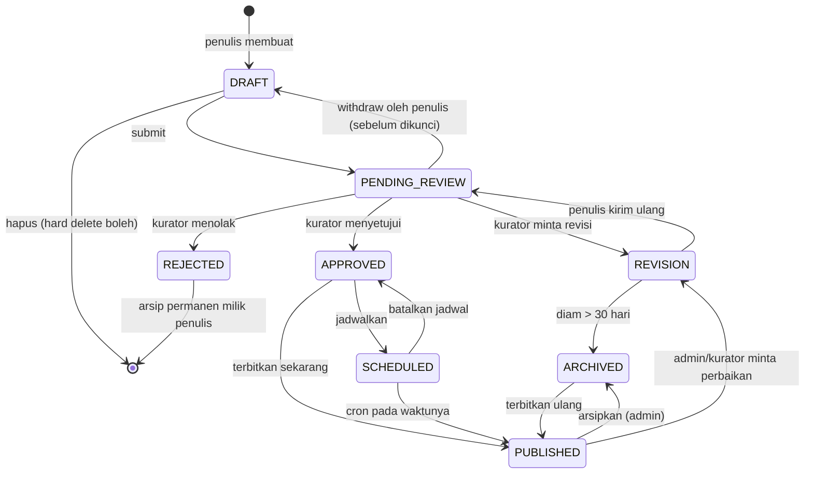

**Tabel transisi yang sah (server WAJIB menolak selain ini):**

| Dari | Ke | Siapa |
|---|---|---|
| `DRAFT` | `PENDING_REVIEW` | Penulis |
| `DRAFT` | `PUBLISHED` | Kurator/Admin (tulisan internal) |
| `PENDING_REVIEW` | `DRAFT` | Penulis (jika belum dikunci) |
| `PENDING_REVIEW` | `REVISION` / `REJECTED` / `APPROVED` | Kurator/Admin |
| `REVISION` | `PENDING_REVIEW` | Penulis |
| `REVISION` | `ARCHIVED` | Sistem (cron) |
| `APPROVED` | `PUBLISHED` / `SCHEDULED` | Kurator/Admin |
| `SCHEDULED` | `PUBLISHED` | Sistem (cron) |
| `SCHEDULED` | `APPROVED` | Kurator/Admin |
| `PUBLISHED` | `ARCHIVED` / `REVISION` | Admin (Kurator hanya `REVISION`) |
| `ARCHIVED` | `PUBLISHED` | Admin |

### 8.6 Acceptance Criteria

- `AC-ART-01` — Membuka URL artikel `DRAFT` sebagai orang lain menghasilkan 404, bukan 403 (tidak membocorkan keberadaannya).
- `AC-ART-02` — Mengubah `?kategori=` di URL dan me-refresh menghasilkan hasil filter yang sama persis.
- `AC-ART-03` — Artikel tanpa cover tetap tampil rapi dengan placeholder bertema Perpusjal.
- `AC-ART-04` — Artikel `SCHEDULED` otomatis terbit paling lambat 10 menit setelah `scheduledAt`.
- `AC-ART-05` — Memuat `/artikel` pada koneksi 3G lambat menampilkan konten utama < 5 detik.
- `AC-ART-06` — Maksimal 3 artikel `isFeatured`; mencoba menandai yang keempat menolak dengan pesan jelas.

---

## 9. Modul: Editor & Submission

**Prioritas:** P0 · **Fase:** 2

### 9.1 Editor (TipTap)

**Toolbar minimum (WAJIB v3):**

| Kelompok | Tombol |
|---|---|
| Teks | Paragraf, Heading 2, Heading 3 |
| Format | Bold, Italic, Strikethrough, Link |
| Blok | Kutipan, Daftar berpoin, Daftar bernomor, Pembatas, Blok kode |
| Media | Sisipkan gambar |
| Riwayat | Undo, Redo |

**Future (P2):** tabel, embed YouTube, caption gambar, tempel Markdown, mode fokus, hitung kata langsung.

**FR-EDT-01:** Autosave setiap **15 detik** jika ada perubahan, dan saat blur. Indikator status: "Menyimpan…" / "Tersimpan 14.32".
**FR-EDT-02:** Menutup tab dengan perubahan belum tersimpan memunculkan konfirmasi browser.
**FR-EDT-03:** Menempelkan teks dari Word/Google Docs WAJIB dibersihkan dari gaya inline; hanya struktur (heading, bold, italic, list, link) yang dipertahankan.
**FR-EDT-04:** Unggah gambar: drag & drop dan klik. Maks **2 MB**, format jpg/png/webp. Kompresi & konversi ke WebP di Cloudinary. Progress bar wajib.
**FR-EDT-05:** Konten disimpan sebagai **JSON TipTap** (bukan HTML mentah). Render ke HTML dilakukan server-side dan disanitasi.
**FR-EDT-06:** Editor menampilkan hitungan kata dan estimasi waktu baca secara langsung.
**FR-EDT-07:** Editor harus dapat digunakan di layar 360px — toolbar menjadi baris yang dapat digulir horizontal, bukan terpotong.

### 9.2 Checklist Submit

Tombol "Kirim untuk Review" nonaktif sampai seluruh butir terpenuhi, dan checklist ditampilkan sebagai daftar terlihat (bukan error setelah klik):

- [ ] Judul 10–120 karakter
- [ ] Kategori dipilih
- [ ] Cover image terunggah
- [ ] Isi minimal 300 kata
- [ ] Tidak ada gambar yang gagal diunggah
- [ ] Menyetujui pernyataan orisinalitas

**BR-SUB-01:** Pernyataan orisinalitas WAJIB dicentang setiap kali submit: _"Saya menyatakan tulisan ini karya saya sendiri, dan sumber kutipan telah saya cantumkan."_ Tercatat di `ArticleRevision`.
**BR-SUB-02:** Maksimal **3 artikel** berstatus `PENDING_REVIEW` per user secara bersamaan, agar antrean tidak dibanjiri satu orang.
**BR-SUB-03:** Setelah submit, penulis melihat perkiraan waktu review: _"Biasanya ditinjau dalam 3–7 hari."_

### 9.3 Acceptance Criteria

- `AC-EDT-01` — Menulis 1000 kata lalu koneksi terputus: setelah kembali online, draft tetap utuh (autosave lokal + sinkron).
- `AC-EDT-02` — Menempelkan artikel dari Google Docs tidak menghasilkan `<span style="...">` di konten tersimpan.
- `AC-EDT-03` — Mengunggah gambar 5 MB ditolak dengan pesan ukuran maksimum, bukan gagal diam-diam.
- `AC-EDT-04` — Editor dapat dipakai penuh di iPhone SE (375px) tanpa scroll horizontal pada badan teks.

---

## 10. Modul: Kurasi (Curator Workflow)

**Prioritas:** P1 · **Fase:** 4

### 10.1 Antrean Review

Tab: **Menunggu (n)** · **Perlu Revisi** · **Disetujui** · **Terbit** · **Ditolak**

Kolom tabel: Judul · Penulis · Kategori · Jumlah kata · Dikirim (relatif, mis. "3 hari lalu") · Umur antrean (warna: hijau <3 hari, kuning 3–7, merah >7) · Aksi.

### 10.2 Layar Review

Tata letak dua kolom (desktop) / bertumpuk (mobile):
- **Kiri (70%):** konten artikel dalam tampilan pratinjau persis seperti publik.
- **Kanan (30%), sticky:** info penulis (jumlah tulisan terbit sebelumnya, tingkat penerimaan), metadata, riwayat revisi, kotak catatan, tombol aksi.

**Aksi:** `Setujui & Terbitkan` · `Setujui & Jadwalkan` · `Minta Revisi` · `Tolak` · `Simpan suntingan`

**FR-CUR-01:** Catatan revisi mendukung **template cepat** yang bisa disisipkan sekali klik:
- "Judul perlu dipertajam agar lebih spesifik."
- "Paragraf pembuka terlalu panjang; ringkas menjadi 2–3 kalimat."
- "Mohon cantumkan sumber untuk data/kutipan yang disebut."
- "Perlu perbaikan ejaan dan tanda baca (lihat bagian yang ditandai)."
- "Cover image kurang relevan/kualitas rendah."

**FR-CUR-02:** Kurator dapat menyunting langsung artikel saat review; seluruh suntingan tersimpan sebagai revisi atas nama kurator, dan penulis dapat melihat perbandingan versi (P2: diff visual).
**FR-CUR-03:** Alasan penolakan dipilih dari daftar terstruktur + catatan bebas: Plagiat · Mengandung SARA/ujaran kebencian · Promosi/iklan · Di luar tema literasi · Kualitas jauh di bawah standar · Lainnya.
**FR-CUR-04:** Riwayat keputusan (siapa, kapan, apa, catatan) tampil di panel kanan dan tidak dapat dihapus.

### 10.3 Acceptance Criteria

- `AC-CUR-01` — Kurator tidak menemukan artikel karyanya sendiri di antrean; percobaan `POST` approve artikel sendiri ditolak 403.
- `AC-CUR-02` — "Minta Revisi" tanpa catatan ditolak dengan pesan wajib isi.
- `AC-CUR-03` — Dua kurator membuka artikel yang sama: yang kedua melihat peringatan "Sedang ditinjau oleh Ayu sejak 5 menit lalu".
- `AC-CUR-04` — Setelah approve, penulis menerima notifikasi in-app dan email dalam < 1 menit.

---

## 11. Modul: Komentar Native

**Prioritas:** P1 · **Fase:** 2 (dasar) & 4 (moderasi lanjutan)

> **Perubahan dari v2:** Giscus **diganti** komentar native. Alasan lengkap di [ADR-001](#adr-001--komentar-native-menggantikan-giscus).

### 11.1 Kemampuan

| Kemampuan | v3 | Catatan |
|---|:--:|---|
| Komentar pada artikel | ✅ | |
| Komentar pada Surat Pembaca | ✅ | |
| Komentar pada buku/event | ❌ | Tidak perlu di v3 |
| Balasan | ✅ | Kedalaman **maksimal 1** (komentar → balasan). Balasan atas balasan tetap masuk thread yang sama dengan mention |
| Edit sendiri | ✅ | Jendela 15 menit, tampil label "diedit" |
| Hapus sendiri | ✅ | Soft delete: "Komentar ini dihapus oleh penulisnya" |
| Reaksi/like | 🟡 P2 | Satu jenis: 👍 |
| Mention `@username` | 🟡 P2 | Memicu notifikasi |
| Lampiran gambar | ❌ | Vektor penyalahgunaan, tidak sepadan |
| Markdown | ❌ | Plain text + tautan otomatis saja |

### 11.2 Anti-Spam: Trust Level

Karena komentar native memindahkan beban moderasi ke komunitas sendiri, sistem kepercayaan bertingkat WAJIB ada agar kurator tidak kewalahan.

| Level | Syarat naik level | Perilaku |
|---|---|---|
| **TL0 — Baru** | Default saat daftar | Semua komentar masuk **PENDING** (pre-moderasi). Tidak boleh menyisipkan tautan. Maks 3 komentar/hari |
| **TL1 — Terverifikasi** | Email terverifikasi **dan** 3 komentar disetujui **dan** akun ≥ 3 hari | Komentar **langsung tayang**. Tautan diperbolehkan tetapi memicu pre-moderasi |
| **TL2 — Tepercaya** | 15 komentar disetujui, 0 pelanggaran dalam 90 hari, atau punya ≥1 artikel terbit | Langsung tayang termasuk tautan. Laporan terhadapnya butuh 3 (bukan 2) untuk auto-hide |
| **TL-X — Dibatasi** | Ditetapkan admin setelah pelanggaran | Semua komentar PENDING selamanya, atau dilarang berkomentar |

**FR-CMT-01 (Rate limit):** Maks 5 komentar per 10 menit, dan jeda minimal 20 detik antar komentar, per user.
**FR-CMT-02 (Filter otomatis):** Komentar dicek terhadap daftar kata terlarang yang dapat dikelola admin. Kecocokan → `PENDING` (bukan langsung tolak, untuk menghindari salah tangkap).
**FR-CMT-03 (Pelaporan):** Setiap komentar punya menu "Laporkan" dengan alasan: Spam · Kasar/ujaran kebencian · Di luar topik · Informasi pribadi. Akumulasi laporan ≥ 2 (TL0/TL1) atau ≥ 3 (TL2) → otomatis `HIDDEN` + masuk antrean.
**FR-CMT-04:** Panjang 3–1500 karakter. Komentar berisi lebih dari 2 tautan otomatis `PENDING` apa pun levelnya.
**FR-CMT-05:** Penulis artikel menerima notifikasi setiap komentar baru di tulisannya (dapat dimatikan di pengaturan).
**FR-CMT-06:** Komentar dimuat lazily (setelah konten utama), 10 teratas dulu, dengan tombol "Muat lebih banyak".

### 11.3 State Machine Komentar

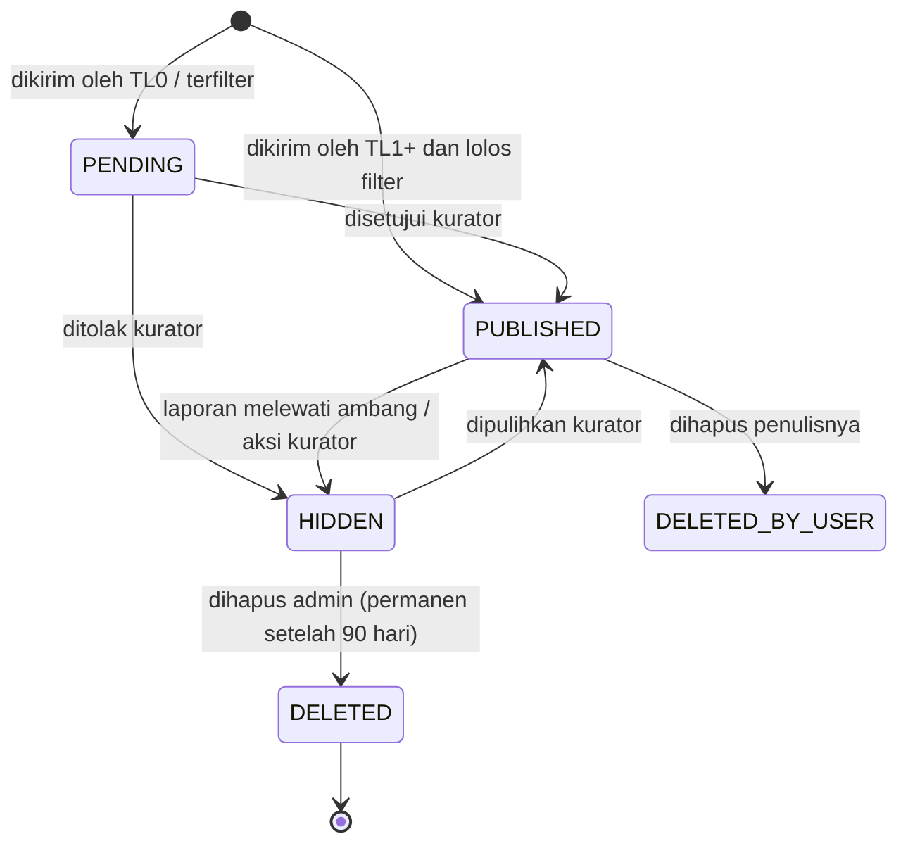

### 11.4 Antarmuka Moderasi

Tab: **Menunggu (n)** · **Dilaporkan (n)** · **Disembunyikan** · **Semua**
Aksi massal: pilih banyak → Setujui / Sembunyikan / Tandai spam.
Setiap baris menampilkan: isi komentar, penulis + trust level, konteks (judul artikel + tautan), waktu, alasan masuk antrean.

**FR-CMT-07:** Dari antrean, kurator dapat langsung menurunkan trust level user ke **TL-X** dalam satu klik.
**FR-CMT-08:** Menyembunyikan komentar induk otomatis menyembunyikan balasannya.

### 11.5 Acceptance Criteria

- `AC-CMT-01` — Visitor melihat komentar yang ada, tetapi kotak tulis tergantikan ajakan masuk.
- `AC-CMT-02` — Komentar dari akun baru tidak muncul publik sampai disetujui, tetapi **terlihat oleh penulisnya** dengan label "Menunggu moderasi".
- `AC-CMT-03` — Mengirim 6 komentar dalam 10 menit: yang keenam ditolak dengan pesan jelas.
- `AC-CMT-04` — Menghapus komentar induk yang punya balasan tetap mempertahankan balasan dengan placeholder induk.
- `AC-CMT-05` — Isi komentar dirender sebagai teks; `<script>alert(1)</script>` tampil sebagai teks biasa, tidak dieksekusi.

---

## 12. Modul: Perpustakaan Digital (Katalog)

**Prioritas:** P0 · **Fase:** 3

### 12.1 Model Buku vs Eksemplar

> **Keputusan v3:** Satu **judul** (`Book`) memiliki banyak **eksemplar** (`BookCopy`). Status seperti `BORROWED`, `LOST`, `DAMAGED` melekat pada eksemplar, bukan judul. Lihat [ADR-002](#adr-002--pemisahan-book-dan-bookcopy).

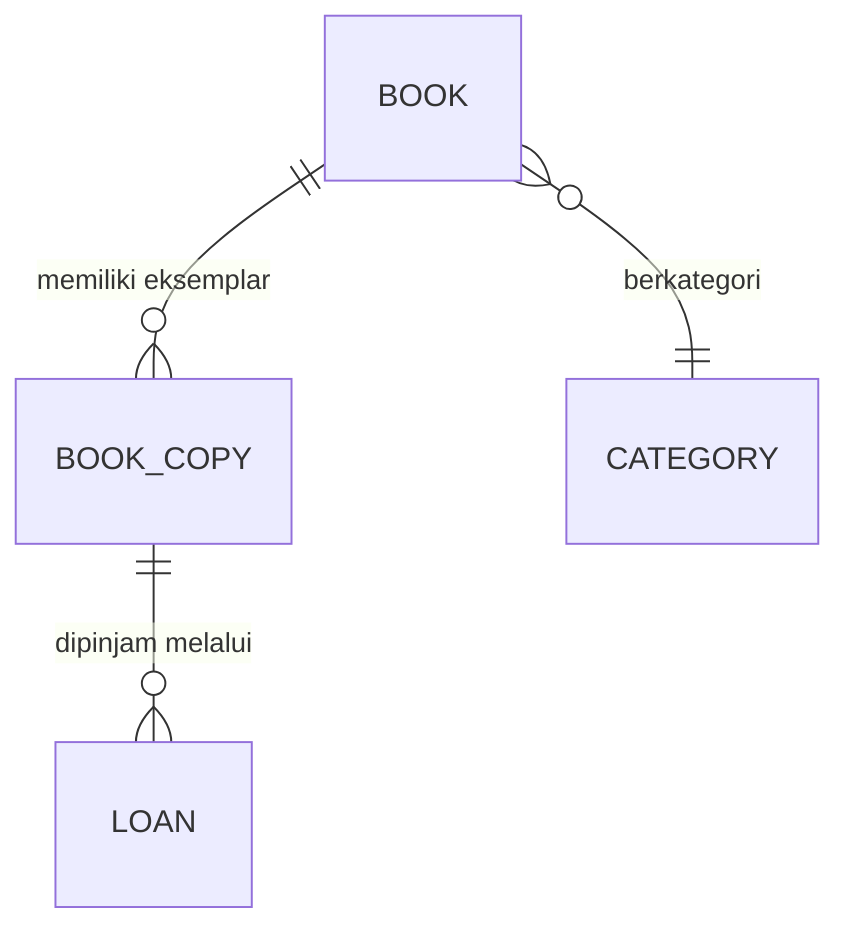

### 12.2 Field Buku

| Field | Tipe | Wajib | Aturan |
|---|---|:--:|---|
| `title` | string | ✅ | 1–200 karakter |
| `slug` | string | ✅ | auto, unik |
| `author` | string | ✅ | 1–150; beberapa penulis dipisah koma |
| `isbn` | string | — | 10 atau 13 digit, divalidasi checksum, unik jika diisi |
| `publisher` | string | — | maks 120 |
| `publicationYear` | int | — | 1400 – tahun berjalan |
| `categoryId` | fk | ✅ | |
| `description` | text | — | maks 2000 karakter |
| `coverImage` | url | — | rasio 2:3, maks 2 MB, ada placeholder |
| `language` | enum | ✅ | `ID` (default), `EN`, `JV`, `AR`, `OTHER` |
| `pages` | int | — | 1–10000 |
| `shelfLocation` | string | — | mis. "Rak A-3" atau "Box Lapak 2" |
| `isPublished` | boolean | ✅ | default `false` |
| `isBorrowable` | boolean | ✅ | default `true`; `false` untuk koleksi referensi baca di tempat |
| `donatedBy` | string | — | nama donatur, ditampilkan sebagai apresiasi |
| `totalCopies` | int | ✅ | turunan dari jumlah `BookCopy` aktif |
| `availableCopies` | int | ✅ | turunan; **WAJIB** dijaga konsisten dalam transaksi |
| `borrowCount` | int | ✅ | statistik kumulatif |

### 12.3 Field Eksemplar (`BookCopy`)

| Field | Tipe | Aturan |
|---|---|---|
| `inventoryCode` | string | Unik, otomatis: `PJ-{tahun}-{urut 4 digit}`, mis. `PJ-2026-0173` |
| `condition` | enum | `BARU`, `BAIK`, `CUKUP`, `RUSAK_RINGAN` |
| `status` | enum | `AVAILABLE`, `BORROWED`, `RESERVED`, `UNAVAILABLE`, `LOST`, `DAMAGED` |
| `acquiredAt` | date | Tanggal masuk koleksi |
| `note` | string | Catatan internal (mis. "halaman 40 sobek") |

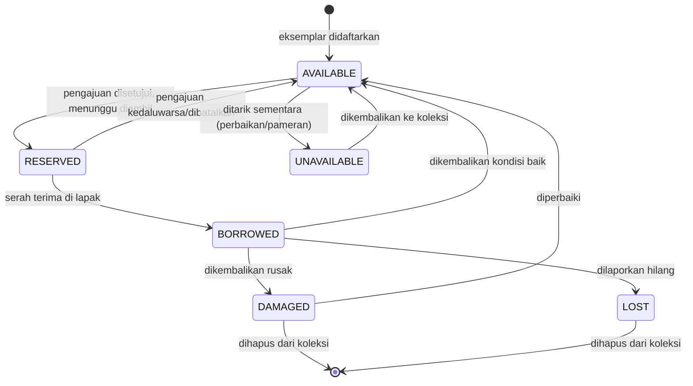

### 12.4 Halaman Katalog `/buku`

| Elemen | Spesifikasi |
|---|---|
| Tampilan | Grid kartu (2 kolom mobile, 4 desktop): sampul, judul, penulis, lencana ketersediaan |
| Filter | Kategori · Ketersediaan (Tersedia saja) · Bahasa · Tahun terbit (rentang) |
| Urutan | Terbaru ditambahkan (default) · Judul A–Z · Paling sering dipinjam |
| Pencarian | Judul, penulis, ISBN |
| Paginasi | 24 per halaman |
| Lencana | 🟢 "Tersedia (n)" · 🟡 "Sisa 1" · 🔴 "Sedang dipinjam" · ⚪ "Baca di tempat" |

**FR-LIB-01:** Buku dengan `isPublished=false` tidak muncul di katalog publik maupun hasil pencarian.
**FR-LIB-02:** Ketersediaan di halaman katalog boleh di-cache 60 detik, tetapi di halaman detail WAJIB diambil segar sebelum tombol pinjam ditampilkan.
**FR-LIB-03:** Buku tanpa sampul memakai placeholder bertema (warna kategori + judul terpotong), bukan ikon patah.

### 12.5 Halaman Detail Buku `/buku/:slug`

Menampilkan: sampul besar · judul · penulis · deskripsi · kategori · penerbit · tahun · ISBN · jumlah halaman · bahasa · lokasi rak · jumlah tersedia dari total · donatur (jika ada) · CTA pinjam · buku serupa (kategori sama, 4 buah).

**Aturan CTA:**

| Kondisi | Tampilan tombol |
|---|---|
| Tersedia & user lolos syarat | **Pinjam Buku** (primer) |
| Tersedia & belum login | **Masuk untuk Meminjam** |
| Tersedia & email belum diverifikasi | **Verifikasi Email Dulu** + tautan kirim ulang |
| Tidak tersedia | **Sedang Dipinjam** (nonaktif) + "Masuk Antrean" (P1) + estimasi tanggal kembali |
| `isBorrowable=false` | **Baca di Tempat** (nonaktif) + penjelasan |
| User punya pinjaman `OVERDUE` | Nonaktif + "Kembalikan dulu buku yang terlambat" |
| User sudah 2 pinjaman aktif | Nonaktif + "Batas 2 buku tercapai" |
| User sedang mengajukan buku ini | **Pengajuan Sedang Diproses** + tautan ke dashboard |

### 12.6 Acceptance Criteria

- `AC-LIB-01` — Menghapus judul yang memiliki riwayat pinjaman ditolak; sistem menawarkan "Arsipkan" sebagai gantinya.
- `AC-LIB-02` — `availableCopies` selalu sama dengan jumlah `BookCopy` berstatus `AVAILABLE` (diverifikasi tes integrasi + job rekonsiliasi harian).
- `AC-LIB-03` — Dua user menekan "Pinjam" pada buku dengan sisa 1 eksemplar secara bersamaan: hanya satu berhasil, yang lain mendapat pesan "Buku baru saja diajukan orang lain."
- `AC-LIB-04` — Katalog 500 judul memuat < 2 detik pada koneksi 4G.

---

## 13. Modul: Peminjaman (Borrowing)

**Prioritas:** P0 · **Fase:** 3

> **Model yang ditetapkan:** Pengajuan online → persetujuan pengurus → **pengambilan & pengembalian fisik di lapak/basecamp** → **tanpa denda uang**, sanksi berupa pembatasan pinjam.

### 13.1 Business Rules (normatif)

| ID | Aturan | Nilai default | Dapat diubah admin |
|---|---|---|:--:|
| BR-LOAN-01 | Maksimum pinjaman aktif per user | 2 judul | ✅ |
| BR-LOAN-02 | Durasi pinjam | 7 hari | ✅ |
| BR-LOAN-03 | Perpanjangan | 1×, +7 hari | ✅ |
| BR-LOAN-04 | Syarat perpanjangan | Belum pernah diperpanjang, tidak `OVERDUE`, tidak ada antrean pada judul itu, diajukan maks H-1 | ✅ |
| BR-LOAN-05 | Batas waktu pengambilan setelah disetujui | 3 hari **atau** sampai akhir jadwal lapak berikutnya (mana yang lebih lama) | ✅ |
| BR-LOAN-06 | Sanksi keterlambatan | **Tidak ada denda uang.** Selama ada pinjaman `OVERDUE`, user tidak bisa mengajukan pinjaman baru | ❌ |
| BR-LOAN-07 | Keterlambatan ≥ 14 hari | Suspend hak pinjam 30 hari setelah buku dikembalikan | ✅ |
| BR-LOAN-08 | No-show 3× dalam 90 hari | Suspend hak pinjam 14 hari | ✅ |
| BR-LOAN-09 | Buku hilang | Diselesaikan secara kekeluargaan offline (mengganti buku serupa/senilai). Sistem hanya mencatat, tidak menagih | ❌ |
| BR-LOAN-10 | Pengajuan duplikat | User tidak boleh punya 2 pengajuan aktif untuk judul yang sama | ❌ |
| BR-LOAN-11 | Hak batal | User dapat membatalkan sendiri saat status `PENDING` atau `APPROVED` | ❌ |
| BR-LOAN-12 | Soft hold | Saat `PENDING`, `availableCopies` langsung dikurangi agar tidak oversold | ❌ |

### 13.2 State Machine Peminjaman

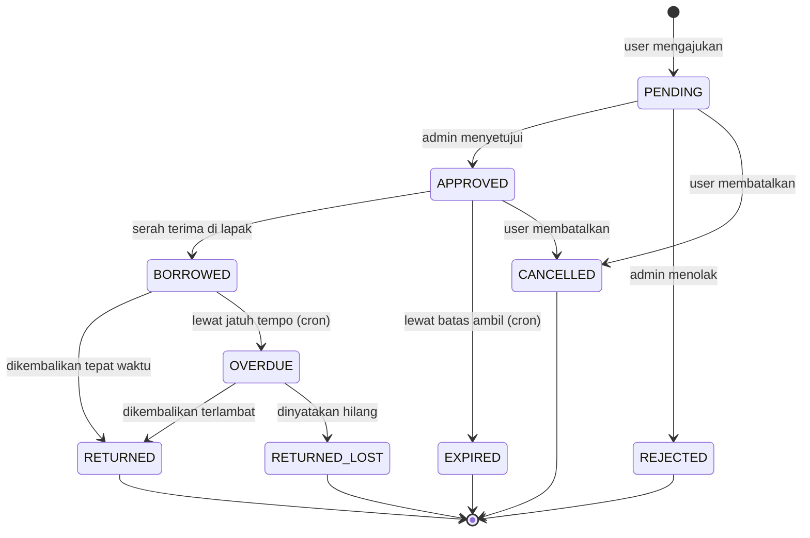

**Catatan status:** `EXPIRED` dan `RETURNED_LOST` adalah **tambahan v3** terhadap daftar status di v2. `RESERVED` dipindahkan ke level `BookCopy` (bukan status pinjaman).

### 13.3 Data yang Dicatat per Peminjaman

| Field | Keterangan |
|---|---|
| `id`, `loanCode` | Kode unik, mis. `PJM-2026-0451` |
| `userId` | Peminjam |
| `bookId`, `bookCopyId` | `bookCopyId` diisi saat serah terima |
| `status` | Lihat state machine |
| `requestedAt` | Waktu pengajuan |
| `pickupPoint` | Titik ambil (dari daftar yang dikelola admin) |
| `pickupDatePlan` | Rencana tanggal ambil dari user |
| `approvedAt`, `approvedById` | Jejak persetujuan |
| `pickupCode` | 6 digit numerik, unik selama aktif |
| `pickupDeadline` | Batas ambil |
| `borrowedAt`, `handedOverById` | Serah terima |
| `dueDate` | Jatuh tempo |
| `extensionCount` | Jumlah perpanjangan |
| `returnedAt`, `receivedById` | Pengembalian |
| `returnCondition` | `BAIK`, `RUSAK`, `HILANG` |
| `rejectionReason` | Jika ditolak |
| `notes` | Catatan internal pengurus |

### 13.4 Mode Lapak (fitur khas, WAJIB)

Layar khusus di `/admin/pinjaman/pickup` yang dioptimalkan untuk HP saat pengurus berada di lapak:

**FR-LOAN-01:** Satu input besar untuk **kode pengambilan 6 digit**; tekan enter langsung menampilkan kartu transaksi (foto sampul, judul, nama peminjam, tanggal jatuh tempo yang akan berlaku).
**FR-LOAN-02:** Alternatif pencarian dengan nama/username jika peminjam lupa kode.
**FR-LOAN-03:** Dua tombol besar: **Serahkan Buku** dan **Terima Pengembalian**. Target sentuh minimal 48×48 px.
**FR-LOAN-04:** Saat menerima pengembalian, pilih kondisi: Baik (default) · Rusak · Hilang. Rusak/Hilang mewajibkan catatan.
**FR-LOAN-05:** Layar menampilkan daftar "Siap diambil hari ini" dan "Jatuh tempo hari ini" agar pengurus bisa mengingatkan langsung.
**FR-LOAN-06:** Layar SEBAIKNYA tetap berfungsi dengan sinyal lemah: aksi yang gagal dikirim masuk antrean dan dicoba ulang, dengan indikator jelas "Belum tersimpan".

### 13.5 Antrean / Waitlist (P1)

**FR-LOAN-07:** Saat semua eksemplar terpinjam, user dapat menekan **Masuk Antrean**. Maks 5 orang per judul, satu user satu posisi.
**FR-LOAN-08:** Saat eksemplar kembali, orang pertama di antrean mendapat notifikasi dan **hak prioritas 48 jam** untuk mengajukan. Lewat itu, giliran berpindah.
**FR-LOAN-09:** Buku yang sedang "dipesan" untuk antrean tidak dapat diajukan user lain selama masa prioritas.

### 13.6 Acceptance Criteria

- `AC-LOAN-01` — User dengan pinjaman `OVERDUE` mendapat tombol pinjam nonaktif **dan** request API langsung ditolak 422 dengan kode `HAS_OVERDUE`.
- `AC-LOAN-02` — Pengajuan yang tidak diambil sampai `pickupDeadline` berubah menjadi `EXPIRED` dan `availableCopies` kembali bertambah, paling lambat sehari setelahnya.
- `AC-LOAN-03` — Kode pengambilan yang sudah dipakai atau kedaluwarsa ditolak dengan pesan spesifik.
- `AC-LOAN-04` — Perpanjangan kedua ditolak dengan pesan "Perpanjangan hanya dapat dilakukan satu kali."
- `AC-LOAN-05` — Riwayat pinjam user menampilkan seluruh transaksi termasuk yang ditolak dan kedaluwarsa, dengan alasan.
- `AC-LOAN-06` — Admin dapat menyelesaikan satu serah terima di HP dalam ≤ 3 ketukan setelah memasukkan kode.
- `AC-LOAN-07` — Data peminjam (email, kontak) tidak pernah muncul di endpoint publik mana pun.

---

## 14. Modul: Kegiatan / Event

**Prioritas:** P1 · **Fase:** 5

### 14.1 Jenis Kegiatan

Kelas literasi · Diskusi buku · Workshop menulis · Lapak baca · Kegiatan komunitas lain.

### 14.2 Field Event

| Field | Tipe | Wajib | Aturan |
|---|---|:--:|---|
| `title` | string | ✅ | 5–120 karakter |
| `slug` | string | ✅ | auto, unik |
| `type` | enum | ✅ | `KELAS`, `DISKUSI`, `WORKSHOP`, `LAPAK`, `LAINNYA` |
| `description` | rich text | ✅ | TipTap ringkas |
| `coverImage` | url | ✅ | 16:9 |
| `startAt`, `endAt` | datetime | ✅ | `endAt` > `startAt`, WIB |
| `locationName` | string | ✅ | mis. "Alun-Alun Blora" |
| `locationDetail` | string | — | Patokan / tautan peta |
| `isOnline` | boolean | ✅ | Jika `true`, `meetingUrl` wajib & hanya tampil ke peserta terdaftar |
| `quota` | int | — | Kosong = tanpa batas |
| `registrationOpenAt` / `registrationCloseAt` | datetime | — | Default: sejak terbit s.d. `startAt` |
| `organizerId` | fk | ✅ | Penanggung jawab |
| `isFree` | boolean | ✅ | v3 selalu `true`; kontribusi sukarela ditulis di deskripsi |
| `status` | enum | ✅ | Lihat §14.3 |

### 14.3 State Machine Event

```mermaid
stateDiagram-v2
    [*] --> DRAFT
    DRAFT --> PUBLISHED: diterbitkan
    PUBLISHED --> OPEN: pendaftaran dibuka (otomatis pada registrationOpenAt)
    OPEN --> FULL: kuota penuh
    FULL --> OPEN: ada pembatalan peserta
    OPEN --> CLOSED: pendaftaran ditutup
    FULL --> CLOSED: pendaftaran ditutup
    PUBLISHED --> CLOSED: tanpa pendaftaran
    CLOSED --> COMPLETED: kegiatan selesai (cron setelah endAt)
    PUBLISHED --> CANCELLED: dibatalkan
    OPEN --> CANCELLED: dibatalkan
    FULL --> CANCELLED: dibatalkan
    COMPLETED --> [*]
    CANCELLED --> [*]
```

### 14.4 Pendaftaran

Status pendaftaran: `REGISTERED` · `WAITLISTED` · `CANCELLED` · `ATTENDED` · `NO_SHOW`.

**FR-EVT-01:** Setelah mendaftar, user memperoleh **kode hadir 6 karakter** dan tombol "Tambahkan ke Kalender" (berkas `.ics`).
**FR-EVT-02:** Pembatalan oleh peserta hanya sampai **H-1**; setelah itu perlu menghubungi panitia (ditampilkan kontak).
**FR-EVT-03:** Saat event `CANCELLED`, seluruh peserta menerima notifikasi + email berisi alasan.
**FR-EVT-04:** Check-in dilakukan panitia lewat `/admin/kegiatan/:id/peserta` dengan input kode atau pencarian nama; daftar menampilkan indikator hadir secara langsung.
**FR-EVT-05:** Setelah event `COMPLETED`, admin dapat menambahkan **dokumentasi** (galeri foto + ringkasan) yang tampil di halaman detail — ini yang menjawab masalah P5 (dokumentasi tidak terstruktur).
**FR-EVT-06:** Daftar peserta (nama saja) SEBAIKNYA tampil publik hanya jika event `isParticipantListPublic = true`; default `false`.

### 14.5 Acceptance Criteria

- `AC-EVT-01` — Saat kuota terakhir diambil, user lain yang menekan daftar mendapat opsi daftar tunggu, bukan error.
- `AC-EVT-02` — Pembatalan peserta mempromosikan orang pertama di daftar tunggu dan mengirim notifikasi dalam < 1 menit.
- `AC-EVT-03` — Event yang sudah lewat tidak lagi menampilkan tombol daftar.
- `AC-EVT-04` — Tautan pertemuan daring tidak tampil di HTML bagi yang belum terdaftar.

---

## 15. Modul: Surat Pembaca

**Prioritas:** P2 · **Fase:** 4

Kanal ringan untuk masyarakat menyampaikan opini, pengalaman membaca, cerita komunitas, kritik, apresiasi, atau gagasan sosial.

| Aspek | Ketentuan |
|---|---|
| Format | Plain text (textarea), tanpa gambar & tanpa TipTap |
| Panjang | 100–2000 kata |
| Alur | Submit → moderasi → terbit/tolak (tanpa siklus revisi) |
| Anonimitas | Boleh tampil anonim ("Warga Blora"); identitas asli tetap tersimpan & hanya terlihat admin |
| Kuota | Maks 2 kiriman `PENDING` per user |
| Komentar | Diizinkan |
| Badge | Tidak dihitung sebagai badge penulis |
| SLA moderasi | 7 hari |

**FR-SP-01:** Halaman `/surat-pembaca` menampilkan daftar kronologis dengan kutipan pembuka 2 baris.
**FR-SP-02:** Kurator dapat melakukan penyuntingan ringan (typo, tanda baca) tanpa mengubah substansi; teks asli disimpan.
**FR-SP-03:** Penolakan wajib disertai alasan dari daftar terstruktur.
**BR-SP-01:** Anonimitas **tidak** melindungi dari pertanggungjawaban: konten fitnah/SARA tetap ditolak dan pelanggaran berulang berujung sanksi akun.

---

## 16. Modul: Notifikasi

**Prioritas:** P1 · **Fase:** 5 (dasar sudah dipakai sejak Fase 3 untuk peminjaman)

### 16.1 Matriks Notifikasi

| Kode | Pemicu | Penerima | In-App | Email | Dapat dimatikan |
|---|---|---|:--:|:--:|:--:|
| `LOAN_APPROVED` | Pengajuan disetujui | Peminjam | ✅ | ✅ | ❌ |
| `LOAN_REJECTED` | Pengajuan ditolak | Peminjam | ✅ | ✅ | ❌ |
| `LOAN_READY_REMINDER` | H-1 batas ambil | Peminjam | ✅ | ✅ | ❌ |
| `LOAN_EXPIRED` | Tidak diambil | Peminjam | ✅ | ✅ | ❌ |
| `LOAN_BORROWED` | Serah terima tercatat | Peminjam | ✅ | ✅ | ❌ |
| `LOAN_DUE_SOON` | H-2 dan H-0 jatuh tempo | Peminjam | ✅ | ✅ | ❌ |
| `LOAN_OVERDUE` | H+1, H+3, H+7 | Peminjam | ✅ | ✅ | ❌ |
| `LOAN_RETURNED` | Pengembalian tercatat | Peminjam | ✅ | ❌ | ✅ |
| `LOAN_SUSPENDED` | Sanksi berlaku | Peminjam | ✅ | ✅ | ❌ |
| `WAITLIST_AVAILABLE` | Giliran antrean tiba | User | ✅ | ✅ | ❌ |
| `ARTICLE_APPROVED` | Artikel disetujui | Penulis | ✅ | ✅ | ✅ |
| `ARTICLE_PUBLISHED` | Artikel tayang | Penulis | ✅ | ✅ | ✅ |
| `ARTICLE_REVISION` | Diminta revisi | Penulis | ✅ | ✅ | ❌ |
| `ARTICLE_REJECTED` | Ditolak | Penulis | ✅ | ✅ | ❌ |
| `COMMENT_ON_MY_ARTICLE` | Komentar baru | Penulis | ✅ | ❌ | ✅ |
| `COMMENT_REPLY` | Balasan komentar | Pengomentar | ✅ | ❌ | ✅ |
| `COMMENT_APPROVED` | Komentar lolos moderasi | Pengomentar | ✅ | ❌ | ✅ |
| `EVENT_REGISTERED` | Berhasil mendaftar | Peserta | ✅ | ✅ | ❌ |
| `EVENT_REMINDER` | H-1 | Peserta | ✅ | ✅ | ✅ |
| `EVENT_CANCELLED` | Dibatalkan | Peserta | ✅ | ✅ | ❌ |
| `BADGE_EARNED` | Badge baru | User | ✅ | ❌ | ✅ |
| `NEW_SUBMISSION` | Artikel masuk antrean | Semua kurator | ✅ | ✅ | ✅ |
| `REVIEW_SLA_BREACH` | Antrean > 7 hari | Semua kurator | ✅ | ✅ | ✅ |
| `NEW_LOAN_REQUEST` | Pengajuan baru | Semua admin | ✅ | ✅ | ✅ |
| `COMMENT_NEEDS_MODERATION` | Komentar masuk antrean | Kurator | ✅ | ❌ | ✅ |
| `COMMENT_REPORTED` | Komentar dilaporkan | Kurator | ✅ | ✅ | ✅ |
| `NEW_LETTER` | Surat pembaca masuk | Kurator | ✅ | ❌ | ✅ |

### 16.2 Ketentuan Teknis

**FR-NOT-01:** Setiap notifikasi menyimpan: `type`, `title`, `body`, `actionUrl`, `isRead`, `readAt`, `entityType`, `entityId`.
**FR-NOT-02:** Lonceng di header menampilkan jumlah belum dibaca; membuka panel menandai terlihat, bukan otomatis terbaca. Tersedia "Tandai semua terbaca".
**FR-NOT-03:** Notifikasi sejenis dalam 1 jam digabung (mis. "3 komentar baru di artikelmu").
**FR-NOT-04:** Email untuk kurator/admin dikirim sebagai **digest harian** jika dalam 24 jam ada > 3 kejadian sejenis, agar tidak membanjiri.
**FR-NOT-05:** Setiap email WAJIB memuat tautan berhenti berlangganan untuk notifikasi yang dapat dimatikan, dan halaman pengaturan notifikasi di `/dashboard/profil`.
**FR-NOT-06:** Pengiriman email berjalan di antrean/latar belakang; kegagalan email **tidak boleh** menggagalkan transaksi bisnisnya (approve pinjaman tetap berhasil meski email gagal).
**FR-NOT-07:** Notifikasi in-app dihapus otomatis setelah 90 hari.

### 16.3 Template Email

Seluruh email memakai satu template: header logo Perpusjal · salam dengan nama · isi 1–3 kalimat · satu tombol aksi utama · footer (alamat komunitas, tautan berhenti berlangganan). Plain-text fallback WAJIB.

**Contoh — `LOAN_APPROVED`:**
> **Subjek:** Pengajuanmu disetujui — ambil bukunya ya 📚
> Halo Rina, pengajuan peminjaman **"Bumi Manusia"** sudah disetujui.
> **Kode pengambilan: 482913**
> Ambil di **Basecamp Perpusjal, Jl. …** paling lambat **Kamis, 24 September 2026**.
> [Lihat Detail Peminjaman]

---

## 17. Modul: Gamifikasi & Badge

**Prioritas:** P2 · **Fase:** 5

Tujuan badge adalah **apresiasi**, bukan kompetisi. Tidak ada leaderboard publik, tidak ada poin yang bisa ditukar.

### 17.1 Daftar Badge (kriteria konkret & dapat dihitung)

| Badge | Kategori | Kriteria | Cara hitung |
|---|---|---|---|
| 🌱 **Pembaca Pertama** | Reader | Membaca 1 artikel | Terbaca = dibuka ≥ 30 detik dan scroll ≥ 50% |
| 📖 **Pembaca Aktif** | Reader | 10 artikel terbaca | idem |
| 🦉 **Kutu Buku** | Reader | 50 artikel terbaca | idem |
| ✍️ **Penulis Pertama** | Writer | 1 artikel `PUBLISHED` | |
| 🖋️ **Kontributor** | Writer | 5 artikel `PUBLISHED` | |
| 📰 **Kolumnis** | Writer | 15 artikel `PUBLISHED` | |
| 💬 **Teman Diskusi** | Community | 10 komentar `PUBLISHED` | |
| 🔥 **Penggerak Literasi** | Community | Hadir di 3 event (`ATTENDED`) | |
| 🧭 **Book Explorer** | Library | 5 peminjaman `RETURNED` | |
| 🛡️ **Penjaga Amanah** | Library | 10 pengembalian berturut-turut tanpa terlambat | Reset jika `OVERDUE` |
| 🏮 **Sahabat Lapak** | Community | Bergabung ≥ 1 tahun & minimal 1 aktivitas | Dicek saat ulang tahun akun |
| 🎁 **Donatur Buku** | Library | Namanya tercatat di `Book.donatedBy` | Diberikan manual oleh admin |

**FR-BDG-01:** Evaluasi badge dijalankan **berbasis kejadian** (setelah aksi relevan) dan diperiksa ulang oleh cron harian sebagai jaring pengaman.
**FR-BDG-02:** Badge bersifat permanen; sekali diperoleh tidak dicabut (kecuali pelanggaran berat oleh keputusan admin).
**FR-BDG-03:** Halaman `/dashboard/badge` menampilkan badge terkunci beserta progresnya ("3 dari 5 buku") — progres inilah yang memotivasi, bukan badge itu sendiri.
**FR-BDG-04:** Badge yang diperoleh tampil di profil publik dan di kartu penulis pada artikel.
**FR-BDG-05:** Admin dapat menambah/menyunting badge (nama, ikon, deskripsi, kriteria dari daftar yang didukung) tanpa deploy ulang.

---

## 18. Modul: Profil Pengguna

**Prioritas:** P1 · **Fase:** 4

### 18.1 Profil Publik `/u/:username`

Menampilkan: avatar · nama · username · bio (maks 200 karakter) · tanggal bergabung · badge · daftar artikel terbit · jumlah artikel · tautan sosial opsional (Instagram, X, situs).

**Tidak pernah ditampilkan publik:** email, riwayat peminjaman, aktivitas membaca, nomor telepon, daftar event yang diikuti.

### 18.2 Pengaturan Privasi

| Opsi | Default | Efek |
|---|---|---|
| Profil publik | Aktif | Jika dimatikan, `/u/:username` hanya menampilkan nama + artikel terbit |
| Tampilkan badge | Aktif | |
| Tampilkan jumlah artikel | Aktif | |
| Terima notifikasi email opsional | Aktif | |

**BR-PROF-01:** Artikel yang sudah terbit **tetap** menampilkan nama penulis meski profil disetel privat — atribusi karya tidak bisa disembunyikan, tetapi halaman profilnya bisa.
**FR-PROF-01:** Avatar maks 1 MB, dipotong ke 1:1 di klien, disimpan 3 ukuran (40/96/256 px).
**FR-PROF-02:** Tersedia tombol **Unduh Data Saya** (JSON: profil, artikel, komentar, riwayat pinjam) dan **Hapus Akun** sesuai §7.3.

---

## 19. Modul: Search

**Prioritas:** P1 · **Fase:** 2 (dasar) · **Fase:** 5 (lanjutan)

### 19.1 Cakupan

```mermaid
flowchart LR
    Q["🔍 Kata kunci"] --> ART["Artikel: judul, excerpt, isi, tag"]
    Q --> BK["Buku: judul, penulis, ISBN, deskripsi"]
    Q --> EV["Event: judul, deskripsi, lokasi"]
    Q --> US["Pengguna: nama, username"]
```

### 19.2 Ketentuan

**FR-SRC-01:** Halaman `/cari` menampilkan hasil berkelompok per tipe dengan tab: Semua · Artikel · Buku · Kegiatan · Orang, beserta jumlah hasil.
**FR-SRC-02:** Kotak cari di header memberikan saran instan (top 3 artikel + top 3 buku) dengan debounce 300 ms, minimum 3 karakter.
**FR-SRC-03:** Pencarian WAJIB tidak sensitif huruf besar-kecil dan mengabaikan tanda baca.
**FR-SRC-04:** Kata kunci ditandai (highlight) pada hasil.
**FR-SRC-05:** Hasil kosong menampilkan saran: periksa ejaan · coba kata lain · jelajahi kategori populer · **ajukan usulan buku** (formulir singkat ke admin).
**FR-SRC-06:** Pencarian tidak pernah mengembalikan entitas non-publik (draft, buku belum terbit, event draft, profil privat).
**FR-SRC-07:** Kata kunci yang dicari dicatat anonim untuk analitik (§28) — berguna untuk tahu buku apa yang dicari tetapi belum dimiliki.

**Implementasi:** v3 memakai **PostgreSQL full-text search** (`tsvector` + GIN index) dengan konfigurasi `simple`, ditambah `pg_trgm` untuk toleransi salah ketik pada judul/penulis. Mesin pencari eksternal (Meilisearch/Typesense) ditunda.

---

## 20. Modul: Dashboard Admin & Kurator

**Prioritas:** P0 (admin dasar) · **Fase:** 3–5

### 20.1 Dashboard Admin — KPI

Kartu KPI (dengan perbandingan terhadap periode sebelumnya):

| KPI | Tautan aksi |
|---|---|
| Total Pengguna (+n minggu ini) | `/admin/pengguna` |
| Total Artikel · **Menunggu Review (n)** | `/kurator/review` |
| Total Judul Buku · Eksemplar Tersedia | `/admin/buku` |
| **Pengajuan Pinjam Menunggu (n)** | `/admin/pinjaman?status=PENDING` |
| Pinjaman Aktif | `/admin/pinjaman?status=BORROWED` |
| **Terlambat (n)** | `/admin/pinjaman?status=OVERDUE` |
| Siap Diambil Hari Ini | `/admin/pinjaman/pickup` |
| Kegiatan Mendatang | `/admin/kegiatan` |
| **Komentar Menunggu Moderasi (n)** | `/kurator/komentar` |

**FR-DASH-01:** Setiap KPI yang menunjukkan **pekerjaan tertunda** ditampilkan menonjol (warna aksen) dan langsung mengarah ke daftar yang relevan. Dashboard adalah daftar tugas, bukan pajangan angka.
**FR-DASH-02:** Tersedia seksi "Aktivitas Terbaru" (15 peristiwa terakhir lintas modul).
**FR-DASH-03:** Grafik sederhana: pendaftaran user & peminjaman per minggu selama 12 minggu.
**FR-DASH-04:** Dashboard WAJIB nyaman dipakai di HP.

### 20.2 Manajemen Artikel (Admin)

Aksi: Buat · Sunting · Hapus · Terbitkan · Jadwalkan · Arsipkan · Tandai unggulan · Ubah kategori · Ganti penulis · Lihat submission.
Kolom tabel: Judul · Penulis · Kategori · Status · Tanggal terbit · Diperbarui · Dibaca · Aksi.
Filter: status, kategori, penulis, rentang tanggal. Pencarian judul. Aksi massal: ubah kategori, arsipkan.

**BR-ADM-01:** Menghapus artikel `PUBLISHED` memerlukan konfirmasi ketik ulang judul, dan tetap soft delete (dapat dipulihkan 30 hari).

### 20.3 Manajemen Pengguna

Kolom: Nama · Username · Email · Role · Status · Bergabung · Aktivitas terakhir · Pinjaman aktif.
Aksi: ubah role · suspend/aktifkan · reset password (kirim tautan) · lihat sebagai (read-only, P2) · cabut sanksi pinjam.

**BR-ADM-02:** Admin tidak dapat menurunkan role dirinya sendiri jika ia satu-satunya admin tersisa.
**BR-ADM-03:** Setiap perubahan role dicatat di audit log beserta pelakunya.

### 20.4 Audit Log

Mencatat minimal: perubahan role, suspend/aktivasi akun, penghapusan konten, approve/reject pinjaman, serah terima & pengembalian, perubahan pengaturan sistem, penghapusan komentar.
Field: `actorId`, `action`, `entityType`, `entityId`, `before`, `after`, `ip`, `userAgent`, `createdAt`.
**FR-AUD-01:** Audit log bersifat **append-only**; tidak ada UI penghapusan. Retensi 2 tahun.

---

## 21. Modul: CMS Halaman Statis

**Prioritas:** P0 · **Fase:** 2

Halaman yang dikelola: Tentang Perpusjal · Sejarah · Kontak · **Cara Meminjam** · FAQ · Ketentuan Penggunaan · Kebijakan Privasi · Jadwal Lapak.

| Field | Keterangan |
|---|---|
| `title`, `slug` | Slug halaman sistem tidak dapat diubah |
| `content` | TipTap |
| `isPublished` | Draft tidak tampil publik |
| `showInFooter` / `showInNav` | Penempatan otomatis |
| `seoTitle`, `seoDescription` | |
| `updatedAt` | Ditampilkan sebagai "Diperbarui …" pada halaman kebijakan |

**FR-CMS-01:** Halaman **Cara Meminjam** WAJIB terisi sebelum fitur peminjaman diaktifkan, memuat: syarat akun, batas 2 buku, durasi 7 hari, alur kode pengambilan, lokasi & jadwal lapak, konsekuensi keterlambatan, dan cara memperpanjang.
**FR-CMS-02:** Menghapus halaman sistem dilarang; hanya boleh di-unpublish.
**FR-CMS-03:** Jadwal lapak dikelola sebagai data terstruktur (hari, jam, lokasi) agar dapat ditampilkan di footer, halaman Cara Meminjam, dan form pengajuan pinjam sekaligus.

---

## 22. Data Model & ERD

### 22.1 Entity Relationship Diagram

```mermaid
erDiagram
    USER ||--o{ ARTICLE : "menulis"
    USER ||--o{ ARTICLE_REVISION : "membuat revisi"
    USER ||--o{ COMMENT : "menulis"
    USER ||--o{ COMMENT_REPORT : "melaporkan"
    USER ||--o{ LOAN : "meminjam"
    USER ||--o{ LOAN : "menyetujui"
    USER ||--o{ EVENT_REGISTRATION : "mendaftar"
    USER ||--o{ EVENT : "menyelenggarakan"
    USER ||--o{ NOTIFICATION : "menerima"
    USER ||--o{ USER_BADGE : "memperoleh"
    USER ||--o{ READER_LETTER : "mengirim"
    USER ||--o{ READING_LOG : "membaca"
    USER ||--o{ WAITLIST : "mengantre"
    USER ||--o{ AUDIT_LOG : "melakukan"
    USER ||--o{ MEDIA : "mengunggah"
    USER ||--o{ SESSION : "memiliki"

    ARTICLE }o--|| CATEGORY : "berkategori"
    ARTICLE }o--o{ TAG : "bertag"
    ARTICLE ||--o{ COMMENT : "memiliki"
    ARTICLE ||--o{ ARTICLE_REVISION : "memiliki"
    ARTICLE ||--o{ READING_LOG : "dibaca"

    BOOK }o--|| CATEGORY : "berkategori"
    BOOK ||--o{ BOOK_COPY : "memiliki"
    BOOK ||--o{ WAITLIST : "diantre"
    BOOK_COPY ||--o{ LOAN : "dipinjamkan"

    EVENT ||--o{ EVENT_REGISTRATION : "memiliki"

    COMMENT ||--o{ COMMENT : "balasan"
    COMMENT ||--o{ COMMENT_REPORT : "dilaporkan"
    READER_LETTER ||--o{ COMMENT : "memiliki"

    BADGE ||--o{ USER_BADGE : "diberikan"
    CATEGORY ||--o{ CATEGORY : "induk"
```

### 22.2 Daftar Entitas & Field Kunci

| Entitas | Field penting | Catatan |
|---|---|---|
| `User` | id, name, username(uniq), email(uniq), passwordHash, avatarUrl, bio, role, status, trustLevel, emailVerifiedAt, borrowSuspendedUntil, noShowCount, isProfilePublic, createdAt | Indeks: `email`, `username`, `role`, `status` |
| `Session` | id, userId, tokenHash, userAgent, ip, expiresAt, lastActiveAt | |
| `VerificationToken` | id, userId, type(`EMAIL_VERIFY`\|`PASSWORD_RESET`), tokenHash, expiresAt, usedAt | Token disimpan ter-hash |
| `Article` | id, title, slug(uniq), subtitle, excerpt, content(Json), coverImage, coverCredit, categoryId, authorId, status, publishedAt, scheduledAt, isFeatured, readingTime, viewCount, seoTitle, seoDescription, ogImage, allowComments, deletedAt | Indeks: `slug`, `status+publishedAt`, `categoryId`, `authorId`; FTS pada judul+excerpt+teks |
| `ArticleRevision` | id, articleId, editorId, content(Json), statusFrom, statusTo, note, rejectionReason, createdAt | Append-only |
| `Category` | id, name, slug(uniq), description, iconName, color, parentId, type(`ARTICLE`\|`BOOK`\|`BOTH`), order, isActive | |
| `Tag` | id, name, slug(uniq) | |
| `Comment` | id, content(text), authorId, articleId?, letterId?, parentId?, status, editedAt, reportCount, deletedAt | Tepat satu dari `articleId`/`letterId` terisi |
| `CommentReport` | id, commentId, reporterId, reason, note, createdAt | Unik per (commentId, reporterId) |
| `Book` | id, title, slug(uniq), author, isbn, publisher, publicationYear, categoryId, description, coverImage, language, pages, shelfLocation, isPublished, isBorrowable, donatedBy, totalCopies, availableCopies, borrowCount, deletedAt | Indeks: `slug`, `categoryId`, `isPublished`; FTS pada judul+penulis |
| `BookCopy` | id, bookId, inventoryCode(uniq), condition, status, acquiredAt, note | Indeks: `bookId+status` |
| `Loan` | id, loanCode(uniq), userId, bookId, bookCopyId?, status, requestedAt, pickupPoint, pickupDatePlan, approvedAt, approvedById, rejectionReason, pickupCode, pickupDeadline, borrowedAt, handedOverById, dueDate, extensionCount, returnedAt, receivedById, returnCondition, notes | Indeks: `userId+status`, `status+dueDate`, `pickupCode` |
| `Waitlist` | id, bookId, userId, position, notifiedAt, priorityUntil, status | Unik (bookId, userId) aktif |
| `Event` | id, title, slug(uniq), type, description(Json), coverImage, startAt, endAt, locationName, locationDetail, isOnline, meetingUrl, quota, registrationOpenAt, registrationCloseAt, organizerId, status, isParticipantListPublic, summary, gallery(Json) | |
| `EventRegistration` | id, eventId, userId, status, attendanceCode, registeredAt, checkedInAt, note | Unik (eventId, userId) |
| `ReaderLetter` | id, title, slug, content(text), authorId, displayName, isAnonymous, status, publishedAt, moderatedById, rejectionReason | |
| `Notification` | id, userId, type, title, body, actionUrl, entityType, entityId, isRead, readAt, createdAt | Indeks: `userId+isRead+createdAt` |
| `NotificationPreference` | id, userId, type, inApp, email | |
| `Badge` | id, code(uniq), name, description, iconName, criteriaType, criteriaValue, isActive | |
| `UserBadge` | id, userId, badgeId, earnedAt, progress | Unik (userId, badgeId) |
| `ReadingLog` | id, userId?, articleId, anonId?, readAt, secondsSpent, scrollDepth, counted | Dasar badge pembaca & viewCount |
| `Page` | id, title, slug(uniq), content(Json), isPublished, isSystem, showInFooter, showInNav, seoTitle, seoDescription, updatedAt | |
| `Media` | id, url, publicId, type, width, height, sizeBytes, alt, uploadedById, usedIn, createdAt | Cloudinary |
| `Setting` | key(uniq), value(Json), description, updatedById | Konfigurasi runtime (durasi pinjam, batas buku, dll.) |
| `AuditLog` | id, actorId, action, entityType, entityId, before(Json), after(Json), ip, userAgent, createdAt | Append-only |
| `SearchQueryLog` | id, query, resultCount, type, createdAt | Anonim |

### 22.3 Enum Lengkap

```text
Role                 : USER | KURATOR | ADMIN
UserStatus           : PENDING_VERIFICATION | ACTIVE | SUSPENDED | DEACTIVATED | DELETED
TrustLevel           : TL0 | TL1 | TL2 | RESTRICTED
ArticleStatus        : DRAFT | PENDING_REVIEW | REVISION | APPROVED | SCHEDULED | PUBLISHED | ARCHIVED | REJECTED
CommentStatus        : PENDING | PUBLISHED | HIDDEN | DELETED_BY_USER | DELETED
BookCopyStatus       : AVAILABLE | BORROWED | RESERVED | UNAVAILABLE | LOST | DAMAGED
BookCondition        : BARU | BAIK | CUKUP | RUSAK_RINGAN
LoanStatus           : PENDING | APPROVED | BORROWED | RETURNED | RETURNED_LOST | OVERDUE | REJECTED | CANCELLED | EXPIRED
ReturnCondition      : BAIK | RUSAK | HILANG
EventStatus          : DRAFT | PUBLISHED | OPEN | FULL | CLOSED | COMPLETED | CANCELLED
EventType            : KELAS | DISKUSI | WORKSHOP | LAPAK | LAINNYA
RegistrationStatus   : REGISTERED | WAITLISTED | CANCELLED | ATTENDED | NO_SHOW
LetterStatus         : PENDING | PUBLISHED | REJECTED
Language             : ID | EN | JV | AR | OTHER
CategoryType         : ARTICLE | BOOK | BOTH
```

### 22.4 Aturan Integritas Data

| ID | Aturan |
|---|---|
| `DI-01` | Perubahan `availableCopies` WAJIB dilakukan di dalam transaksi database yang sama dengan perubahan `Loan.status`. |
| `DI-02` | Gunakan **pessimistic lock** (`SELECT … FOR UPDATE`) pada baris `Book` saat membuat pinjaman, untuk mencegah race condition. |
| `DI-03` | Constraint: `availableCopies >= 0` dan `availableCopies <= totalCopies`. |
| `DI-04` | Satu user tidak boleh punya dua `Loan` aktif (`PENDING`/`APPROVED`/`BORROWED`/`OVERDUE`) untuk `bookId` yang sama — partial unique index. |
| `DI-05` | `Comment` WAJIB memiliki tepat satu dari `articleId` atau `letterId` (check constraint). |
| `DI-06` | Slug dibuat server-side; tabrakan diselesaikan dengan sufiks `-2`, `-3`. |
| `DI-07` | Seluruh timestamp disimpan **UTC**, ditampilkan **WIB**. |
| `DI-08` | Soft delete memakai `deletedAt`; seluruh query publik WAJIB memfilter `deletedAt IS NULL`. |
| `DI-09` | Job rekonsiliasi harian membandingkan `availableCopies` dengan hitungan nyata `BookCopy` dan melaporkan selisih ke admin. |

### 22.5 Data Awal (Seed)

- 1 akun ADMIN (dari variabel lingkungan, password wajib diganti saat login pertama).
- 9 kategori: Sastra, Pendidikan, Sosial, Budaya, Lingkungan, Sejarah, Anak, Fiksi, Non-Fiksi.
- 12 badge sesuai §17.1.
- 8 halaman CMS dengan konten placeholder.
- Setting default: `loan.maxActive=2`, `loan.durationDays=7`, `loan.maxExtension=1`, `loan.pickupDeadlineDays=3`, `comment.rateLimit=5/10m`, `review.slaDays=7`.

---

## 23. API Specification

### 23.1 Konvensi

- Base URL: `/api/v1`
- Format: JSON. Penamaan field: `camelCase`.
- Autentikasi: cookie sesi HTTP-only (web) — bukan token di localStorage.
- Setiap respons daftar memakai amplop paginasi:

```json
{
  "data": [],
  "meta": { "page": 1, "perPage": 12, "total": 132, "totalPages": 11 }
}
```

- Format error konsisten:

```json
{
  "error": {
    "code": "HAS_OVERDUE",
    "message": "Kamu masih punya buku yang terlambat dikembalikan.",
    "details": [{ "field": "bookId", "message": "…" }]
  }
}
```

- Kode status: `200` OK · `201` Created · `204` No Content · `400` payload tidak valid · `401` belum login · `403` tidak berwenang · `404` tidak ditemukan · `409` konflik state · `422` aturan bisnis dilanggar · `429` rate limit · `500` galat server.

### 23.2 Ringkasan Endpoint

Legenda akses: `P` publik · `U` user · `K` kurator · `A` admin.

#### Auth
| Method | Endpoint | Akses | Keterangan |
|---|---|:--:|---|
| POST | `/auth/register` | P | Rate limit 5/jam/IP |
| POST | `/auth/login` | P | Rate limit 10/15 menit/IP |
| POST | `/auth/logout` | U | |
| POST | `/auth/verify-email` | P | Body: token |
| POST | `/auth/resend-verification` | U | Maks 3/jam |
| POST | `/auth/forgot-password` | P | Selalu 200 |
| POST | `/auth/reset-password` | P | Token sekali pakai |
| GET | `/auth/me` | U | Profil + izin |
| GET | `/auth/sessions` · DELETE `/auth/sessions/:id` | U | |

#### Articles
| Method | Endpoint | Akses | Keterangan |
|---|---|:--:|---|
| GET | `/articles` | P | `?page&perPage&kategori&tag&sort&q&featured` — hanya `PUBLISHED` |
| GET | `/articles/:slug` | P | 404 jika belum terbit (kecuali pemilik/kurator/admin) |
| GET | `/articles/:slug/related` | P | 3 artikel |
| POST | `/articles/:id/view` | P | Menambah `ReadingLog`, dibatasi 1×/24 jam |
| GET | `/me/articles` | U | Semua status milik sendiri |
| POST | `/articles` | U | Membuat draft |
| PATCH | `/articles/:id` | U | Hanya pemilik & status `DRAFT`/`REVISION` |
| DELETE | `/articles/:id` | U/A | User hanya `DRAFT` miliknya |
| POST | `/articles/:id/submit` | U | → `PENDING_REVIEW` |
| POST | `/articles/:id/withdraw` | U | → `DRAFT` jika belum dikunci |
| POST | `/articles/:id/review/lock` | K | Kunci 30 menit |
| POST | `/articles/:id/approve` | K | Body: `{publishNow, scheduledAt}` |
| POST | `/articles/:id/request-revision` | K | `note` wajib |
| POST | `/articles/:id/reject` | K | `reason` + `note` wajib |
| POST | `/articles/:id/publish` · `/unpublish` · `/archive` | A | |
| POST | `/articles/:id/feature` | K | Maks 3 |
| GET | `/articles/:id/revisions` | K/pemilik | |

#### Books & Loans
| Method | Endpoint | Akses | Keterangan |
|---|---|:--:|---|
| GET | `/books` | P | `?q&kategori&tersedia&bahasa&tahunMin&tahunMax&sort&page` |
| GET | `/books/:slug` | P | Termasuk ketersediaan real-time |
| GET | `/books/:slug/availability` | P | Ringan, untuk polling tombol |
| POST | `/books` · PATCH `/books/:id` · DELETE `/books/:id` | A | Delete = arsip jika ada riwayat |
| GET/POST | `/books/:id/copies` | A | Kelola eksemplar |
| PATCH | `/copies/:id` | A | Ubah status/kondisi |
| POST | `/loans` | U | Ajukan pinjam — cek seluruh BR §13.1 |
| GET | `/me/loans` | U | `?status` |
| POST | `/loans/:id/cancel` | U | Saat `PENDING`/`APPROVED` |
| POST | `/loans/:id/extend` | U | Cek BR-LOAN-04 |
| GET | `/loans` | A | `?status&q&overdue` |
| POST | `/loans/:id/approve` | A | Menghasilkan `pickupCode` |
| POST | `/loans/:id/reject` | A | `reason` wajib |
| POST | `/loans/pickup` | A | Body: `{pickupCode \| loanId, bookCopyId}` → `BORROWED` |
| POST | `/loans/:id/return` | A | Body: `{condition, note}` |
| GET | `/loans/pickup-board` | A | Siap diambil & jatuh tempo hari ini |
| POST | `/books/:id/waitlist` · DELETE | U | P1 |

#### Lainnya
| Method | Endpoint | Akses | Keterangan |
|---|---|:--:|---|
| GET | `/categories` · POST · PATCH · DELETE | P / K | |
| GET | `/comments?articleId=` | P | Hanya `PUBLISHED` (+ milik sendiri yang `PENDING`) |
| POST | `/comments` | U | Rate limited |
| PATCH | `/comments/:id` | U | ≤15 menit |
| DELETE | `/comments/:id` | U/K | |
| POST | `/comments/:id/report` | U | |
| GET | `/moderation/comments` | K | Antrean |
| POST | `/comments/:id/approve` · `/hide` | K | |
| GET | `/events` · `/events/:slug` | P | |
| POST | `/events/:id/register` · `/cancel` | U | |
| POST | `/events/:id/checkin` | K/A | Body: `{code \| userId}` |
| GET | `/events/:id/registrations` | K/A | |
| POST/PATCH/DELETE | `/events` | K/A | |
| GET | `/letters` · `/letters/:slug` | P | |
| POST | `/letters` | U | |
| POST | `/letters/:id/approve` · `/reject` | K | |
| GET | `/notifications` · POST `/notifications/read-all` | U | |
| PATCH | `/notifications/:id/read` | U | |
| GET/PATCH | `/me/notification-preferences` | U | |
| GET | `/badges` · `/me/badges` | P / U | |
| POST/PATCH | `/badges` | A | |
| GET | `/users/:username` | P | Profil publik |
| PATCH | `/me` | U | Update profil |
| GET | `/me/export` | U | Unduh data |
| GET | `/admin/users` · PATCH `/admin/users/:id/role` · `/status` | A | |
| GET | `/pages/:slug` · POST/PATCH | P / A | |
| POST | `/media/upload` | U | Signed upload Cloudinary |
| GET | `/search?q=&type=&kategori=` | P | |
| GET | `/admin/stats` | K/A | KPI dashboard |
| GET | `/admin/audit-logs` | A | |
| GET/PATCH | `/admin/settings` | A | |
| GET | `/health` | P | Untuk monitoring |

### 23.3 Contoh Kontrak Penting

**POST `/api/v1/loans`**

```jsonc
// Request
{
  "bookId": "clx123…",
  "pickupPoint": "BASECAMP",
  "pickupDatePlan": "2026-09-24",
  "note": "Saya ambil sore hari setelah sekolah"
}

// 201 Created
{
  "data": {
    "id": "clm456…",
    "loanCode": "PJM-2026-0451",
    "status": "PENDING",
    "book": { "title": "Bumi Manusia", "coverImage": "https://…" },
    "requestedAt": "2026-09-21T10:12:00Z",
    "message": "Pengajuan terkirim. Kamu akan dikabari setelah pengurus menyetujui."
  }
}

// 422 — aturan bisnis
{
  "error": {
    "code": "MAX_ACTIVE_LOANS",
    "message": "Kamu sudah meminjam 2 buku. Kembalikan salah satunya dulu ya.",
    "details": [{ "field": "bookId", "message": "Batas pinjam aktif: 2" }]
  }
}
```

**Daftar kode error aturan bisnis peminjaman:**
`EMAIL_NOT_VERIFIED` · `HAS_OVERDUE` · `MAX_ACTIVE_LOANS` · `DUPLICATE_REQUEST` · `BORROW_SUSPENDED` · `BOOK_UNAVAILABLE` · `BOOK_NOT_BORROWABLE` · `PICKUP_CODE_INVALID` · `PICKUP_EXPIRED` · `EXTENSION_NOT_ALLOWED` · `WAITLIST_FULL`

### 23.4 Ketentuan API Umum

**FR-API-01:** Seluruh input divalidasi dengan **Zod** di server; skema dibagikan ke frontend lewat `packages/types` agar validasi klien dan server tidak berbeda.
**FR-API-02:** Endpoint mutasi WAJIB menolak field yang tidak dikenal (strict schema), terutama `role`, `status`, `authorId`.
**FR-API-03:** Rate limit default: 100 request/menit/IP; endpoint sensitif (auth, komentar, pengajuan pinjam) punya batas lebih ketat.
**FR-API-04:** Endpoint yang mengubah data WAJIB idempoten terhadap pengiriman ganda (mis. approve pinjaman dua kali tidak membuat dua kode).
**FR-API-05:** Respons daftar publik di-cache dengan header `s-maxage` yang sesuai; respons yang mengandung data pribadi memakai `Cache-Control: private, no-store`.

---

## 24. Arsitektur Teknis & ADR

### 24.1 Technology Stack

**Frontend:** Next.js (App Router) · TypeScript · Tailwind CSS · shadcn/ui + Radix UI · React Hook Form + Zod · Zustand (state klien seperlunya) · TipTap · Lucide · next-themes
**Backend:** Node.js · Express.js · TypeScript · Prisma ORM · PostgreSQL · REST API
**Auth:** Auth.js / NextAuth · sesi berbasis cookie · RBAC
**Storage:** Cloudinary (gambar artikel, sampul buku, avatar, cover event)
**Email:** Resend (atau SMTP mana pun) + React Email untuk template
**Scheduler:** cron pada layanan API (`node-cron`) atau cron eksternal yang memanggil endpoint terproteksi
**Deployment:** Frontend → Vercel · Backend/API + PostgreSQL → Railway
**Monitoring:** Sentry (error) · Vercel Analytics · Uptime check pada `/health`

### 24.2 Diagram Arsitektur

```mermaid
flowchart TB
    subgraph Klien
        B["🌐 Browser / HP"]
    end
    subgraph Vercel
        N["Next.js App Router<br/>Server Components + Route Handlers tipis"]
    end
    subgraph Railway
        E["Express API<br/>REST + Zod + Prisma"]
        PG[("PostgreSQL")]
        CR["Cron Jobs"]
    end
    subgraph Eksternal
        CL["Cloudinary"]
        RS["Resend (Email)"]
        SN["Sentry"]
    end

    B --> N
    N -->|fetch server-side| E
    B -.->|unggah langsung dengan signed URL| CL
    E --> PG
    CR --> PG
    CR --> RS
    E --> RS
    E --> SN
    N --> SN
    N --> CL
```

**Prinsip:** Browser tidak pernah memanggil API bisnis dengan kredensial mentah; Next.js Server Component/Route Handler bertindak sebagai perantara tepercaya. Unggahan gambar langsung ke Cloudinary memakai **signed upload** agar tidak membebani server.

### 24.3 Repository Structure

```text
perpusjal/
├── apps/
│   ├── web/                    # Next.js
│   │   ├── app/
│   │   │   ├── (public)/       # home, artikel, buku, kegiatan, dll
│   │   │   ├── (auth)/         # masuk, daftar, reset
│   │   │   ├── dashboard/      # area user
│   │   │   ├── kurator/
│   │   │   ├── admin/
│   │   │   └── api/            # route handler tipis (proxy, webhook)
│   │   ├── components/
│   │   ├── lib/
│   │   └── styles/
│   └── api/                    # Express
│       ├── src/
│       │   ├── modules/        # auth, articles, books, loans, events…
│       │   │   └── <modul>/    # controller · service · repository · schema
│       │   ├── middleware/     # auth, rbac, rateLimit, errorHandler
│       │   ├── jobs/           # cron
│       │   ├── lib/            # mailer, cloudinary, logger
│       │   └── index.ts
│       └── tests/
├── packages/
│   ├── types/                  # tipe & skema Zod bersama
│   ├── ui/                     # komponen lintas app (opsional)
│   ├── config/                 # eslint, tsconfig, tailwind preset
│   └── utils/                  # slug, tanggal, format
├── prisma/
│   ├── schema.prisma
│   ├── migrations/
│   └── seed.ts
├── docs/
│   ├── PRD.md                  # dokumen ini
│   ├── ARCHITECTURE.md
│   ├── API-SPEC.md
│   ├── DATABASE-ERD.md
│   ├── DESIGN-SYSTEM.md
│   └── SPRINT-PLAN.md
└── README.md
```

**Aturan lapisan (WAJIB):** `controller` (HTTP & validasi) → `service` (aturan bisnis) → `repository` (Prisma). Aturan bisnis dilarang ditulis di controller, dan Prisma dilarang dipanggil langsung dari controller. Ini yang membuat aturan peminjaman bisa diuji tanpa menyalakan server.

### 24.4 Architecture Decision Records

#### ADR-001 — Komentar Native menggantikan Giscus

**Status:** Diterima (21 Sep 2026) · **Menggantikan:** PRD v2 §7
**Konteks:** v2 menetapkan Giscus yang memerlukan akun GitHub. Audiens Perpusjal adalah pelajar dan warga umum Blora; kepemilikan akun GitHub praktis nol. Gerbang login GitHub akan mematikan diskusi sepenuhnya. Selain itu v2 sudah mencantumkan entitas `Comment` dan tugas "moderasi komentar" untuk kurator — dua hal yang tidak mungkin dilakukan jika komentar hidup di GitHub Discussions.

**Keputusan:** Membangun sistem komentar native yang terikat pada akun Perpusjal.

**Konsekuensi:**
- ➕ Tidak ada hambatan pendaftaran tambahan; satu akun untuk semua fitur.
- ➕ Moderasi berada di dashboard yang sama dengan kurasi artikel.
- ➕ Komentar menjadi data milik komunitas, dapat dipakai untuk badge & statistik.
- ➖ Beban implementasi bertambah (+3–5 hari kerja solo dev).
- ➖ Muncul kewajiban anti-spam. **Mitigasi:** sistem Trust Level (§11.2), rate limit, filter kata, pelaporan komunitas.
- ➖ Menambah kewajiban privasi (komentar berisi data pengguna). **Mitigasi:** tercakup di Kebijakan Privasi & fitur ekspor/hapus data.

**Alternatif yang ditolak:** Disqus (iklan, berat, privasi buruk), Cusdis (moderasi terpisah, ekosistem kecil), tanpa komentar (bertentangan dengan Goal G3).

#### ADR-002 — Pemisahan `Book` dan `BookCopy`

**Status:** Diterima · **Konteks:** v2 menyimpan `stock`/`availableStock` pada buku sekaligus status `LOST`/`DAMAGED` pada judul. Keduanya bertabrakan: satu judul dengan 3 eksemplar tidak bisa "hilang" sebagian.
**Keputusan:** Tambah entitas `BookCopy` dengan kode inventaris per eksemplar; `Book` menyimpan hitungan turunan sebagai denormalisasi untuk kecepatan katalog.
**Konsekuensi:** ➕ Status fisik akurat, riwayat per eksemplar, mendukung kode inventaris yang ditempel di buku. ➖ Satu tabel tambahan + kewajiban menjaga konsistensi hitungan (dijawab oleh DI-01, DI-02, DI-09).

#### ADR-003 — Tetap memakai Express terpisah, dengan syarat

**Status:** Diterima dengan catatan
**Konteks:** Untuk **solo developer**, memelihara dua aplikasi (Next.js + Express) berarti dua deployment, dua konfigurasi env, dua log, dan pekerjaan ekstra pada autentikasi lintas layanan. Next.js Route Handlers sebenarnya cukup untuk beban Perpusjal.
**Keputusan:** Stack v2 dipertahankan karena API terpisah memudahkan pemakaian ulang oleh aplikasi mobile di masa depan dan memisahkan cron dari frontend. **Namun** ini ditandai sebagai risiko terbesar jadwal (lihat R-01).
**Pintu keluar (exit ramp):** Jika pada akhir Sprint 2 waktu terpakai untuk hal infrastruktur > 30%, **pindahkan API ke Route Handlers Next.js** dalam satu aplikasi. Struktur modular `service`/`repository` di §24.3 membuat pemindahan ini murah karena logika bisnis tidak terikat Express.

#### ADR-004 — PostgreSQL FTS, bukan mesin pencari eksternal

**Status:** Diterima
**Konteks:** Volume data kecil (ribuan baris, bukan jutaan). Meilisearch menambah layanan, biaya, dan sinkronisasi.
**Keputusan:** `tsvector` + GIN + `pg_trgm`. Tinjau ulang jika jumlah artikel+buku > 10.000 atau keluhan relevansi muncul berulang.

#### ADR-005 — Tanpa denda uang

**Status:** Diterima (keputusan pemilik produk)
**Konteks:** Perpusjal adalah komunitas relawan tanpa kas, tanpa pembukuan, dan tanpa kewenangan menagih. Denda uang menciptakan kewajiban akuntansi, konflik sosial, dan menghalangi orang yang justru paling perlu membaca.
**Keputusan:** Sanksi bersifat non-moneter: pemblokiran hak pinjam sampai buku kembali, lalu suspensi berjangka untuk keterlambatan ekstrem.
**Konsekuensi:** ➕ Selaras nilai komunitas, tanpa modul keuangan. ➖ Efek jera lebih lemah. **Mitigasi:** pengingat bertingkat, kode pengambilan yang mempertemukan peminjam dengan pengurus secara langsung, dan transparansi riwayat di profil.

---

## 25. Security Requirements

| ID | Requirement |
|---|---|
| `SEC-01` | Seluruh trafik lewat HTTPS; HSTS aktif. |
| `SEC-02` | Password di-hash bcrypt cost ≥ 12 atau argon2id. Dilarang menyimpan/mencatat plaintext. |
| `SEC-03` | Sesi memakai cookie `httpOnly`, `secure`, `sameSite=lax`. Token sesi tidak pernah masuk localStorage. |
| `SEC-04` | Proteksi CSRF pada seluruh mutasi berbasis cookie. |
| `SEC-05` | Otorisasi diperiksa di server pada setiap endpoint sesuai §4.3. Role tidak pernah dibaca dari klien. |
| `SEC-06` | Validasi input menyeluruh dengan Zod, termasuk batas panjang dan tipe. |
| `SEC-07` | Query memakai Prisma (parameterized). Raw SQL hanya untuk FTS dan wajib parameterized. |
| `SEC-08` | Output HTML dari TipTap disanitasi server-side (allowlist tag/atribut) sebelum dirender. |
| `SEC-09` | Rate limiting per IP dan per akun pada auth, komentar, pengajuan pinjam, pencarian. |
| `SEC-10` | CORS dibatasi pada origin frontend yang diketahui. |
| `SEC-11` | Security headers: CSP, `X-Content-Type-Options`, `Referrer-Policy`, `X-Frame-Options`, `Permissions-Policy`. |
| `SEC-12` | Unggahan dibatasi jenis MIME & ukuran; pemrosesan di Cloudinary; nama berkas tidak pernah dipercaya. |
| `SEC-13` | Rahasia hanya lewat environment variable; dilarang masuk repositori. Rotasi saat ada kebocoran. |
| `SEC-14` | Pesan error ke klien tidak membocorkan stack trace, query, atau struktur internal. |
| `SEC-15` | Audit log untuk seluruh aksi istimewa (§20.4). |
| `SEC-16` | Backup database otomatis harian, retensi 14 hari, **dan diuji restore minimal sekali sebelum rilis**. |
| `SEC-17` | Dependensi dipindai (`npm audit` / Dependabot); kerentanan tinggi ditambal dalam 7 hari. |
| `SEC-18` | Data pribadi (email, riwayat pinjam) tidak pernah muncul di endpoint publik, sitemap, atau OG tag. |
| `SEC-19` | Pintu masuk cron dilindungi secret; tidak dapat dipicu publik. |
| `SEC-20` | Akun admin SEBAIKNYA memakai 2FA (P2) dan WAJIB memakai password unik yang kuat. |

> **Prinsip utama: _Tidak boleh mempercayai apa pun yang berasal dari klien._**

---

## 26. Design System

### 26.1 Arah Visual

**Editorial + Human + Community.** Terasa seperti majalah literasi yang hangat, bukan dasbor korporat. Banyak ruang putih, tipografi sebagai elemen utama, foto apa adanya dari kegiatan nyata, sudut membulat lembut, bayangan tipis.

**Karakter:** hangat · literer · manusiawi · ramah · modern · berorientasi komunitas.

### 26.2 Token Warna

| Token | Light | Dark | Penggunaan |
|---|---|---|---|
| `--background` | `#FDFBF7` (cream) | `#14110F` | Latar halaman |
| `--surface` | `#FFFFFF` | `#1C1917` | Kartu, panel |
| `--surface-muted` | `#F5F1E8` | `#262220` | Latar sekunder |
| `--foreground` | `#1A1A1A` | `#F5F1E8` | Teks utama |
| `--muted-foreground` | `#6B6560` | `#A8A29E` | Teks sekunder |
| `--primary` (maroon) | `#7B2D26` | `#A63D33` | Tombol utama, tautan, aksen |
| `--primary-hover` | `#652019` | `#BF4A3E` | |
| `--primary-soft` | `#F7E9E7` | `#3A1C18` | Latar chip/badge |
| `--border` | `#E5DED1` | `#332E2B` | Garis |
| `--success` | `#2E7D50` | `#4CAF7D` | Tersedia, berhasil |
| `--warning` | `#B8860B` | `#D4A017` | Jatuh tempo dekat, menunggu |
| `--danger` | `#B3261E` | `#E5564B` | Terlambat, error, tolak |
| `--info` | `#2B6CB0` | `#63B3ED` | Informasi |

**Kontras WAJIB:** teks normal ≥ 4.5:1, teks besar ≥ 3:1. Maroon di atas cream diverifikasi lolos AA.

### 26.3 Tipografi

| Peran | Font | Keterangan |
|---|---|---|
| UI (navigasi, tombol, label, tabel) | **Inter** | 400/500/600 |
| Editorial (judul & isi artikel, kutipan) | **Lora** | 400/500/600, termasuk italic |

**Skala (mobile → desktop):**

| Token | Ukuran | Line-height | Pemakaian |
|---|---|---|---|
| `display` | 32 → 48 px | 1.15 | Hero |
| `h1` | 28 → 38 px | 1.2 | Judul artikel |
| `h2` | 22 → 28 px | 1.3 | Subjudul |
| `h3` | 18 → 22 px | 1.4 | |
| `body-editorial` | 17 → 19 px | **1.75** | Isi artikel (Lora) |
| `body` | 15 → 16 px | 1.6 | Teks UI |
| `small` | 13 → 14 px | 1.5 | Meta, caption |

**Lebar baca maksimum isi artikel: 68 karakter (±680 px).**

### 26.4 Spasi, Radius, Elevasi

- Skala spasi 4 px: `4 · 8 · 12 · 16 · 24 · 32 · 48 · 64 · 96`.
- Radius: `sm 6px` · `md 10px` · `lg 16px` · `full`.
- Bayangan: `sm` untuk kartu, `md` untuk dropdown/modal. Hindari bayangan tebal.
- Breakpoint: `sm 640` · `md 768` · `lg 1024` · `xl 1280`.

### 26.5 Komponen Inti

Button (primary/secondary/ghost/danger; ukuran sm/md/lg; state loading & disabled) · Input, Textarea, Select, Checkbox, Radio, Switch · ArticleCard · BookCard (dengan lencana ketersediaan) · EventCard · Badge/Chip · Avatar · Pagination · Tabs · Dialog · Sheet (drawer mobile) · Toast · Tooltip · Dropdown · Table (dengan tampilan kartu di mobile) · EmptyState · Skeleton · StatusPill (artikel/pinjaman/event) · CommentItem · NotificationItem · FileUpload · Breadcrumb.

**FR-DS-01:** Setiap komponen interaktif WAJIB punya state: default · hover · focus-visible · active · disabled · loading.
**FR-DS-02:** Setiap tampilan daftar WAJIB punya tiga state: loading (skeleton) · empty (§33) · error (dengan tombol coba lagi).
**FR-DS-03:** Target sentuh minimum **44×44 px** di mobile.
**FR-DS-04:** Mode gelap WAJIB tersedia melalui `next-themes`, mengikuti preferensi sistem secara default.

### 26.6 Bahasa & Nada

- Sapaan **"kamu"**, bukan "Anda" — hangat dan setara.
- Bahasa Indonesia yang wajar, bukan terjemahan kaku. Hindari istilah teknis di UI publik ("submit" → "kirim", "loan" → "peminjaman").
- Pesan error menjelaskan **apa yang terjadi + apa yang harus dilakukan**, tanpa menyalahkan.
- Emoji dipakai hemat: di badge dan notifikasi saja.

---

## 27. SEO, Accessibility, Performance

### 27.1 SEO

**FR-SEO-01:** Setiap artikel WAJIB memiliki: `seoTitle` (≤60 karakter) · `seoDescription` (≤160) · slug deskriptif · canonical URL · OG image.
**FR-SEO-02:** Metadata dinamis lewat `generateMetadata` Next.js untuk artikel, buku, event, halaman, profil.
**FR-SEO-03:** `sitemap.xml` dinamis mencakup artikel terbit, buku terpublikasi, event, halaman; diperbarui otomatis.
**FR-SEO-04:** `robots.txt` memblokir `/dashboard`, `/admin`, `/kurator`, `/api`, dan halaman hasil pencarian.
**FR-SEO-05:** Structured data JSON-LD: `Article` (artikel), `Book` (buku), `Event` (kegiatan), `Organization` + `LocalBusiness` (komunitas), `BreadcrumbList`.
**FR-SEO-06:** HTML semantik: satu `<h1>` per halaman, hierarki heading tanpa lompatan, `<article>`, `<nav>`, `<main>`, `<time datetime>`.
**FR-SEO-07:** OG image default bertema Perpusjal; SEBAIKNYA dihasilkan dinamis (judul + penulis) memakai `next/og`.
**FR-SEO-08:** Feed RSS di `/rss.xml`.
**FR-SEO-09:** Halaman non-publik mengirim `noindex`.

### 27.2 Accessibility — target **WCAG 2.1 AA**

| ID | Requirement |
|---|---|
| `A11Y-01` | Seluruh fungsi dapat dijalankan dengan keyboard; urutan fokus logis; tidak ada jebakan fokus. |
| `A11Y-02` | Indikator fokus terlihat jelas (outline 2px warna aksen), tidak pernah dihapus. |
| `A11Y-03` | Seluruh gambar memiliki `alt`; gambar dekoratif memakai `alt=""`. Unggahan artikel meminta alt text. |
| `A11Y-04` | Setiap input memiliki `<label>` terkait; error dihubungkan lewat `aria-describedby` dan diumumkan. |
| `A11Y-05` | Kontras warna memenuhi AA (§26.2). Warna bukan satu-satunya penanda makna — status selalu disertai teks/ikon. |
| `A11Y-06` | Hierarki heading benar; tersedia tautan "Lewati ke konten utama". |
| `A11Y-07` | Dialog/drawer mengunci fokus, ditutup dengan Esc, dan mengembalikan fokus ke pemicu. |
| `A11Y-08` | Toast & perubahan dinamis memakai `aria-live` yang sesuai. |
| `A11Y-09` | Menghormati `prefers-reduced-motion`. |
| `A11Y-10` | Bahasa halaman `lang="id"`. |
| `A11Y-11` | Tabel data memakai `<th scope>`; tabel admin punya padanan kartu di mobile. |
| `A11Y-12` | Zoom sampai 200% tidak merusak tata letak atau menyembunyikan konten. |

### 27.3 Performance Budget

| Metrik | Target | Halaman kritis |
|---|---|---|
| LCP | < 2,5 detik (4G) | Home, detail artikel, katalog |
| CLS | < 0,1 | Semua |
| INP | < 200 ms | Semua |
| JS awal | < 180 KB terkompresi | Publik |
| Berat halaman | < 1 MB termasuk gambar | Publik |
| Lighthouse Performance | ≥ 85 mobile | Home, artikel, katalog |
| Lighthouse Accessibility | ≥ 95 | Semua |

**FR-PERF-01:** Server Components sebagai default; `"use client"` hanya untuk bagian yang benar-benar interaktif (editor, komentar, filter, form).
**FR-PERF-02:** Seluruh gambar memakai `next/image` dengan `width`/`height` eksplisit, `sizes` yang tepat, dan format WebP/AVIF dari Cloudinary.
**FR-PERF-03:** Gambar di bawah lipatan memakai lazy loading; cover hero memakai `priority`.
**FR-PERF-04:** Daftar selalu terpaginasi di sisi server; dilarang mengambil seluruh tabel.
**FR-PERF-05:** Indeks database WAJIB ada pada seluruh kolom yang dipakai untuk filter/urut (§22.2).
**FR-PERF-06:** Editor TipTap dimuat dinamis (`next/dynamic`) agar tidak membebani bundel publik.
**FR-PERF-07:** Font dimuat lewat `next/font` dengan `display: swap` dan subset latin.

---

## 28. Analytics & Event Tracking

Analitik dipakai untuk menjawab pertanyaan produk, bukan mengumpulkan data sebanyak mungkin.

### 28.1 Peristiwa yang Dilacak

| Event | Properti | Menjawab pertanyaan |
|---|---|---|
| `page_view` | path, referrer | Trafik dasar |
| `search_performed` | query, type, resultCount | Apa yang dicari orang; buku apa yang belum kita punya |
| `search_no_result` | query | Kesenjangan koleksi |
| `book_detail_viewed` | bookId, available | Minat vs ketersediaan |
| `borrow_clicked` | bookId, loggedIn, blockedReason | Di mana user tersendat |
| `loan_requested` | bookId | Konversi |
| `loan_picked_up` | loanId, daysToPickup | Seberapa cepat orang datang |
| `article_read` | articleId, scrollDepth, seconds | Artikel mana yang benar-benar dibaca |
| `article_submitted` | categoryId, wordCount | Aliran kontribusi |
| `comment_posted` | articleId, trustLevel | Kesehatan diskusi |
| `event_registered` | eventId | |
| `signup_started` / `signup_completed` | source | Corong registrasi |
| `badge_earned` | badgeCode | Efektivitas gamifikasi |

### 28.2 Ketentuan Privasi

**FR-ANA-01:** Tidak menggunakan analitik yang menjual data. Gunakan Vercel Analytics atau instansi Umami/Plausible sendiri.
**FR-ANA-02:** Tidak mencatat data pribadi (email, nama) pada peristiwa analitik; gunakan id pseudonim.
**FR-ANA-03:** Banner cookie hanya diperlukan jika memakai cookie non-esensial. Rancangan default: **hindari** analitik berbasis cookie agar tidak perlu banner.
**FR-ANA-04:** Kebijakan Privasi menjelaskan data apa yang dikumpulkan, untuk apa, berapa lama, dan cara menghapusnya.

---

## 29. Roadmap & Sprint Plan (Solo Dev)

### 29.1 Asumsi Perencanaan

| Parameter | Nilai |
|---|---|
| Kapasitas | 1 developer full-stack, **±18 jam/minggu** (paruh waktu) |
| Panjang sprint | 2 minggu (±36 jam kerja efektif) |
| Cadangan | 20% tiap sprint untuk bug, riset, dan hal tak terduga |
| Definisi "selesai" | Sesuai §31, termasuk sudah di-deploy ke staging |

> **Peringatan realistis:** ruang lingkup penuh PRD ini ±9 bulan untuk satu orang paruh waktu. Karena itu rilis dipecah menjadi **tiga rilis publik**, bukan satu peluncuran besar. Jangan menunggu semuanya selesai — Perpusjal lebih berguna tayang separuh daripada sempurna tetapi tak pernah terbit.

### 29.2 Strategi Rilis

```mermaid
flowchart LR
    R0["🏗️ Sprint 0<br/>Fondasi"] --> R1["🚀 RILIS 1 — Sprint 1-5<br/>Blog + CMS + Akun<br/>~12 minggu"]
    R1 --> R2["📚 RILIS 2 — Sprint 6-9<br/>Perpustakaan + Peminjaman<br/>~8 minggu"]
    R2 --> R3["🤝 RILIS 3 — Sprint 10-13<br/>Komunitas + Kegiatan + Badge<br/>~8 minggu"]
    R3 --> R4["✨ Iterasi berkelanjutan"]
```

**Mengapa Blog dulu, bukan Perpustakaan?**
Blog dapat tayang tanpa kesiapan offline apa pun, langsung menghasilkan konten yang bisa dibagikan dan menarik pendaftaran akun. Sementara itu, pengurus punya waktu untuk menginventarisasi koleksi fisik — pekerjaan manual yang tidak bergantung pada developer dan sering menjadi penghambat sesungguhnya.

### 29.3 Rencana Sprint

| Sprint | Minggu | Fokus | Keluaran utama | Beban |
|---|---|---|---|---|
| **0** | 1 | Fondasi proyek | Monorepo, TypeScript, ESLint/Prettier, Prisma + PostgreSQL di Railway, skema awal, seed, deploy kosong ke Vercel, Sentry, CI dasar | S |
| **1** | 2–3 | Design system & layout | Token warna/tipografi, Tailwind preset, shadcn/ui terpasang, komponen inti (Button, Input, Card, Dialog, Toast, EmptyState, Skeleton), header/footer, mode gelap, halaman 404/500 | M |
| **2** | 4–5 | Autentikasi & RBAC | Register, verifikasi email, login, lupa/reset password, sesi, middleware RBAC, guard route, halaman profil dasar, email transaksional | L |
| **3** | 6–7 | Artikel (publik) | Model artikel & kategori, daftar artikel, detail, filter kategori, paginasi, SEO + sitemap + RSS, halaman CMS statis | L |
| **4** | 8–9 | Editor & CRUD artikel | TipTap + toolbar, unggah gambar Cloudinary, autosave, dashboard "Tulisan Saya", admin artikel (CRUD, terbitkan, jadwalkan, unggulan) | L |
| **5** | 10–11 | Homepage, komentar dasar, pencarian | Homepage 10 seksi, komentar native + trust level + rate limit, antrean moderasi sederhana, pencarian PostgreSQL FTS | L |
| **🚀** | **12** | **RILIS 1** | Uji terima, perbaikan a11y, audit Lighthouse, isi konten awal, domain, peluncuran | S |
| **6** | 13–14 | Katalog buku | Model `Book` + `BookCopy`, admin CRUD buku & eksemplar, unggah sampul, katalog publik + filter, detail buku | L |
| **7** | 15–16 | Peminjaman inti | Pengajuan pinjam + seluruh aturan kelayakan, transaksi & penguncian baris, admin approve/reject, kode pengambilan, riwayat user | L |
| **8** | 17–18 | Mode Lapak & siklus hidup | Layar serah terima/pengembalian di HP, perpanjangan, cron (overdue, expired, pengingat), notifikasi in-app + email untuk peminjaman | L |
| **9** | 19–20 | Dashboard admin & penguatan | KPI dashboard, manajemen pengguna & role, audit log, pengaturan sistem, job rekonsiliasi, halaman Cara Meminjam | M |
| **🚀** | **20** | **RILIS 2** | Pelatihan pengurus (1 sesi), uji coba peminjaman nyata 1 minggu, perbaikan | S |
| **10** | 21–22 | Alur kurasi | Submission, state machine artikel lengkap, dashboard kurator, layar review, catatan revisi, `ArticleRevision` | L |
| **11** | 23–24 | Kegiatan | CRUD event, pendaftaran, kuota & daftar tunggu, kode hadir, check-in, dokumentasi pascakegiatan | L |
| **12** | 25–26 | Komunitas & profil | Profil publik, halaman kontributor, Surat Pembaca, pengaturan privasi, ekspor/hapus data | M |
| **13** | 27–28 | Gamifikasi & moderasi lanjutan | Badge + progres, antrean moderasi penuh (laporan, aksi massal), pusat notifikasi, preferensi notifikasi | M |
| **🚀** | **28** | **RILIS 3** | Fitur lengkap · retrospektif · rencana v4 berdasarkan data nyata | S |

Beban: **S** ≈ ≤20 jam · **M** ≈ 25–35 jam · **L** ≈ 35–45 jam.

### 29.4 Timeline

```mermaid
gantt
    title Perpusjal v3 — Timeline Solo Developer
    dateFormat YYYY-MM-DD
    axisFormat %b
    section Fondasi
    Sprint 0 Setup            :s0, 2026-10-01, 7d
    Sprint 1 Design System    :s1, after s0, 14d
    Sprint 2 Auth & RBAC      :s2, after s1, 14d
    section Rilis 1 - Konten
    Sprint 3 Artikel Publik   :s3, after s2, 14d
    Sprint 4 Editor & CRUD    :s4, after s3, 14d
    Sprint 5 Home & Komentar  :s5, after s4, 14d
    RILIS 1                   :milestone, m1, after s5, 0d
    section Rilis 2 - Perpustakaan
    Sprint 6 Katalog          :s6, after s5, 14d
    Sprint 7 Peminjaman       :s7, after s6, 14d
    Sprint 8 Mode Lapak       :s8, after s7, 14d
    Sprint 9 Dashboard Admin  :s9, after s8, 14d
    RILIS 2                   :milestone, m2, after s9, 0d
    section Rilis 3 - Komunitas
    Sprint 10 Kurasi          :s10, after s9, 14d
    Sprint 11 Kegiatan        :s11, after s10, 14d
    Sprint 12 Profil & Surat  :s12, after s11, 14d
    Sprint 13 Badge           :s13, after s12, 14d
    RILIS 3                   :milestone, m3, after s13, 0d
```

### 29.5 Jika Waktu Menipis — Urutan Pemangkasan

Pangkas dari bawah ke atas. Setiap butir dapat dihapus tanpa merusak yang di atasnya:

1. Badge & gamifikasi (§17) → tunda seluruhnya.
2. Surat Pembaca (§15) → sementara pakai formulir biasa yang masuk sebagai draft artikel.
3. Daftar tunggu buku (§13.5) → cukup tampilkan "sedang dipinjam".
4. Daftar tunggu event & check-in → panitia mencatat manual dulu.
5. Digest email (FR-NOT-04) → kirim satuan saja.
6. Mode gelap → hanya terang.
7. Penjadwalan artikel (`SCHEDULED`) → terbitkan manual.
8. **Jangan pernah dipangkas:** autentikasi, RBAC server-side, transaksi peminjaman, sanitasi input, backup.

### 29.6 Pekerjaan Non-Developer (paralel, oleh pengurus)

Ini sering menjadi jalur kritis sesungguhnya, jadi mulai dari sekarang:

| Pekerjaan | Deadline | Penanggung jawab |
|---|---|---|
| Inventarisasi koleksi (judul, penulis, kondisi, foto sampul) | Sebelum Sprint 6 | Tim koleksi |
| Menulis isi halaman: Tentang, Sejarah, FAQ, Ketentuan, Kebijakan Privasi | Sebelum Sprint 5 | Pengurus |
| Menetapkan & mengumumkan jadwal lapak tetap | Sebelum Sprint 7 | Pengurus |
| Menyiapkan 10–15 artikel awal agar blog tidak kosong saat rilis | Sebelum Rilis 1 | Kontributor |
| Merekrut 2–3 kurator & menyepakati standar penerimaan tulisan | Sebelum Sprint 10 | Pengurus |
| Foto dokumentasi kegiatan untuk aset visual | Berkelanjutan | Siapa saja |
| Menyiapkan email domain (`halo@perpusjal…`) & akun Cloudinary/Resend | Sebelum Sprint 2 | Pengurus |

---

## 30. Risks & Mitigation

| ID | Risiko | Dampak | Peluang | Mitigasi |
|---|---|:--:|:--:|---|
| `R-01` | Solo dev kehabisan waktu/kehilangan momentum | Tinggi | Tinggi | Rilis bertahap (§29.2), urutan pemangkasan (§29.5), exit ramp arsitektur (ADR-003) |
| `R-02` | Memelihara dua aplikasi (Next + Express) memakan waktu | Sedang | Sedang | Evaluasi di akhir Sprint 2; siap pindah ke Route Handlers |
| `R-03` | Tidak ada pengurus yang rutin approve pinjaman → pengajuan menumpuk | Tinggi | Sedang | Notifikasi email + WhatsApp manual, minimal 2 admin, tampilkan SLA di dashboard |
| `R-04` | Kurator tidak aktif → tulisan menumpuk & kontributor kecewa | Tinggi | Sedang | SLA 7 hari + pengingat otomatis, tampilkan estimasi ke penulis, minimal 2 kurator |
| `R-05` | Spam komentar setelah membuka komentar native | Sedang | Sedang | Trust Level, rate limit, filter kata, pelaporan (§11.2) |
| `R-06` | Buku hilang / tidak dikembalikan | Sedang | Tinggi | Kode pengambilan, riwayat peminjam, pengingat bertingkat, blokir pinjam, pendekatan kekeluargaan (ADR-005) |
| `R-07` | Data katalog tidak pernah diisi lengkap | Tinggi | Sedang | Mulai inventarisasi dari sekarang (§29.6), impor massal via CSV (P2), izinkan buku tanpa ISBN/sampul |
| `R-08` | Adopsi rendah karena kurang sosialisasi | Tinggi | Sedang | QR code di lapak & poster, tautan di bio Instagram, umumkan tiap artikel baru |
| `R-09` | Biaya hosting melebihi kemampuan komunitas | Sedang | Rendah | Vercel Hobby + Railway tier terkecil; pantau; siapkan opsi VPS murah |
| `R-10` | Kehilangan data (kesalahan migrasi/penghapusan) | Tinggi | Rendah | Backup harian **dan uji restore**, soft delete, audit log, migrasi diuji di staging |
| `R-11` | Konten bermasalah (fitnah/SARA) terbit | Tinggi | Rendah | Kurasi wajib, alasan penolakan terstruktur, kanal pengaduan, kemampuan unpublish cepat |
| `R-12` | Kebocoran data pribadi peminjam | Tinggi | Rendah | §25, data pribadi hanya di endpoint admin, audit log, minimalkan data yang dikumpulkan |
| `R-13` | Pengurus kesulitan memakai panel admin | Sedang | Sedang | Mode Lapak yang dioptimalkan HP, satu sesi pelatihan, panduan bergambar 1 halaman |
| `R-14` | Ketergantungan pada satu orang (bus factor = 1) | Tinggi | Sedang | Dokumentasi (`docs/`), kredensial disimpan di pengelola kata sandi komunitas, kode di organisasi GitHub komunitas bukan akun pribadi |

---

## 31. Definition of Done & QA Checklist

### 31.1 DoD per Fitur

Sebuah fitur dianggap selesai apabila **seluruh** butir terpenuhi:

**Fungsional**
- [ ] Memenuhi seluruh FR & AC yang tertulis di PRD
- [ ] Aturan bisnis (BR) terkait divalidasi di server
- [ ] Transisi status tidak sah ditolak server

**Frontend**
- [ ] UI selesai sesuai design system
- [ ] Responsif 360 px → 1440 px
- [ ] State loading, empty, dan error tersedia
- [ ] Dapat dioperasikan penuh dengan keyboard; kontras lolos AA
- [ ] Tidak ada error/warning di console

**Backend**
- [ ] Endpoint API selesai, tervalidasi Zod
- [ ] Otorisasi diterapkan dan diuji untuk setiap role
- [ ] Relasi & indeks database benar; migrasi tercatat
- [ ] Penanganan error mengembalikan kode & pesan yang sesuai

**Kualitas**
- [ ] Unit test untuk aturan bisnis kritis (kelayakan pinjam, transisi status, trust level)
- [ ] Uji manual pada Chrome Android & Safari iOS
- [ ] Tidak merusak fitur yang sudah ada (uji regresi asap)
- [ ] Ter-deploy ke staging dan dicoba oleh minimal 1 pengurus

**Dokumentasi**
- [ ] Perubahan API tercatat di `API-SPEC.md`
- [ ] Variabel lingkungan baru tercatat di `.env.example` & README
- [ ] Keputusan penting yang menyimpang dari PRD dicatat sebagai ADR

### 31.2 Checklist Pra-Rilis

- [ ] Backup otomatis aktif **dan restore sudah diuji**
- [ ] Sentry menerima error dari produksi
- [ ] Health check & uptime monitor aktif
- [ ] Rate limit aktif di endpoint auth & mutasi
- [ ] Security headers & CSP terpasang (uji dengan securityheaders.com)
- [ ] Lighthouse: Performance ≥ 85, Accessibility ≥ 95 pada Home/Artikel/Katalog
- [ ] Sitemap & robots.txt benar; `/admin` ter-noindex
- [ ] Halaman Ketentuan & Kebijakan Privasi terisi nyata (bukan placeholder)
- [ ] Email transaksional terkirim & tidak masuk spam (uji SPF/DKIM)
- [ ] Akun admin awal sudah ganti password
- [ ] Konten awal terisi (≥10 artikel, ≥50 buku untuk Rilis 2)
- [ ] Pengurus sudah dilatih & punya panduan 1 halaman
- [ ] Kanal pengaduan/kontak berfungsi

### 31.3 Skenario Uji Kritis (wajib lulus sebelum Rilis 2)

| # | Skenario | Hasil yang diharapkan |
|---|---|---|
| T1 | Dua user mengajukan buku dengan 1 eksemplar bersamaan | Satu berhasil, satu ditolak `BOOK_UNAVAILABLE`; `availableCopies` = 0, bukan −1 |
| T2 | User dengan 1 pinjaman terlambat mencoba pinjam lagi | Ditolak `HAS_OVERDUE` di server meski tombol dimanipulasi |
| T3 | Pengajuan disetujui lalu tidak diambil 4 hari | Menjadi `EXPIRED`, eksemplar tersedia kembali |
| T4 | Kode pengambilan dipakai dua kali | Penggunaan kedua ditolak |
| T5 | USER memanggil `POST /loans/:id/approve` | 403, tercatat di audit log |
| T6 | Kurator mencoba menyetujui artikelnya sendiri | 403 |
| T7 | Komentar berisi `<script>` | Tampil sebagai teks, tidak dieksekusi |
| T8 | Artikel `DRAFT` diakses orang lain | 404 |
| T9 | Buku dikembalikan rusak | `Loan.RETURNED`, `BookCopy.DAMAGED`, `availableCopies` tidak bertambah |
| T10 | Cron dijalankan dua kali dalam sehari | Tidak ada notifikasi ganda |

---

## 32. Open Questions

Pertanyaan yang **belum** terjawab dan perlu diputuskan pemilik produk sebelum sprint terkait dimulai:

| ID | Pertanyaan | Dibutuhkan sebelum | Usulan default jika tidak dijawab |
|---|---|---|---|
| `Q-01` | Apakah peminjam perlu verifikasi identitas (KTP/kartu pelajar) saat pertama meminjam? | Sprint 7 | Tidak; cukup akun terverifikasi + serah terima tatap muka. Pengurus mencatat manual jika perlu |
| `Q-02` | Berapa titik lapak dan jadwal tetapnya? | Sprint 7 | Satu titik (basecamp) + satu lapak mingguan |
| `Q-03` | Apakah anak di bawah 13 tahun boleh membuat akun? | Sprint 2 | Minimal 13 tahun; di bawah itu meminjam lewat akun orang tua. Wajib ditulis di Ketentuan |
| `Q-04` | Siapa yang menjadi kurator pertama, dan apa standar penerimaan tulisannya? | Sprint 10 | Dua pengurus; standar ditulis di halaman "Panduan Menulis" |
| `Q-05` | Apakah perlu impor massal katalog dari spreadsheet yang sudah ada? | Sprint 6 | Ya, sediakan importir CSV sederhana (±1 hari kerja) — hemat waktu inventarisasi |
| `Q-06` | Apakah Google login diaktifkan? | Sprint 2 | Ya, menurunkan friksi pendaftaran |
| `Q-07` | Domain yang dipakai? | Sprint 0 | `perpusjal.or.id` atau subdomain sementara di Vercel |
| `Q-08` | Siapa yang memegang kredensial produksi selain developer? | Sprint 0 | Ketua komunitas, lewat pengelola kata sandi bersama |
| `Q-09` | Apakah donasi buku perlu formulir di web? | Rilis 3 | Cukup informasi kontak di halaman Tentang |
| `Q-10` | Apakah artikel boleh memuat karya sastra kiriman (puisi/cerpen)? | Sprint 10 | Boleh, dengan kategori khusus "Karya" dan standar kurasi tersendiri |

---

## 33. Appendix: Microcopy & Empty States

Nada: hangat, memakai "kamu", selalu menawarkan langkah berikutnya.

### 33.1 Empty States

| Lokasi | Judul | Penjelasan | Aksi |
|---|---|---|---|
| Daftar artikel kosong | "Belum ada tulisan di sini" | "Tulisan pertama bisa jadi punyamu." | [Kirim Tulisan] |
| Hasil pencarian kosong | "Tidak ketemu" | "Coba kata lain, atau usulkan buku yang kamu cari supaya kami carikan." | [Usulkan Buku] |
| Katalog kosong (filter) | "Tidak ada buku dengan filter ini" | "Coba longgarkan filternya." | [Hapus Filter] |
| Tulisan saya kosong | "Belum ada tulisan" | "Mulai dari satu paragraf. Nanti juga jadi." | [Tulis Sekarang] |
| Pinjaman kosong | "Belum ada peminjaman" | "Buku-buku kami menunggu dibaca." | [Jelajahi Koleksi] |
| Notifikasi kosong | "Belum ada kabar" | "Nanti kalau ada yang baru, kami beri tahu di sini." | — |
| Badge terkunci | "Masih terkunci" | "Pinjam 3 buku lagi untuk membukanya." | [Lihat Koleksi] |
| Antrean review kosong | "Antrean bersih 🎉" | "Semua tulisan sudah ditinjau." | — |
| Event kosong | "Belum ada kegiatan terjadwal" | "Ikuti Instagram kami supaya tidak ketinggalan." | [Lihat Instagram] |
| Komentar kosong | "Belum ada komentar" | "Jadi yang pertama berkomentar." | — |

### 33.2 Pesan Error & Konfirmasi

| Situasi | Pesan |
|---|---|
| Gagal jaringan | "Sambungan terputus. Coba lagi, ya." + [Coba Lagi] |
| Galat server | "Ada yang salah di sisi kami. Sudah kami catat — coba lagi sebentar lagi." |
| 404 | "Halaman ini tidak ada. Mungkin pindah, mungkin salah ketik." + [Kembali ke Beranda] |
| 403 dashboard | "Kamu tidak punya akses ke halaman itu." |
| Butuh login | "Masuk dulu ya untuk melanjutkan." |
| Email belum verifikasi | "Verifikasi emailmu dulu untuk bisa meminjam dan berkomentar." + [Kirim Ulang] |
| Batas pinjam | "Kamu sedang meminjam 2 buku. Kembalikan salah satunya dulu ya." |
| Ada keterlambatan | "Ada buku yang belum kamu kembalikan. Kembalikan dulu supaya bisa pinjam lagi." |
| Buku sudah diambil orang | "Yah, buku ini baru saja diajukan orang lain." + [Masuk Antrean] |
| Rate limit komentar | "Santai dulu sebentar ya, tunggu beberapa menit sebelum berkomentar lagi." |
| Komentar menunggu moderasi | "Komentarmu terkirim dan sedang ditinjau. Biasanya tidak lama." |
| Konfirmasi hapus draft | "Hapus draft ini? Tindakan ini tidak bisa dibatalkan." |
| Konfirmasi batal pinjam | "Batalkan pengajuan ini? Bukunya akan kembali tersedia untuk orang lain." |
| Berhasil submit tulisan | "Tulisanmu terkirim. Biasanya ditinjau dalam 3–7 hari — kami kabari lewat email." |
| Berhasil ajukan pinjam | "Pengajuan terkirim. Tunggu persetujuan pengurus, ya." |

### 33.3 Contoh Catatan Revisi (template kurator)

> "Terima kasih sudah mengirim tulisan ini. Idenya bagus, terutama bagian tentang kebiasaan membaca di desa. Ada dua hal yang perlu diperbaiki sebelum kami terbitkan: (1) paragraf pembuka masih terlalu panjang, coba ringkas jadi 2–3 kalimat; (2) data jumlah perpustakaan desa perlu dicantumkan sumbernya. Kami tunggu revisinya."

---

## 34. Product Principles

1. **Community First** — dibuat untuk komunitas, bukan etalase organisasi.
2. **Curated, Not Censored** — tulisan warga tetap diberi ruang; kualitas dijaga lewat kurasi, penolakan selalu disertai alasan.
3. **Simple for Users** — pengguna tidak perlu memahami sistem. Jika sebuah alur butuh penjelasan, alurnya yang salah.
4. **Powerful for Administrators** — relawan punya waktu terbatas; setiap klik yang dihemat adalah waktu untuk mengurus buku sungguhan.
5. **Offline Is Part of the Product** — setiap fitur harus masuk akal saat orang berdiri di lapak dengan tangan penuh buku.
6. **Content Is the Product** — artikel, buku, cerita, dan kegiatan adalah intinya; fitur hanya pembungkus.
7. **Build Incrementally** — **Core → Validate → Improve → Expand.** Jangan bangun semuanya sekaligus.

---

## 35. Final Product Vision

> **Perpusjal ingin menjadi lebih dari sekadar perpustakaan digital.**
>
> Ia adalah ruang tempat buku berpindah tangan, cerita berpindah pikiran, dan orang-orang bertemu melalui literasi.
>
> **Membaca dan Berbahagia.**

---

## Document Note

Dokumen ini adalah **PRD final Perpusjal v3.0** dan menjadi **single source of truth** selama pengembangan. Perubahan requirement setelah dokumen ini ditetapkan WAJIB dicatat di [Changelog](#0-2-changelog) beserta alasannya, dan jika menyangkut keputusan arsitektur, ditambahkan sebagai ADR baru di §24.4.

**Dokumen turunan yang perlu dibuat berikutnya:**

| Dokumen | Isi | Kapan dibutuhkan |
|---|---|---|
| `ARCHITECTURE.md` | Detail teknis, alur deployment, struktur modul, strategi caching | Sprint 0 |
| `DATABASE-ERD.md` | Skema Prisma final + penjelasan indeks & migrasi | Sprint 0 |
| `DESIGN-SYSTEM.md` | Token final, katalog komponen, aturan pemakaian | Sprint 1 |
| `API-SPEC.md` | Kontrak lengkap tiap endpoint (OpenAPI) | Sprint 2 |
| `SPRINT-PLAN.md` | Pemecahan tugas per sprint menjadi issue | Sprint 0 |
| `CONTENT-GUIDELINES.md` | Standar penerimaan tulisan untuk kurator & penulis | Sprint 10 |
| `RUNBOOK.md` | Panduan pengurus: approve pinjaman, mode lapak, moderasi | Sebelum Rilis 2 |
