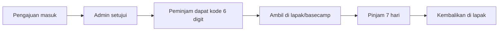
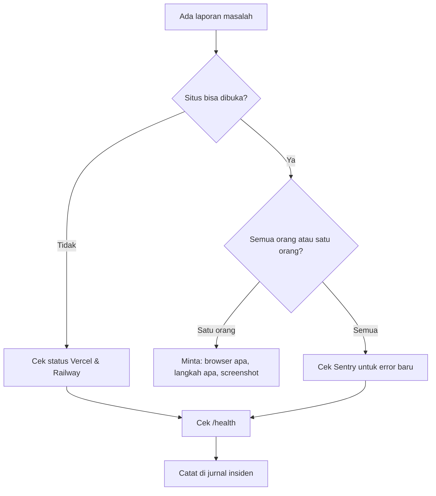

# RUNBOOK — Perpusjal

**Untuk:** pengurus, admin, dan relawan yang mengoperasikan Perpusjal sehari-hari
**Status:** Baseline · **Versi:** 1.0 · **Tanggal:** 22 September 2026
**Acuan:** `PRD.md` v3.0 §13, §20 · `ARCHITECTURE.md` §18

> Dokumen ini dipakai **sambil bekerja**, bukan dibaca sekali lalu dilupakan. Simpan tautannya di HP. Bagian 1–6 untuk pengurus umum, bagian 7–10 untuk yang memegang sisi teknis.

---

## Daftar Isi

**Operasional Harian**
1. [Ringkasan Peran & Tanggung Jawab](#1-ringkasan-peran--tanggung-jawab)
2. [Rutinitas Harian & Mingguan](#2-rutinitas-harian--mingguan)
3. [Mengurus Peminjaman](#3-mengurus-peminjaman)
4. [Mode Lapak](#4-mode-lapak)
5. [Mengurus Koleksi](#5-mengurus-koleksi)
6. [Moderasi & Pengguna](#6-moderasi--pengguna)

**Teknis**
7. [Saat Terjadi Masalah](#7-saat-terjadi-masalah)
8. [Backup & Pemulihan](#8-backup--pemulihan)
9. [Pemeliharaan Rutin](#9-pemeliharaan-rutin)
10. [Kontak & Akses](#10-kontak--akses)

**Lampiran**
11. [Kartu Cepat](#11-kartu-cepat)

---

# OPERASIONAL HARIAN

## 1. Ringkasan Peran & Tanggung Jawab

| Peran | Siapa | Tugas utama | Waktu yang dibutuhkan |
|---|---|---|---|
| **Admin** | Minimal 2 orang | Menyetujui peminjaman, serah terima buku, kelola koleksi & pengguna | ±20 menit/hari |
| **Kurator** | Minimal 2 orang | Meninjau tulisan, moderasi komentar | ±45 menit, 2×/minggu |
| **Penanggung jawab teknis** | 1 orang | Backup, pemantauan, pemulihan masalah | ±30 menit/minggu |

> **Penting:** jangan pernah hanya ada satu admin. Kalau orang itu sakit atau sibuk, peminjaman berhenti total dan orang berhenti memakai platform. Ini risiko R-03 di PRD.

---

## 2. Rutinitas Harian & Mingguan

### 2.1 Cek Harian Admin (±10 menit)

Buka `/admin`. Dashboard sengaja dirancang sebagai **daftar tugas**, bukan pajangan angka. Kerjakan kartu yang berwarna aksen:

```text
1. Pengajuan Pinjam Menunggu   → setujui atau tolak
2. Siap Diambil Hari Ini       → siapkan bukunya
3. Terlambat                   → hubungi bila sudah lewat seminggu
4. Komentar Menunggu Moderasi  → serahkan ke kurator bila bukan bagianmu
```

Kalau keempat angka itu nol, hari itu tidak ada yang perlu dikerjakan. Tutup saja.

### 2.2 Sebelum Hari Lapak (H-1)

- [ ] Buka `/admin/pinjaman/pickup` → lihat daftar "Siap diambil"
- [ ] Siapkan buku-buku tersebut, letakkan terpisah, tandai dengan nama peminjam
- [ ] Bawa HP yang bisa membuka Mode Lapak
- [ ] Pastikan ada sinyal atau siapkan catatan kertas cadangan

### 2.3 Mingguan (±20 menit)

- [ ] Periksa daftar terlambat, hubungi yang sudah lewat 7 hari
- [ ] Periksa koleksi baru yang belum dimasukkan katalog
- [ ] Lihat laporan pencarian tanpa hasil di `/admin` — ini memberi tahu buku apa yang dicari orang tetapi belum kita punya
- [ ] Balas pesan yang masuk lewat halaman Kontak

### 2.4 Bulanan (±45 menit)

- [ ] Cocokkan jumlah fisik buku dengan katalog (ambil sampel 20 judul)
- [ ] Periksa notifikasi rekonsiliasi eksemplar dari sistem
- [ ] Tinjau pengguna yang sedang tersuspensi — apakah perlu dicabut?
- [ ] Lihat metrik di dashboard, bandingkan dengan bulan lalu
- [ ] Perbarui halaman Jadwal Lapak bila ada perubahan

---

## 3. Mengurus Peminjaman

### 3.1 Alur Lengkap



### 3.2 Menyetujui Pengajuan

1. Buka `/admin/pinjaman` → tab **Menunggu**
2. Periksa: buku tersedia? peminjam punya riwayat bermasalah? (sistem sudah memblokir yang bertunggakan, jadi biasanya aman)
3. Tekan **Setujui**

Yang terjadi otomatis:
- Peminjam menerima email + notifikasi berisi **kode 6 digit**, tempat ambil, dan batas waktu
- Batas ambil: 3 hari atau sampai jadwal lapak berikutnya, mana yang lebih lama
- Eksemplarnya sudah "dikunci" sejak pengajuan masuk, jadi tidak akan diambil orang lain

**Target waktu:** setujui dalam 12 jam. Semakin cepat, semakin besar kemungkinan orang benar-benar datang mengambil.

### 3.3 Kapan Menolak

| Situasi | Tindakan |
|---|---|
| Buku ternyata hilang/rusak dan belum diperbarui di sistem | Tolak + perbarui status eksemplar |
| Buku sedang dipakai untuk kegiatan | Tolak + jelaskan kapan tersedia lagi |
| Peminjam punya riwayat buruk yang tidak tercatat sistem | Tolak + jelaskan, lalu diskusikan dengan pengurus lain |
| Permintaan mencurigakan (mis. satu orang banyak akun) | Tolak + laporkan ke penanggung jawab teknis |

Alasan penolakan **wajib** diisi dan akan dibaca peminjam. Tulis dengan sopan — orang ini calon pembaca kita.

### 3.4 Kalau Peminjam Tidak Datang

Sistem menanganinya sendiri: lewat batas waktu → status menjadi **Kedaluwarsa** → buku tersedia lagi. Kamu tidak perlu melakukan apa-apa.

Kalau seseorang tiga kali tidak datang dalam 90 hari, sistem otomatis menangguhkan hak pinjamnya 14 hari.

### 3.5 Kalau Buku Terlambat Dikembalikan

**Perpusjal tidak memungut denda uang.** Sanksinya: selama ada buku terlambat, orang itu tidak bisa meminjam lagi.

Sistem mengirim pengingat otomatis pada H-2, hari-H, lalu H+1, H+3, H+7. Peranmu dimulai setelah itu:

| Kondisi | Tindakan |
|---|---|
| Terlambat 1–7 hari | Biarkan sistem yang mengingatkan |
| Terlambat 7–14 hari | Hubungi langsung lewat WhatsApp. Nada mengajak, bukan menagih |
| Terlambat ≥14 hari | Sistem otomatis menangguhkan hak pinjam 30 hari setelah buku kembali |
| Terlambat >30 hari, tidak bisa dihubungi | Catat sebagai hilang, diskusikan di rapat pengurus |

**Contoh pesan WhatsApp:**

> Halo Mas Dimas, ini dari Perpusjal. Buku *Bumi Manusia* yang dipinjam sudah lewat jatuh tempo seminggu. Kalau masih dibaca tidak apa-apa, tapi tolong kabari ya supaya kami bisa mencatat. Kalau sudah selesai, bisa dikembalikan Minggu pagi di lapak alun-alun. Terima kasih 🙏

### 3.6 Kalau Buku Hilang

1. Catat di sistem lewat **Terima Pengembalian → Hilang** (butuh catatan)
2. Sistem mengurangi jumlah eksemplar dan mencatat riwayatnya
3. Penyelesaian dilakukan **secara kekeluargaan di luar sistem** — biasanya peminjam mengganti dengan buku serupa atau senilai
4. Jangan menagih uang lewat platform. Perpusjal tidak punya kas dan tidak punya kewenangan menagih

---

## 4. Mode Lapak

Layar khusus untuk dipakai di lapangan: `/admin/pinjaman/pickup`

### 4.1 Menyerahkan Buku

```text
1. Peminjam menyebut kode 6 digit
2. Ketik kodenya di kotak besar → tekan Enter
3. Layar menampilkan: sampul buku, judul, nama peminjam
4. Cocokkan dengan orang di depanmu
5. Tekan "Serahkan Buku"
6. Selesai — tanggal kembali otomatis 7 hari dari hari ini
```

**Kalau peminjam lupa kodenya:** ketik namanya di kotak pencarian. Kodenya juga ada di email dan di dashboard mereka.

### 4.2 Menerima Pengembalian

```text
1. Cari dengan nama peminjam atau kode pinjaman
2. Tekan "Terima Pengembalian"
3. Pilih kondisi buku:
   • Baik    → selesai
   • Rusak   → wajib isi catatan (mis. "halaman 40-42 sobek")
   • Hilang  → wajib isi catatan
4. Selesai
```

Kalau kondisinya **Baik**, buku langsung tersedia lagi di katalog dan blokir pinjam peminjam (kalau ada) langsung dicabut.

### 4.3 Kalau Sinyal Hilang

1. Coba sekali lagi — layar akan memberi tahu kalau data belum tersimpan
2. Kalau tetap gagal, catat di kertas: **nama peminjam · judul buku · tanggal · serah/terima**
3. Masukkan ke sistem setelah kembali ke tempat bersinyal, lewat `/admin/pinjaman` dengan mengubah status manual
4. **Jangan** menyerahkan buku tanpa mencatat di mana pun

### 4.4 Tips Lapangan

- Pegang HP dengan satu tangan; tombolnya sengaja dibuat besar
- Naikkan kecerahan layar di bawah sinar matahari
- Siapkan powerbank — layar terang menghabiskan baterai
- Kalau antre panjang, kumpulkan dulu kodenya, proses beberapa sekaligus

---

## 5. Mengurus Koleksi

### 5.1 Menambah Buku Baru

1. Buka `/admin/buku` → **Tambah Buku**
2. Isi minimal: **judul, penulis, kategori**
3. Isi kalau ada: ISBN, penerbit, tahun, jumlah halaman, deskripsi
4. Unggah sampul (boleh difoto sendiri; kalau kosong, sistem membuat placeholder)
5. Isi **jumlah eksemplar** — sistem otomatis membuat kode inventaris `PJ-2026-0001`, `PJ-2026-0002`, dst.
6. Isi **lokasi rak** supaya mudah dicari nanti
7. Isi **donatur** kalau buku ini sumbangan — ini bentuk apresiasi
8. Centang **Tampilkan di katalog** kalau sudah siap dipinjam

### 5.2 Menulis Kode Inventaris di Buku Fisik

Tulis kode inventaris dengan pensil di halaman dalam sampul, atau tempel stiker. Ini yang memungkinkan kita tahu eksemplar mana yang mana saat satu judul punya beberapa salinan.

### 5.3 Buku Rusak, Hilang, atau Ditarik

| Situasi | Tindakan |
|---|---|
| Rusak ringan, masih terbaca | Ubah kondisi eksemplar → **Rusak Ringan**, tetap bisa dipinjam |
| Rusak berat | Ubah status eksemplar → **Rusak**, tidak muncul sebagai tersedia |
| Hilang | Ubah status → **Hilang** |
| Ditarik sementara (perbaikan, pameran) | Ubah status → **Tidak Tersedia** |
| Sudah diperbaiki | Kembalikan ke **Tersedia** |

Jangan menghapus buku yang punya riwayat peminjaman — sistem akan menolak. Gunakan **Arsipkan** supaya riwayatnya tetap utuh.

### 5.4 Koleksi Baca di Tempat

Untuk buku referensi yang tidak boleh dibawa pulang: matikan **Dapat dipinjam**. Buku tetap tampil di katalog dengan label "Baca di Tempat", sehingga orang tahu kita memilikinya.

---

## 6. Moderasi & Pengguna

### 6.1 Komentar

Kurator membuka `/kurator/komentar` beberapa kali seminggu.

| Tab | Isi | Tindakan |
|---|---|---|
| **Menunggu** | Komentar dari akun baru atau yang tersaring otomatis | Setujui kalau wajar |
| **Dilaporkan** | Dilaporkan pengguna lain | Periksa konteksnya di artikel |
| **Disembunyikan** | Sudah disembunyikan | Bisa dipulihkan kalau keliru |

**Setujui** komentar yang wajar meski tidak sependapat dengan isi artikel. **Sembunyikan** hanya kalau: spam, menyerang pribadi, SARA, membocorkan data pribadi, atau sama sekali di luar topik.

Setelah tiga komentar disetujui dan akun berumur ≥3 hari, komentar orang itu otomatis tayang tanpa perlu ditinjau lagi.

### 6.2 Pengguna Bermasalah

| Tingkat | Tindakan | Siapa |
|---|---|---|
| Komentar bermasalah sesekali | Sembunyikan komentarnya | Kurator |
| Berulang | Turunkan ke **Dibatasi** — semua komentarnya perlu ditinjau dulu | Kurator |
| Melanggar berat (ancaman, SARA berulang) | Tangguhkan akun | Admin |
| Menyalahgunakan peminjaman | Tangguhkan hak pinjam | Admin |

Setiap tindakan tercatat di audit log lengkap dengan siapa yang melakukannya. Tulis alasan yang jelas — suatu saat akan ada yang bertanya.

### 6.3 Mengangkat Kurator atau Admin

1. `/admin/pengguna` → cari orangnya → **Ubah Role**
2. Pilih **Kurator** atau **Admin**
3. Kirimkan `CONTENT-GUIDELINES.md` (untuk kurator) atau dokumen ini (untuk admin)
4. Dampingi pada 2–3 kasus pertama

Jangan mengangkat admin hanya karena orangnya aktif. Admin bisa melihat data pribadi peminjam dan mengubah role orang lain.

### 6.4 Permintaan Hapus Akun atau Data

1. Pengguna bisa mengunduh datanya sendiri lewat **Profil → Unduh Data Saya**
2. Pengguna bisa menghapus akunnya sendiri — kecuali masih ada pinjaman aktif
3. Artikel yang sudah terbit **tetap tayang** dengan nama "Pengguna Dihapus"; ini tertulis di Kebijakan Privasi
4. Kalau ada yang meminta artikelnya diturunkan, pengurus memutuskan dalam 7 hari dan menjelaskan keputusannya

---

# TEKNIS

## 7. Saat Terjadi Masalah

### 7.1 Urutan Pemeriksaan Umum



### 7.2 Situs Tidak Bisa Dibuka

1. Buka `https://api.perpusjal.or.id/api/v1/health`
   - Balasan `status: ok` → masalah ada di frontend (Vercel)
   - Tidak membalas → masalah ada di API (Railway)
2. Periksa halaman status Vercel dan Railway — mungkin gangguan di pihak mereka
3. Periksa Sentry untuk lonjakan error
4. Periksa apakah ada deploy baru dalam 1 jam terakhir → kalau ya, **rollback ke deploy sebelumnya**
5. Umumkan di Instagram kalau gangguan >30 menit

### 7.3 Masalah yang Sering Terjadi

| Gejala | Kemungkinan penyebab | Tindakan |
|---|---|---|
| Email verifikasi tidak sampai | Masuk spam, atau domain pengirim bermasalah | Minta cek folder spam; kirim ulang; periksa dasbor Resend |
| Gambar tidak muncul | Kuota Cloudinary habis atau gagal unggah | Periksa dasbor Cloudinary |
| Jumlah buku tersedia terlihat salah | Selisih data | Jalankan job rekonsiliasi di `/admin/jobs`; laporkan ke penanggung jawab teknis |
| Pengingat tidak terkirim | Cron tidak berjalan | Cek `/admin/jobs`; jalankan manual; periksa apakah API sempat mati |
| Kode pengambilan ditolak | Sudah dipakai, atau sudah kedaluwarsa | Cek status pinjaman; kalau kedaluwarsa, buat pengajuan baru atau ubah status manual |
| Orang tidak bisa meminjam padahal buku ada | Ada tunggakan, batas 2 buku, atau email belum diverifikasi | Cek profilnya di `/admin/pengguna` — alasannya tertulis |
| Situs terasa lambat | Gambar terlalu besar, atau query lambat | Periksa Vercel Analytics & log query lambat |

### 7.4 Tingkat Keparahan

| Tingkat | Contoh | Target penanganan |
|---|---|---|
| **P1 — Genting** | Situs mati, data hilang, kebocoran data | Segera, hubungi penanggung jawab teknis lewat telepon |
| **P2 — Tinggi** | Peminjaman tidak bisa diajukan, login gagal | Dalam 24 jam |
| **P3 — Sedang** | Satu halaman error, email telat | Dalam 3 hari |
| **P4 — Rendah** | Typo, tampilan kurang rapi | Sprint berikutnya |

### 7.5 Kalau Ada Dugaan Kebocoran Data

**Ini P1. Jangan tunda.**

1. Catat apa yang terlihat bocor dan kapan diketahui
2. Ganti seluruh rahasia: `SESSION_SECRET`, `INTERNAL_API_TOKEN`, kunci API pihak ketiga
3. Cabut seluruh sesi aktif (paksa semua orang login ulang)
4. Periksa audit log untuk aktivitas tidak wajar
5. Ambil backup keadaan saat ini untuk pemeriksaan
6. Kalau data pribadi pengguna benar-benar terpapar, **beri tahu pengguna yang terdampak** — jangan disembunyikan
7. Tulis catatan insiden: apa yang terjadi, penyebab, perbaikan

---

## 8. Backup & Pemulihan

### 8.1 Yang Sudah Berjalan Otomatis

| Data | Cara | Frekuensi | Retensi |
|---|---|---|---|
| Database | Backup Railway | Harian | 14 hari |
| Gambar | Penyimpanan Cloudinary | — | Selama akun aktif |
| Kode | GitHub | Setiap push | Permanen |

### 8.2 Yang Harus Dilakukan Manual

- [ ] **Backup sebelum setiap migrasi besar** — simpan di luar Railway (mis. Google Drive komunitas)
- [ ] **Uji restore setiap 6 bulan** — backup yang belum pernah diuji bukan backup
- [ ] **Ekspor daftar `publicId` Cloudinary** setiap bulan

### 8.3 Prosedur Uji Restore

```bash
# 1. Unduh backup terakhir dari Railway
# 2. Buat database kosong untuk uji
createdb perpusjal_restore_test

# 3. Pulihkan
psql perpusjal_restore_test < backup-2026-09-22.sql

# 4. Periksa
psql perpusjal_restore_test -c 'SELECT COUNT(*) FROM "User";'
psql perpusjal_restore_test -c 'SELECT COUNT(*) FROM "Book";'
psql perpusjal_restore_test -c 'SELECT COUNT(*) FROM "Loan";'

# 5. Jalankan aplikasi lokal menyambung ke database uji, buka beberapa halaman

# 6. Hapus database uji
dropdb perpusjal_restore_test
```

Catat hasilnya (tanggal, ukuran backup, jumlah baris, berhasil/tidak) di `docs/journal.md`.

### 8.4 Pemulihan Nyata

**Target:** kehilangan data maksimal 24 jam, pemulihan maksimal 4 jam.

1. **Berhenti dulu.** Jangan mengubah apa pun sebelum tahu apa yang terjadi
2. Ambil backup keadaan sekarang, sekalipun rusak — mungkin berguna
3. Aktifkan halaman pemeliharaan
4. Pulihkan dari backup terakhir yang baik
5. Verifikasi: jumlah pengguna, buku, pinjaman aktif
6. Nyalakan kembali, pantau Sentry selama 1 jam
7. Beri tahu pengguna apa yang terjadi dan data apa yang mungkin hilang

---

## 9. Pemeliharaan Rutin

### 9.1 Mingguan

- [ ] Lihat Sentry: ada error baru yang berulang?
- [ ] Lihat `/admin/jobs`: semua cron berjalan?
- [ ] Lihat uptime monitor: ada gangguan?

### 9.2 Bulanan

- [ ] Jalankan `pnpm audit`, tambal kerentanan tinggi dalam 7 hari
- [ ] Periksa kuota Cloudinary, Resend, Railway
- [ ] Bersihkan media yatim yang dilaporkan sistem
- [ ] Tinjau metrik dashboard vs target di PRD §3.3

### 9.3 Setiap 6 Bulan

- [ ] Uji restore backup
- [ ] Perbarui dependensi besar (Next.js, Prisma) di branch terpisah
- [ ] Tinjau daftar admin & kurator — masih aktif semua?
- [ ] Ganti kredensial yang sudah lama tidak dirotasi
- [ ] Tinjau ulang PRD: mana yang sudah tidak relevan?

### 9.4 Sebelum Deploy Besar

- [ ] Backup manual database
- [ ] Uji di staging dengan data menyerupai produksi
- [ ] Deploy di waktu sepi (pagi hari kerja, bukan Minggu pagi saat lapak)
- [ ] Pantau Sentry 30 menit setelah deploy
- [ ] Siapkan rencana rollback

---

## 10. Kontak & Akses

Isi tabel ini dan simpan di tempat yang aman. **Minimal dua orang** harus punya akses ke setiap baris (mitigasi R-14).

| Layanan | Kegunaan | Pemegang akses | Catatan |
|---|---|---|---|
| GitHub (organisasi komunitas) | Kode | | Bukan akun pribadi developer |
| Vercel | Frontend | | |
| Railway | API + database | | |
| Cloudinary | Gambar | | |
| Resend | Email | | |
| Sentry | Pemantauan error | | |
| Registrar domain | Domain | | Perhatikan tanggal perpanjangan |
| Pengelola kata sandi | Seluruh kredensial | | Sumber kebenaran |
| Akun admin Perpusjal | Panel admin | | |

| Peran | Nama | Kontak | Jam bisa dihubungi |
|---|---|---|---|
| Penanggung jawab teknis | | | |
| Admin 1 | | | |
| Admin 2 | | | |
| Kurator 1 | | | |
| Kurator 2 | | | |
| Ketua komunitas | | | |

---

## 11. Kartu Cepat

*Cetak bagian ini dan tempel di basecamp.*

### 📌 Serah Terima di Lapak

```text
MENYERAHKAN BUKU
1. Buka /admin/pinjaman/pickup
2. Ketik kode 6 digit → Enter
3. Cocokkan nama & buku
4. Tekan "Serahkan Buku"

MENERIMA PENGEMBALIAN
1. Cari nama peminjam
2. Tekan "Terima Pengembalian"
3. Pilih kondisi: Baik / Rusak / Hilang
4. Rusak & Hilang wajib isi catatan

SINYAL HILANG?
Catat di kertas: nama · judul · tanggal · serah/terima
Masukkan ke sistem setelah ada sinyal
```

### 📌 Aturan Peminjaman

```text
Maksimal        : 2 buku per orang
Durasi          : 7 hari
Perpanjangan    : 1 kali, +7 hari
Batas ambil     : 3 hari setelah disetujui
Denda uang      : TIDAK ADA
Sanksi terlambat: tidak bisa pinjam sampai dikembalikan
Terlambat 14 hari: hak pinjam ditangguhkan 30 hari
Buku hilang     : diselesaikan kekeluargaan, ganti buku senilai
```

### 📌 Kalau Ada yang Bertanya

| Pertanyaan | Jawaban |
|---|---|
| "Kok saya tidak bisa pinjam?" | Cek: email sudah diverifikasi? ada buku terlambat? sudah pinjam 2 buku? |
| "Kode saya hilang" | Ada di email dan di Dashboard → Pinjaman |
| "Bukunya sudah tidak ada?" | Cek katalog; kalau habis, bisa masuk daftar tunggu |
| "Saya mau menyumbang buku" | Bawa ke basecamp atau lapak; nama penyumbang akan dicantumkan |
| "Tulisan saya kapan terbit?" | Biasanya ditinjau 3–7 hari; status ada di Dashboard → Tulisan |
| "Kenapa tulisan saya ditolak?" | Alasannya ada di dashboard mereka; ajak diskusi kalau belum jelas |
| "Bisa pinjam tanpa akun?" | Tidak, supaya bukunya bisa dilacak. Daftarnya cuma 2 menit |

### 📌 Nomor Penting

```text
Situs              : https://perpusjal.or.id
Panel admin        : https://perpusjal.or.id/admin
Mode Lapak         : https://perpusjal.or.id/admin/pinjaman/pickup
Cek kesehatan      : https://api.perpusjal.or.id/api/v1/health

Penanggung jawab teknis : _______________
Ketua komunitas         : _______________
```

---

> **Prinsip terakhir:** kalau sebuah prosedur di dokumen ini terasa merepotkan saat dipakai di lapangan, itu tanda prosedurnya yang perlu diperbaiki — bukan orangnya yang harus dipaksa menyesuaikan diri. Laporkan, supaya sistemnya kita ubah.
>
> **Membaca dan Berbahagia.**
