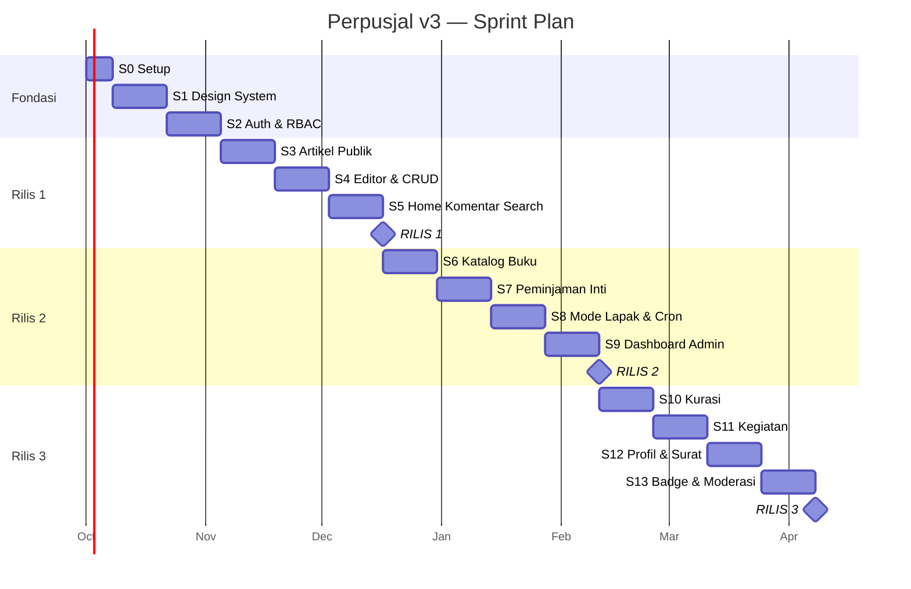

# SPRINT PLAN — Perpusjal v3

**Status:** Baseline · **Versi:** 1.0 · **Tanggal:** 22 September 2026
**Acuan:** `PRD.md` v3.0 §29
**Tim:** 1 developer full-stack, ±18 jam/minggu
**Panjang sprint:** 2 minggu (±36 jam efektif, sudah termasuk cadangan 20%)

---

## Daftar Isi

1. [Cara Memakai Dokumen Ini](#1-cara-memakai-dokumen-ini)
2. [Peta Rilis](#2-peta-rilis)
3. [Sprint 0 — Fondasi](#sprint-0--fondasi-1-minggu)
4. [Sprint 1–5 — Rilis 1](#rilis-1--konten)
5. [Sprint 6–9 — Rilis 2](#rilis-2--perpustakaan)
6. [Sprint 10–13 — Rilis 3](#rilis-3--komunitas)
7. [Checklist Rilis](#7-checklist-rilis)
8. [Ritual Kerja Solo](#8-ritual-kerja-solo)
9. [Aturan Pemangkasan](#9-aturan-pemangkasan)
10. [Papan Pekerjaan Non-Developer](#10-papan-pekerjaan-non-developer)

---

## 1. Cara Memakai Dokumen Ini

- Setiap sprint punya **satu tujuan kalimat**. Kalau sebuah tugas tidak mendukung tujuan itu, dia masuk backlog, bukan sprint ini.
- Setiap tugas diberi kode `S<sprint>-<nomor>` agar bisa jadi judul issue dan nama branch (`feat/S4-02-tiptap-editor`).
- Estimasi memakai satuan **jam**, bukan story point. Untuk tim satu orang, jam lebih jujur.
- Tugas bertanda **🔒** adalah pekerjaan yang tidak boleh dipangkas (keamanan, integritas data).
- "Selesai" berarti memenuhi Definition of Done di PRD §31.1 — termasuk sudah ter-deploy ke staging.

> **Aturan realistis:** jika sebuah sprint meleset lebih dari 20%, jangan memampatkan sprint berikutnya. Pindahkan pekerjaan ke backlog dan sesuaikan tanggal rilis. Utang jadwal yang ditumpuk akan runtuh di Sprint 8.

---

## 2. Peta Rilis

| Rilis | Sprint | Durasi | Yang bisa dipakai orang |
|---|---|---|---|
| **Rilis 1** | S0–S5 | ~13 minggu | Blog publik, akun, komentar, pencarian, halaman statis |
| **Rilis 2** | S6–S9 | ~8 minggu | Katalog buku + peminjaman penuh + panel pengurus |
| **Rilis 3** | S10–S13 | ~8 minggu | Kurasi tulisan warga, kegiatan, profil, badge |

---

## Sprint 0 — Fondasi (1 minggu)

**Tujuan:** Repositori berjalan di lokal dan sudah ter-deploy kosong ke produksi.

| ID | Tugas | Jam | Catatan |
|---|---|---|---|
| S0-01 | Inisialisasi monorepo pnpm + Turborepo, tsconfig bersama | 2 | |
| S0-02 | Setup `apps/web` (Next.js App Router + TS) | 2 | |
| S0-03 | Setup `apps/api` (Express + TS + struktur modul) | 3 | Lapisan controller/service/repository |
| S0-04 | ESLint, Prettier, husky, lint-staged, Conventional Commits | 2 | |
| S0-05 | PostgreSQL lokal via docker-compose | 1 | |
| S0-06 | Skema Prisma awal (User, Category, Page, Setting) | 3 | Dari `DATABASE-ERD.md` |
| S0-07 | Seed dasar: admin, 9 kategori, 8 halaman, setting | 2 | Idempoten |
| S0-08 | Deploy `web` ke Vercel & `api` + DB ke Railway | 3 | Domain sementara |
| S0-09 | CI GitHub Actions: lint + typecheck + test | 2 | |
| S0-10 | 🔒 Sentry di web & api, `/health` endpoint | 2 | |
| S0-11 | `.env.example` + README cara menjalankan | 2 | |
| S0-12 | 🔒 Simpan kredensial di pengelola kata sandi komunitas | 1 | Mitigasi R-14 |
| | **Total** | **25** | |

**Definition of Done sprint:** `pnpm dev` menyalakan semuanya; halaman kosong tayang di URL produksi; CI hijau; error uji muncul di Sentry.

**Keputusan yang harus diambil:** Q-07 (domain), Q-08 (pemegang kredensial).

---

## RILIS 1 — KONTEN

### Sprint 1 — Design System & Layout

**Tujuan:** Setiap halaman berikutnya bisa dibangun tanpa memikirkan warna, font, atau tata letak lagi.

| ID | Tugas | Jam |
|---|---|---|
| S1-01 | Token warna terang & gelap di `globals.css` (DESIGN-SYSTEM §7.1) | 3 |
| S1-02 | Konfigurasi Tailwind + `next/font` (Inter, Lora) | 2 |
| S1-03 | Pasang shadcn/ui, sesuaikan Button, Input, Textarea, Select | 4 |
| S1-04 | Dialog, Sheet, DropdownMenu, Tabs, Toast, Tooltip | 4 |
| S1-05 | Avatar, Badge, StatusPill, Skeleton, Pagination, Breadcrumb | 4 |
| S1-06 | `EmptyState` + isi teks dari PRD §33.1 | 2 |
| S1-07 | Header publik (desktop + drawer mobile) | 4 |
| S1-08 | Footer (navigasi, kontak, jadwal lapak, sosmed) | 2 |
| S1-09 | Mode gelap via next-themes | 2 |
| S1-10 | Halaman 404, 500, dan skip-link | 2 |
| S1-11 | Halaman `/styleguide` internal untuk melihat semua komponen | 3 |
| S1-12 | Audit kontras & fokus keyboard pada seluruh primitif | 2 |
| | **Total** | **34** |

**DoD:** `/styleguide` menampilkan seluruh komponen dalam mode terang & gelap, semua bisa diakses keyboard, kontras lolos AA.

---

### Sprint 2 — Autentikasi & RBAC

**Tujuan:** Orang bisa punya akun, dan server tahu siapa mereka serta apa yang boleh mereka lakukan.

| ID | Tugas | Jam |
|---|---|---|
| S2-01 | Skema Prisma: User, Session, VerificationToken | 2 |
| S2-02 | 🔒 `POST /auth/register` + hash bcrypt + validasi Zod | 3 |
| S2-03 | 🔒 Verifikasi email (token 24 jam, kirim ulang maks 3/jam) | 3 |
| S2-04 | 🔒 `POST /auth/login` + sesi cookie httpOnly + penguncian 5 percobaan | 4 |
| S2-05 | 🔒 Lupa & reset password (token sekali pakai, cabut sesi lain) | 3 |
| S2-06 | 🔒 Middleware `authenticate`, `requireRole`, `requireVerifiedEmail` | 3 |
| S2-07 | 🔒 Token internal antara web dan api | 2 |
| S2-08 | Halaman: Masuk, Daftar, Lupa Password, Reset, Verifikasi | 6 |
| S2-09 | `middleware.ts` proteksi route + redirect `?next=` (FR-FLOW-01) | 3 |
| S2-10 | Menu avatar di header + logout | 2 |
| S2-11 | Setup Resend + template email verifikasi & reset | 3 |
| S2-12 | Halaman profil dasar `/dashboard/profil` (nama, bio, avatar) | 3 |
| S2-13 | 🔒 Uji otorisasi: 4 peran × endpoint terproteksi | 3 |
| S2-14 | Google OAuth (bila Q-06 = ya) | 3 |
| | **Total** | **43** |

**DoD:** Daftar → verifikasi → login → buka dashboard berjalan penuh. Mengakses `/admin` sebagai USER ditolak di server, bukan hanya disembunyikan.

**Keputusan yang harus diambil:** Q-03 (batas usia), Q-06 (Google login).

> **🚦 Gerbang keputusan arsitektur:** di akhir sprint ini, hitung berapa persen waktu S0–S2 terpakai untuk infrastruktur (deploy, konfigurasi, dua aplikasi). Jika > 30%, jalankan ADR-003 exit ramp: pindahkan API ke Route Handlers Next.js sekarang, bukan nanti.

---

### Sprint 3 — Artikel Publik

**Tujuan:** Artikel bisa dibaca orang lewat Google.

| ID | Tugas | Jam |
|---|---|---|
| S3-01 | Skema Prisma: Article, ArticleRevision, Category, Tag | 3 |
| S3-02 | `GET /articles` (filter, sort, paginasi) + indeks | 4 |
| S3-03 | `GET /articles/:slug` + aturan 404 untuk non-publik | 2 |
| S3-04 | `GET /articles/:slug/related` | 1 |
| S3-05 | `RichTextRenderer`: JSON TipTap → HTML tersanitasi | 4 |
| S3-06 | Halaman `/artikel` + `ArticleCard` + `FilterBar` sinkron URL | 5 |
| S3-07 | Halaman `/artikel/:slug` sesuai pola DESIGN-SYSTEM §9.1 | 5 |
| S3-08 | Halaman kategori `/artikel/kategori/:slug` | 2 |
| S3-09 | Tombol bagikan + `AuthorCard` | 2 |
| S3-10 | SEO: `generateMetadata`, JSON-LD Article, OG image dinamis | 4 |
| S3-11 | `sitemap.xml`, `robots.txt`, `rss.xml` | 3 |
| S3-12 | Halaman CMS `/[slug]` dari tabel `Page` | 3 |
| S3-13 | `POST /articles/:id/view` + ReadingLog | 2 |
| S3-14 | Strategi ISR + revalidasi on-demand | 3 |
| | **Total** | **43** |

**DoD:** Artikel yang di-seed tampil rapi, skor Lighthouse ≥85, tautan preview WhatsApp menampilkan OG image dengan benar.

---

### Sprint 4 — Editor & CRUD Artikel

**Tujuan:** Tulisan bisa dibuat dan diterbitkan lewat antarmuka, tanpa menyentuh database.

| ID | Tugas | Jam |
|---|---|---|
| S4-01 | `POST/PATCH/DELETE /articles` + aturan kepemilikan & status | 4 |
| S4-02 | Editor TipTap + toolbar wajib (PRD §9.1) | 8 |
| S4-03 | Pembersih tempel dari Word/Google Docs | 3 |
| S4-04 | Unggah gambar: signed upload Cloudinary + progress + alt text | 5 |
| S4-05 | Autosave 15 detik + indikator + konfirmasi keluar | 3 |
| S4-06 | Hitung kata, waktu baca, `plainText` otomatis | 2 |
| S4-07 | `/dashboard/tulisan` daftar + filter status | 3 |
| S4-08 | `/admin/artikel` tabel + aksi (terbit, jadwalkan, arsip, unggulan) | 5 |
| S4-09 | Unggah cover + pengaturan SEO per artikel | 3 |
| S4-10 | Job penerbitan terjadwal tiap 10 menit | 2 |
| S4-11 | Batas 3 artikel unggulan + validasi | 1 |
| S4-12 | Uji editor di layar 360px | 2 |
| | **Total** | **41** |

**DoD:** Menulis 1000 kata, menyisipkan gambar, menyimpan, menerbitkan — seluruhnya dari HP dan laptop tanpa kehilangan data.

---

### Sprint 5 — Homepage, Komentar, Pencarian

**Tujuan:** Situs terasa hidup dan siap dilihat publik.

| ID | Tugas | Jam |
|---|---|---|
| S5-01 | Homepage 10 seksi (PRD §8.1) + empty state tiap seksi | 7 |
| S5-02 | Statistik komunitas (cache 1 jam) | 2 |
| S5-03 | Skema Comment + CommentReport | 2 |
| S5-04 | 🔒 `POST /comments` + trust level + rate limit + filter kata | 5 |
| S5-05 | `GET /comments` + thread kedalaman 1 | 3 |
| S5-06 | Edit 15 menit, hapus sendiri, laporkan | 3 |
| S5-07 | UI thread komentar + lazy load + `CommentForm` | 5 |
| S5-08 | Antrean moderasi sederhana (`pending`, approve/hide) | 4 |
| S5-09 | 🔒 Migrasi FTS: tsvector, GIN, pg_trgm | 3 |
| S5-10 | `GET /search` + halaman `/cari` bertab | 5 |
| S5-11 | Saran instan di kotak cari header | 3 |
| S5-12 | Empty state pencarian + formulir usulan buku | 2 |
| | **Total** | **44** |

**DoD:** Homepage menampilkan konten nyata; komentar dari akun baru tertahan moderasi; mencari "pram" menemukan artikel dan buku yang relevan.

---

### 🚀 Minggu 12 — RILIS 1

| ID | Tugas | Jam |
|---|---|---|
| R1-01 | Isi konten: 10–15 artikel, seluruh halaman statis | (pengurus) |
| R1-02 | Audit Lighthouse pada Home, Artikel, Detail | 3 |
| R1-03 | Audit aksesibilitas keyboard + screen reader | 3 |
| R1-04 | 🔒 Uji restore backup database | 2 |
| R1-05 | 🔒 Verifikasi SPF/DKIM/DMARC + uji kirim ke Gmail/Outlook | 2 |
| R1-06 | 🔒 Security headers + uji securityheaders.com | 2 |
| R1-07 | Pasang domain, uji sitemap & indexing | 2 |
| R1-08 | Uji lintas perangkat (Android Chrome, iOS Safari) | 3 |
| R1-09 | Umumkan: QR code lapak, bio Instagram, poster | (pengurus) |
| | **Total** | **17** |

---

## RILIS 2 — PERPUSTAKAAN

### Sprint 6 — Katalog Buku

**Tujuan:** Orang bisa mengecek koleksi dari rumah.

| ID | Tugas | Jam |
|---|---|---|
| S6-01 | Skema Prisma: Book, BookCopy + constraint + indeks | 3 |
| S6-02 | `POST/PATCH/DELETE /books` + pembuatan eksemplar otomatis | 4 |
| S6-03 | Kode inventaris otomatis `PJ-{tahun}-{urut}` | 2 |
| S6-04 | CRUD eksemplar + ubah status/kondisi | 3 |
| S6-05 | `/admin/buku` tabel + form + unggah sampul | 6 |
| S6-06 | `GET /books` dengan filter lengkap + FTS buku | 4 |
| S6-07 | Halaman `/buku` grid + filter + `AvailabilityBadge` | 5 |
| S6-08 | `BookCoverPlaceholder` bertema kategori | 2 |
| S6-09 | Halaman `/buku/:slug` + buku serupa | 4 |
| S6-10 | `GET /books/:slug/availability` tanpa cache | 2 |
| S6-11 | JSON-LD Book + metadata | 2 |
| S6-12 | Importir CSV (bila Q-05 = ya) | 5 |
| | **Total** | **42** |

**Prasyarat:** inventarisasi koleksi oleh pengurus sudah selesai minimal 50 judul.

---

### Sprint 7 — Peminjaman Inti

**Tujuan:** Pengajuan pinjam bisa dilakukan online dan disetujui pengurus, tanpa pernah menghasilkan data yang mustahil.

| ID | Tugas | Jam |
|---|---|---|
| S7-01 | Skema Prisma: Loan, LoanReminder + partial unique index | 3 |
| S7-02 | 🔒 `checkBorrowEligibility` — seluruh BR-LOAN-01…12 | 5 |
| S7-03 | 🔒 `POST /loans` dengan transaksi + `FOR UPDATE` | 5 |
| S7-04 | 🔒 Uji konkurensi T1 (dua pemohon, satu eksemplar) | 3 |
| S7-05 | Tombol pinjam kontekstual (9 kondisi, PRD §12.5) | 4 |
| S7-06 | Form pengajuan: titik & rencana tanggal ambil | 3 |
| S7-07 | `POST /loans/:id/approve` + kode pengambilan + batas ambil | 4 |
| S7-08 | `POST /loans/:id/reject` + alasan wajib | 2 |
| S7-09 | `POST /loans/:id/cancel` oleh pengguna | 2 |
| S7-10 | `/admin/pinjaman` tabel per status + aksi | 5 |
| S7-11 | `/dashboard/pinjaman` aktif + riwayat + `PickupCodeDisplay` | 4 |
| S7-12 | Pengaturan `Setting` untuk parameter peminjaman | 2 |
| | **Total** | **42** |

**DoD:** Skenario T1, T2, T5 dari PRD §31.3 lulus. Tidak ada jalur yang bisa membuat `availableCopies` negatif.

**Keputusan yang harus diambil:** Q-01 (verifikasi identitas), Q-02 (titik & jadwal lapak).

---

### Sprint 8 — Mode Lapak & Siklus Hidup

**Tujuan:** Serah terima di lapangan bisa dicatat dalam hitungan detik, dan sistem mengingatkan orang tanpa diminta.

| ID | Tugas | Jam |
|---|---|---|
| S8-01 | `POST /loans/pickup` + pilih eksemplar + set jatuh tempo | 4 |
| S8-02 | `POST /loans/:id/return` + tiga kondisi pengembalian | 4 |
| S8-03 | UI Mode Lapak (DESIGN-SYSTEM §9.4) | 6 |
| S8-04 | `GET /loans/pickup-board` papan harian | 3 |
| S8-05 | `POST /loans/:id/extend` + syarat BR-LOAN-04 | 3 |
| S8-06 | Skema Notification + NotificationPreference | 2 |
| S8-07 | Notifikasi in-app + lonceng header | 4 |
| S8-08 | Template email peminjaman (approved, due, overdue, expired) | 4 |
| S8-09 | 🔒 Cron: overdue, expired, pengingat, suspensi | 6 |
| S8-10 | 🔒 Idempotensi job via `LoanReminder` + tabel `JobRun` | 3 |
| S8-11 | Uji T3, T4, T9, T10 | 3 |
| | **Total** | **42** |

**DoD:** Satu siklus penuh (ajukan → setujui → ambil → ingatkan → kembalikan) berjalan dengan data nyata di staging, dan pengurus bisa menyelesaikan serah terima dalam ≤3 ketukan.

---

### Sprint 9 — Dashboard Admin & Penguatan

**Tujuan:** Pengurus punya satu layar yang memberi tahu apa yang harus dikerjakan hari ini.

| ID | Tugas | Jam |
|---|---|---|
| S9-01 | `GET /admin/stats` dalam satu transaksi | 3 |
| S9-02 | Dashboard KPI + penonjolan pekerjaan tertunda | 5 |
| S9-03 | Grafik pendaftaran & peminjaman 12 minggu | 3 |
| S9-04 | Aktivitas terbaru lintas modul | 2 |
| S9-05 | `/admin/pengguna` + ubah role + suspend + cabut sanksi | 5 |
| S9-06 | 🔒 Audit log: pencatatan + halaman lihat | 4 |
| S9-07 | `/admin/pengaturan` untuk tabel `Setting` | 3 |
| S9-08 | 🔒 Job rekonsiliasi hitungan eksemplar | 3 |
| S9-09 | `DataTable` responsif (tabel ↔ kartu) | 4 |
| S9-10 | Halaman "Cara Meminjam" terisi lengkap (FR-CMS-01) | 2 |
| S9-11 | Panduan 1 halaman untuk pengurus + sesi pelatihan | 3 |
| | **Total** | **37** |

---

### 🚀 Minggu 20 — RILIS 2

| ID | Tugas | Jam |
|---|---|---|
| R2-01 | Uji coba tertutup: 1 minggu peminjaman nyata dengan 5 orang | 4 |
| R2-02 | Perbaikan dari temuan uji coba | 6 |
| R2-03 | 🔒 Uji restore backup ulang | 2 |
| R2-04 | Pelatihan pengurus (Mode Lapak, approve, moderasi) | 3 |
| R2-05 | Cetak QR code katalog untuk dipasang di lapak | (pengurus) |
| | **Total** | **15** |

---

## RILIS 3 — KOMUNITAS

### Sprint 10 — Alur Kurasi

**Tujuan:** Tulisan warga masuk lewat satu pintu, dan penulis selalu tahu posisinya.

| ID | Tugas | Jam |
|---|---|---|
| S10-01 | 🔒 State machine artikel lengkap + tabel transisi di server | 5 |
| S10-02 | `POST /articles/:id/submit` + checklist submit | 4 |
| S10-03 | Checklist submit sebagai UI terlihat, bukan error setelah klik | 3 |
| S10-04 | Withdraw + aturan kunci review | 2 |
| S10-05 | `GET /curation/queue` + umur antrean + status SLA | 4 |
| S10-06 | Dashboard kurator bertab | 3 |
| S10-07 | Layar review dua kolom + pratinjau publik | 5 |
| S10-08 | Approve / Request Revision / Reject + catatan wajib | 4 |
| S10-09 | Template catatan revisi sekali klik | 2 |
| S10-10 | `ArticleRevision` + riwayat keputusan | 3 |
| S10-11 | Kunci review 30 menit + pelepasan otomatis | 3 |
| S10-12 | 🔒 BR-CUR-01: tidak bisa mereview tulisan sendiri (uji T6) | 2 |
| S10-13 | Notifikasi & email kurasi | 3 |
| | **Total** | **43** |

**Prasyarat:** kurator sudah direkrut dan `CONTENT-GUIDELINES.md` sudah disepakati (Q-04).

---

### Sprint 11 — Kegiatan

**Tujuan:** Kegiatan diumumkan, pendaftaran terdata, kehadiran tercatat, dokumentasi tersimpan.

| ID | Tugas | Jam |
|---|---|---|
| S11-01 | Skema Event + EventRegistration + constraint | 2 |
| S11-02 | CRUD event + status machine | 5 |
| S11-03 | `/admin/kegiatan` form + editor deskripsi | 4 |
| S11-04 | Halaman `/kegiatan` + `/kegiatan/:slug` | 5 |
| S11-05 | Pendaftaran + kuota + kode hadir | 4 |
| S11-06 | Daftar tunggu + promosi otomatis saat ada pembatalan | 4 |
| S11-07 | Pembatalan peserta (batas H-1) | 2 |
| S11-08 | Check-in panitia (kode atau nama) | 4 |
| S11-09 | Berkas `.ics` + tombol tambah kalender | 2 |
| S11-10 | Dokumentasi pascakegiatan (ringkasan + galeri) | 4 |
| S11-11 | Notifikasi & email event + pengingat H-1 | 3 |
| S11-12 | JSON-LD Event | 1 |
| | **Total** | **40** |

---

### Sprint 12 — Profil & Surat Pembaca

**Tujuan:** Orang punya wajah di platform, dan ada pintu masuk menulis yang ringan.

| ID | Tugas | Jam |
|---|---|---|
| S12-01 | Profil publik `/u/:username` + aturan privasi | 5 |
| S12-02 | Pengaturan privasi di dashboard | 3 |
| S12-03 | Halaman `/kontributor` | 3 |
| S12-04 | Skema ReaderLetter + alur moderasi | 3 |
| S12-05 | Form kirim surat pembaca + opsi anonim | 4 |
| S12-06 | Halaman `/surat-pembaca` + detail + komentar | 4 |
| S12-07 | Moderasi surat pembaca + penyuntingan ringan | 4 |
| S12-08 | 🔒 `GET /me/export` unduh data | 3 |
| S12-09 | 🔒 Hapus akun + anonimisasi + aturan pinjaman aktif | 4 |
| S12-10 | Halaman keamanan: sesi aktif, ganti password | 3 |
| S12-11 | Kebijakan Privasi diperbarui sesuai perilaku nyata | 2 |
| | **Total** | **38** |

---

### Sprint 13 — Badge & Moderasi Lanjutan

**Tujuan:** Kontribusi diapresiasi, dan moderasi tidak lagi bergantung pada kerajinan satu orang.

| ID | Tugas | Jam |
|---|---|---|
| S13-01 | Skema Badge + UserBadge + seed 12 badge | 2 |
| S13-02 | Mesin evaluasi badge berbasis kejadian | 5 |
| S13-03 | Cron evaluasi badge sebagai jaring pengaman | 2 |
| S13-04 | Halaman `/dashboard/badge` + progres badge terkunci | 4 |
| S13-05 | Badge di profil publik & `AuthorCard` | 2 |
| S13-06 | `/admin/badge` kelola badge | 3 |
| S13-07 | Antrean moderasi penuh: tab dilaporkan & disembunyikan | 4 |
| S13-08 | Aksi massal moderasi | 3 |
| S13-09 | Ubah trust level dari antrean | 2 |
| S13-10 | Halaman notifikasi penuh + preferensi | 4 |
| S13-11 | Digest email harian untuk kurator & admin | 3 |
| S13-12 | Auto-hide berdasarkan ambang laporan | 2 |
| | **Total** | **36** |

---

### 🚀 Minggu 28 — RILIS 3

| ID | Tugas | Jam |
|---|---|---|
| R3-01 | Uji regresi penuh T1–T10 | 4 |
| R3-02 | Audit Lighthouse & aksesibilitas ulang | 3 |
| R3-03 | Retrospektif: bandingkan metrik nyata vs target PRD §3.3 | 2 |
| R3-04 | Susun backlog v4 berdasarkan data, bukan dugaan | 3 |
| R3-05 | Perbarui seluruh dokumen `docs/` | 3 |
| | **Total** | **15** |

---

## 7. Checklist Rilis

Dipakai pada setiap milestone rilis.

### 7.1 Teknis

- [ ] CI hijau, tidak ada `@ts-ignore` baru tanpa penjelasan
- [ ] Migrasi diuji di staging dengan salinan data produksi
- [ ] 🔒 Backup manual diambil sebelum migrasi
- [ ] 🔒 Uji restore berhasil
- [ ] Sentry menerima error dari produksi
- [ ] `/health` hijau, uptime monitor aktif
- [ ] Rate limit aktif di endpoint auth & mutasi
- [ ] Security headers & CSP terpasang
- [ ] Tidak ada rahasia di repositori (`git secrets` / scan manual)

### 7.2 Kualitas

- [ ] Lighthouse Performance ≥85, Accessibility ≥95 di Home/Artikel/Katalog
- [ ] Uji manual di Chrome Android & Safari iOS
- [ ] Seluruh daftar punya loading, empty, error state
- [ ] Tidak ada console error di alur utama
- [ ] Skenario T1–T10 yang relevan lulus

### 7.3 Konten & Hukum

- [ ] Ketentuan Penggunaan & Kebijakan Privasi terisi nyata
- [ ] Halaman Cara Meminjam lengkap (sebelum Rilis 2)
- [ ] Konten awal cukup (≥10 artikel; ≥50 buku untuk Rilis 2)
- [ ] Informasi kontak pengaduan berfungsi

### 7.4 Manusia

- [ ] Pengurus sudah dilatih & punya `RUNBOOK.md`
- [ ] Minimal 2 admin aktif (mitigasi R-03)
- [ ] Minimal 2 kurator aktif sebelum Rilis 3 (mitigasi R-04)
- [ ] Kredensial dipegang minimal 2 orang
- [ ] Rencana sosialisasi siap (QR code, Instagram, poster)

---

## 8. Ritual Kerja Solo

Bekerja sendiri berarti tidak ada yang mengingatkan kalau melenceng. Ritual ini menggantikan peran itu.

| Ritual | Kapan | Durasi | Isi |
|---|---|---|---|
| **Perencanaan sprint** | Senin awal sprint | 45 menit | Pilih tugas, pastikan totalnya ≤36 jam, tulis tujuan satu kalimat |
| **Catatan harian** | Setiap sesi kerja | 5 menit | Tulis apa yang dikerjakan & apa yang menghambat di `docs/journal.md` |
| **Tinjauan tengah sprint** | Minggu kedua | 20 menit | Masih realistis? Kalau tidak, potong sekarang, bukan di hari terakhir |
| **Demo ke pengurus** | Akhir sprint | 30 menit | Tunjukkan di staging. Ini menggantikan peran product owner |
| **Retrospektif** | Akhir sprint | 20 menit | Estimasi meleset di mana, dan kenapa |
| **Jeda wajib** | Setelah setiap rilis | 1 minggu | Tidak menulis fitur. Solo project gagal karena kelelahan, bukan karena kurang fitur |

### 8.1 Aturan Anti-Terjebak

- Macet > 90 menit pada satu masalah → tulis di jurnal, kerjakan tugas lain, kembali besok.
- Muncul ide fitur baru di tengah sprint → masuk `docs/backlog.md`, bukan sprint ini.
- Tergoda merapikan kode yang tidak terkait tugas → catat sebagai tugas `chore/` terpisah.

---

## 9. Aturan Pemangkasan

Ketika jadwal melenceng, pangkas **dari bawah ke atas**. Setiap butir dapat dihapus tanpa merusak yang di atasnya.

| Urutan | Yang dipangkas | Gantinya sementara |
|---|---|---|
| 1 | Badge & gamifikasi (S13-01…06) | Tidak ada |
| 2 | Surat Pembaca (S12-04…07) | Formulir Google, masuk manual sebagai draft |
| 3 | Daftar tunggu buku (S7 waitlist) | Tampilkan "sedang dipinjam" saja |
| 4 | Daftar tunggu & check-in event (S11-06, S11-08) | Panitia mencatat manual |
| 5 | Digest email (S13-11) | Kirim notifikasi satuan |
| 6 | Mode gelap (S1-09) | Hanya mode terang |
| 7 | Penjadwalan artikel (S4-10) | Terbitkan manual |
| 8 | Importir CSV (S6-12) | Input manual |
| 9 | Grafik dashboard (S9-03) | Angka saja tanpa grafik |

**🔒 Tidak pernah boleh dipangkas:** autentikasi, RBAC server-side, transaksi & penguncian peminjaman, sanitasi input, backup + uji restore, audit log untuk aksi istimewa.

---

## 10. Papan Pekerjaan Non-Developer

Ini sering menjadi jalur kritis sesungguhnya. Mulai sekarang, jangan menunggu sprint terkait.

| Pekerjaan | Tenggat | Penanggung jawab | Status |
|---|---|---|---|
| Menyiapkan domain & email komunitas | Sebelum S0 selesai | Pengurus | ☐ |
| Akun Cloudinary, Resend, Sentry | Sebelum S2 | Pengurus | ☐ |
| Menulis isi: Tentang, Sejarah, FAQ, Ketentuan, Kebijakan Privasi | Sebelum S5 | Pengurus | ☐ |
| Menyiapkan 10–15 artikel awal | Sebelum Rilis 1 | Kontributor | ☐ |
| Inventarisasi koleksi (≥50 judul, foto sampul) | Sebelum S6 | Tim koleksi | ☐ |
| Melanjutkan inventarisasi sampai ≥200 judul | Sebelum Rilis 2 | Tim koleksi | ☐ |
| Menetapkan titik & jadwal lapak tetap | Sebelum S7 | Pengurus | ☐ |
| Menunjuk minimal 2 admin | Sebelum Rilis 2 | Pengurus | ☐ |
| Merekrut ≥2 kurator & menyepakati `CONTENT-GUIDELINES.md` | Sebelum S10 | Pengurus | ☐ |
| Menyiapkan materi sosialisasi (QR, poster, konten IG) | Sebelum tiap rilis | Tim media | ☐ |
| Foto dokumentasi kegiatan | Berkelanjutan | Siapa saja | ☐ |
